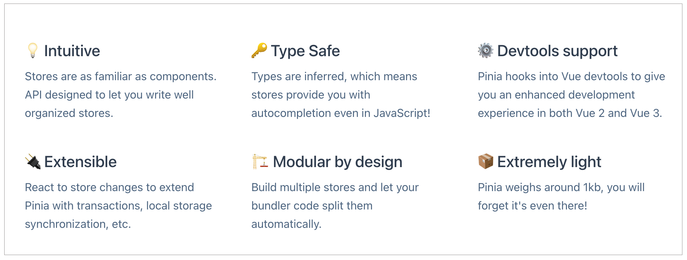

## 数据流原理：Vuex & Pinia源码剖析

之前基于Vue提供的响应式函数reactive和computed的能力，我们封装了一个独立的共享数据的store，并且对外暴露了commit和dispatch方法修改和更新数据。

这里探讨一下下一代Vuex5的提案，并看一下实际的代码是如何实现的。

### Vuex5提案

由于Vuex有模块化namespace的功能，所有模块user中的mutation add方法，我们需要使用`commit('user/add')`来触发。这样虽然可以让Vuex支持更复杂的项目，但是这种**字符串类型的拼接功能，在TypeScript4之前的类型推导中就很难实现**。

然后就有了Vuex5相关提案的讨论，整个讨论过程都是在Github的issue里推进的，可以访问[issue](https://github.com/vuejs/rfcs/pull/271)去围观。

Vuex5的提案相比Vuex4有很大的改进，解决了一些Vuex4中的缺点。Vuex5能够同时支持composition api和option api，并且去掉了namespace模式，**使用组合store的方式更好地支持了TypeScript的类型推导**，还去掉了容易混淆的mutation和action概念，只保留了action，并且支持自动的代码分割。

通过对这个提案研究，可以体验一下在一个框架中如何讨论新的语法设计和实现，以及如何通过api的设计去解决开发方式的痛点。

我们可以在Github的提案RFCs中看到[Vuex5的设计文稿](https://github.com/vuejs/rfcs/blob/34a8b0d541a361a37d05de8d67cb44a7b6f6fd12/active-rfcs/0000-vuex-5.md)，而Pinia正是基于Vuex5设计的框架。

现在Pinia已经正式合并到Vue组织下，成为了Vue的官方项目。


### Pinia使用

下图是Pinia的官方介绍，可以看到类型安全、Vue的Devtools支持、易扩展、只有1KB的体积等优点。



1. 首先执行命令安装Pinia

   ```shell
   yarn add pinia@next
   ```

2. 在src/main.js中，导入createPinia方法，通过createPinia方法创建Pinia的实例，再通过app.use方法注册Pinia

   ```javascript
   import { createApp } from "vue";
   import { createPinia } from "pinia";
   import App from './App1.vue';
   
   const pinia = createPinia();
   const app = createApp(App);
   
   app.use(pinia).mount('#app');
   ```

3. 然后在store文件夹中创建一个count.js。

   以下代码中我们通过Pinia的defineStore方法定义了一个store，store内部通过state返回一个对象，并且通过actions配置修改数据的方法add。

   这里使用的语法和Vuex比较类似，只是删除了mutation的概念，统一使用actions来配置。

   ```javascript
   import { defineStore } from "pinia";
   
   export const useCounterStore = defineStore('count', {
       id: 'count',
       state: () => {
           return { count: 1 }
       },
       actions: {
           add() {
               this.count ++
           }
       }
   })
   ```

4. 使用composition的方式在代码中使用store。

   注意上面的store返回的其实就是一个composition风格的函数，使用useCounterStore返回count后，可以在组件的add方法中直接使用count.add触发action，实现数据的修改。

   ```vue
   <template>
     <div>
       <h3 @click="add">App1</h3>
     </div>
   </template>
   
   <script>
   import { useCounterStore } from "./store/count";
   
   export default {
     setup() {
       const count = useCounterStore();
       function add() {
         count.add();
       }
       return {
         count,
         add
       }
     }
   }
   </script>
   ```

   我们也可以使用composition风格的语法，去创建一个store。

   使用ref或者reactive包裹后，通过defineStore返回，这样store就非常接近我们自己封装的composition语法了，也去除了很多Vuex中特有的概念，学习起来更加简单。

   ```javascript
   export const useCounterStore = defineStore('count', () => {
       const count = ref(0);
       function increment() {
           count.value ++
       }
   
       return { count, increment }
   });
   ```


### Pinia 源码

通过阅读Pinia源码，来看下Pinia是如何实现的。

首先进入到Pinia的[Github](https://github.com/vuejs/pinia)中，可以在`packages/pinia/src/createPinia.ts`中看到createPinia函数的实现。

#### createPinia

下面的代码中，通过`effectScope`创建一个作用域对象，并且通过ref创建了响应式的数据对象state；然后通过install方法支持了app.use的注册，内部通过provide的语法和全局的`$pinia`变量配置Pinia对象，并且通过use方法和toBeInstalled数组实现了Pinia的插件机制；最后通过`pinia.use(devtoolsPlugin)`实现了对VueDevtools的支持。

```typescript
// packages/pinia/src/createPinia.ts
export function createPinia(): Pinia {
  const scope = effectScope(true)
  // NOTE: here we could check the window object for a state and directly set it
  // if there is anything like it with Vue 3 SSR
  const state = scope.run<Ref<Record<string, StateTree>>>(() =>
    ref<Record<string, StateTree>>({}) // 通过ref创建了响应式的数据对象state
  )!

  let _p: Pinia['_p'] = []
  // plugins added before calling app.use(pinia)
  let toBeInstalled: PiniaPlugin[] = []

  const pinia: Pinia = markRaw({
    install(app: App) { // 支持了app.use的注册
      // this allows calling useStore() outside of a component setup after
      // installing pinia's plugin
      setActivePinia(pinia)
      if (!isVue2) {
        pinia._a = app
        app.provide(piniaSymbol, pinia)
        app.config.globalProperties.$pinia = pinia
        /* istanbul ignore else */
        if (USE_DEVTOOLS) {
          registerPiniaDevtools(app, pinia)
        }
        toBeInstalled.forEach((plugin) => _p.push(plugin))
        toBeInstalled = []
      }
    },

    use(plugin) {
      if (!this._a && !isVue2) {
        toBeInstalled.push(plugin)
      } else {
        _p.push(plugin)
      }
      return this
    },

    _p,
    // it's actually undefined here
    // @ts-expect-error
    _a: null,
    _e: scope,
    _s: new Map<string, StoreGeneric>(),
    state,
  })

  // pinia devtools rely on dev only features so they cannot be forced unless
  // the dev build of Vue is used. Avoid old browsers like IE11.
  if (USE_DEVTOOLS && typeof Proxy !== 'undefined') {
    pinia.use(devtoolsPlugin)
  }

  return pinia
}
```

在以上代码中，可以看到Pinia实例就是ref包裹的响应式对象，项目中用到的state都会挂载到Pinia这个响应式对象内部。

#### defineStore

然后去看创建store的defineStore方法，defineStore内部通过useStore方法去定义store，并且每个store都会标记唯一的ID。

* 首先，通过getCurrentInstance获取当前组件的实例，如果useStore没有pinia参数的话，就使用inject去获取Pinia实例，这里inject的数据就是createPinia函数中install方法提供的。

* 然后，设置activePinia，项目中可能会存在很多Pinia实例，设置activePinia就是设置当前活跃的Pinia实例。

  这个函数的实现方式和Vue中的componentInstance很像，每次创建组件的时候都设置当前的组件实例，这样就可以在组件的内部通过getCurrentInstance获取，最后通过createSetupStore或者createOptionsStore创建组件。

  就是之前示例代码中，使用composition和options两种语法创建store的不同执行逻辑

* 最后通过`pinia._s`缓存创建后的store，`_s`就是在createPinia的时候创建的一个Map对象，防止store多次重复创建。

* 至此store创建流程就结束了。

```typescript
// pinia/packages/pinia/src/store.ts
export function defineStore(
  // TODO: add proper types from above
  idOrOptions: any,
  setup?: any,
  setupOptions?: any
): StoreDefinition {
  let id: string
  let options:
    | DefineStoreOptions<
        string,
        StateTree,
        _GettersTree<StateTree>,
        _ActionsTree
      >
    | DefineSetupStoreOptions<
        string,
        StateTree,
        _GettersTree<StateTree>,
        _ActionsTree
      >

  const isSetupStore = typeof setup === 'function'
  if (typeof idOrOptions === 'string') {
    id = idOrOptions
    // the option store setup will contain the actual options in this case
    options = isSetupStore ? setupOptions : setup
  } else {
    options = idOrOptions
    id = idOrOptions.id

    if (__DEV__ && typeof id !== 'string') {
      throw new Error(
        `[🍍]: "defineStore()" must be passed a store id as its first argument.`
      )
    }
  }

  function useStore(pinia?: Pinia | null, hot?: StoreGeneric): StoreGeneric {
    const hasContext = hasInjectionContext()
    pinia =
      // in test mode, ignore the argument provided as we can always retrieve a
      // pinia instance with getActivePinia()
      (__TEST__ && activePinia && activePinia._testing ? null : pinia) ||
      (hasContext ? inject(piniaSymbol, null) : null)
    if (pinia) setActivePinia(pinia) // 设置当前活跃的Pinia实例

    if (__DEV__ && !activePinia) {
      throw new Error(
        `[🍍]: "getActivePinia()" was called but there was no active Pinia. Did you forget to install pinia?\n` +
          `\tconst pinia = createPinia()\n` +
          `\tapp.use(pinia)\n` +
          `This will fail in production.`
      )
    }

    pinia = activePinia!

    if (!pinia._s.has(id)) {
      // `pinia._s`缓存了创建后的store
      // creating the store registers it in `pinia._s`
      if (isSetupStore) {
        createSetupStore(id, setup, options, pinia)
      } else {
        createOptionsStore(id, options as any, pinia)
      }

      /* istanbul ignore else */
      if (__DEV__) {
        // @ts-expect-error: not the right inferred type
        useStore._pinia = pinia
      }
    }

    const store: StoreGeneric = pinia._s.get(id)!

    if (__DEV__ && hot) {
      const hotId = '__hot:' + id
      const newStore = isSetupStore
        ? createSetupStore(hotId, setup, options, pinia, true)
        : createOptionsStore(hotId, assign({}, options) as any, pinia, true)

      hot._hotUpdate(newStore)

      // cleanup the state properties and the store from the cache
      delete pinia.state.value[hotId]
      pinia._s.delete(hotId)
    }

    if (__DEV__ && IS_CLIENT) {
      const currentInstance = getCurrentInstance() // 获取当前组件的实例
      // save stores in instances to access them devtools
      if (
        currentInstance &&
        currentInstance.proxy &&
        // avoid adding stores that are just built for hot module replacement
        !hot
      ) {
        const vm = currentInstance.proxy
        const cache = '_pStores' in vm ? vm._pStores! : (vm._pStores = {})
        cache[id] = store
      }
    }

    // StoreGeneric cannot be casted towards Store
    return store as any
  }

  useStore.$id = id

  return useStore
}
```

#### createOptionsStore

在Pinia中，createOptionsStore内部也是调用了createSetupStore来创建store对象。

以下代码中，我们通过assign方法实现了setup函数；可以看到computed的实现：内部就是通过`pinia._s`缓存获取store对象，调用store的getters方法来模拟；最后依然通过createSetupStore创建。

```javascript
// pinia/packages/pinia/src/store.ts
function createOptionsStore<
  Id extends string,
  S extends StateTree,
  G extends _GettersTree<S>,
  A extends _ActionsTree
>(
  id: Id,
  options: DefineStoreOptions<Id, S, G, A>,
  pinia: Pinia,
  hot?: boolean
): Store<Id, S, G, A> {
  const { state, actions, getters } = options

  const initialState: StateTree | undefined = pinia.state.value[id]

  let store: Store<Id, S, G, A>

  function setup() {
    if (!initialState && (!__DEV__ || !hot)) {
      /* istanbul ignore if */
      if (isVue2) {
        set(pinia.state.value, id, state ? state() : {})
      } else {
        pinia.state.value[id] = state ? state() : {}
      }
    }

    // avoid creating a state in pinia.state.value
    const localState =
      __DEV__ && hot
        ? // use ref() to unwrap refs inside state TODO: check if this is still necessary
          toRefs(ref(state ? state() : {}).value)
        : toRefs(pinia.state.value[id])

    return assign( // 通过assign方法实现了setup函数
      localState,
      actions,
      Object.keys(getters || {}).reduce((computedGetters, name) => {
        if (__DEV__ && name in localState) {
          console.warn(
            `[🍍]: A getter cannot have the same name as another state property. Rename one of them. Found with "${name}" in store "${id}".`
          )
        }

        computedGetters[name] = markRaw(
          // computed的实现，内部就是通过`pinia._s`缓存获取store对象，调用store的getters方法来模拟
          computed(() => {
            setActivePinia(pinia)
            // it was created just before
            const store = pinia._s.get(id)!

            // allow cross using stores
            /* istanbul ignore next */
            if (isVue2 && !store._r) return

            // @ts-expect-error
            // return getters![name].call(context, context)
            // TODO: avoid reading the getter while assigning with a global variable
            return getters![name].call(store, store)
          })
        )
        return computedGetters
      }, {} as Record<string, ComputedRef>)
    )
  }

  store = createSetupStore(id, setup, options, pinia, hot, true)

  return store as any
}
```

#### createSetupStore

最后来看createSetupStore函数的实现。

这个函数也是Pinia中最复杂的函数实现，**内部的`$patch`函数**可以实现数据的更新。如果传递的参数`partialStateMutator`是函数，则直接执行，否则就通过mergeReactiveObjects方法合并到state中，最后生成subscriptionMutation对象，通过triggerSubscriptions方法触发数据的更新。

```javascript
// pinia/packages/pinia/src/store.ts
  function $patch(
    partialStateOrMutator:
      | _DeepPartial<UnwrapRef<S>>
      | ((state: UnwrapRef<S>) => void)
  ): void {
    let subscriptionMutation: SubscriptionCallbackMutation<S>
    isListening = isSyncListening = false
    // reset the debugger events since patches are sync
    /* istanbul ignore else */
    if (__DEV__) {
      debuggerEvents = []
    }
    if (typeof partialStateOrMutator === 'function') { // 传递的是函数
      partialStateOrMutator(pinia.state.value[$id] as UnwrapRef<S>)
      subscriptionMutation = {
        type: MutationType.patchFunction,
        storeId: $id,
        events: debuggerEvents as DebuggerEvent[],
      }
    } else { // 传递的不是函数
      mergeReactiveObjects(pinia.state.value[$id], partialStateOrMutator) // 合并到state
      subscriptionMutation = {
        type: MutationType.patchObject,
        payload: partialStateOrMutator,
        storeId: $id,
        events: debuggerEvents as DebuggerEvent[],
      }
    }
    const myListenerId = (activeListener = Symbol())
    nextTick().then(() => {
      if (activeListener === myListenerId) {
        isListening = true
      }
    })
    isSyncListening = true
    // because we paused the watcher, we need to manually call the subscriptions
		// 触发数据的更新
    triggerSubscriptions(
      subscriptions,
      subscriptionMutation,
      pinia.state.value[$id] as UnwrapRef<S>
    )
  }
```

然后定义**partialStore对象**去存储ID、$patch、Pinia实例，并且新增了subscribe方法。

```javascript
  const partialStore = {
    _p: pinia, // Pinia实例
    // _s: scope,
    $id, // ID
    $onAction: addSubscription.bind(null, actionSubscriptions),
    $patch, // $patch
    $reset,
    $subscribe(callback, options = {}) { // subscribe方法
      const removeSubscription = addSubscription(
        subscriptions,
        callback,
        options.detached,
        () => stopWatcher()
      )
      const stopWatcher = scope.run(() =>
        watch(
          () => pinia.state.value[$id] as UnwrapRef<S>,
          (state) => {
            if (options.flush === 'sync' ? isSyncListening : isListening) {
              callback(
                {
                  storeId: $id,
                  type: MutationType.direct,
                  events: debuggerEvents as DebuggerEvent,
                },
                state
              )
            }
          },
          assign({}, $subscribeOptions, options)
        )
      )!

      return removeSubscription
    },
    $dispose,
  } as _StoreWithState<Id, S, G, A>
```

再**调用reactive函数把partialStore包裹成响应式对象**，通过`pinia._s.set`方法**实现store的挂载**。

```javascript
  const store: Store<Id, S, G, A> = reactive( // 把partialStore包裹成响应式对象
    __DEV__ || USE_DEVTOOLS
      ? assign(
          {
            _hmrPayload,
            _customProperties: markRaw(new Set<string>()), // devtools custom properties
          },
          partialStore
          // must be added later
          // setupStore
        )
      : partialStore
  ) as unknown as Store<Id, S, G, A>
    
    
  // store the partial store now so the setup of stores can instantiate each other before they are finished without
  // creating infinite loops.
  pinia._s.set($id, store) // 实现store的挂载
```

最后我们通过`pinia._s.get`获取的就是partialStore对象，defineStore返回方法useStore，就可以通过useStore去获取缓存的Pinia对象，实现对数据的更新和读取。

可以看到，除了直接执行action方法，还可以通过调用内部的`count.$patch({count: count.count+1})`的方式来实现数字的累加。

可以看出：一个简单的store功能，真正需要支持生产环境的时候，也需要很多逻辑的封装。

代码内部除了`__DEV__`调试环境中对DevTools支持的语法，还有很多适配Vue2的语法，并且同时支持option风格和composition风格去创建store。createSetupStore等方法内部也会通过Map的方式实现缓存，并且setActivePinia方法可以在多个Pinia实例的时候获取当前的实例。

这些思路在Vue、vue-router源码中都能看到类似的实现方式，这种性能优化的思路和手段也值得我们学习，在项目开发中也可以借鉴。


### 总结

Vue5针对Vuex4中的几个痛点，去掉了容易混淆的概念mutation，去掉了对TypeScript不友好的namespace功能，使用组合store的方式让Vuex对TypeScript更加友好。

Pinia就是Vuex5提案产出的框架，现在已经是Vue官方的框架了，也就是Vuex5的实现。

在Pinia的代码中，我们通过createPinia创建Pinia实例，并且可以通过option和composition两种风格的api去创建store，返回useStore函数获取Pinia的实例后，就可以进行数据的修改和读取。


### 思考题

对于数据共享语法，还有provide/inject和自己定义的composition，那什么时候需要使用Pinia呢？

