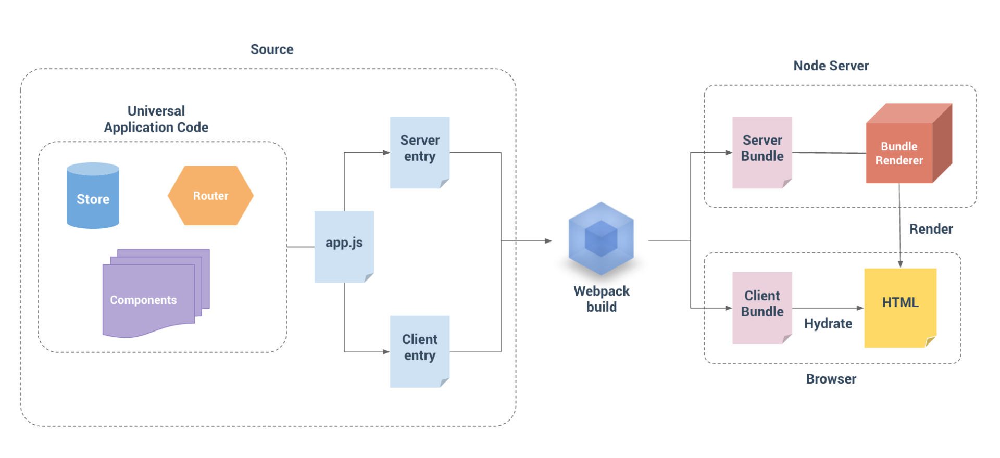

## 服务端渲染原理：vue中的SSR

### SSR是什么

SSR，Server Side Rendering，也就是服务端渲染。

**这个方案是为解决什么问题而产生的？**

无论Vue还是React的全家桶，都有路由的身影，页面的渲染流程也全部都是浏览器加载完JavaScript文件后，由JavaScript获取当前的路由地址，再决定渲染哪个页面。

这种架构下，所有的路由和页面都是在客户端进行解析和渲染的，我们称之为Client Side Rendering，简写为CSR，也就是客户端渲染。

交互体验确实提升了，但同时也带来了两个小问题。

* 【首次加载白屏时间】首先，如果采用CSR，打包后会生成一个index.html，这是一个入口文件，body内部就是一个空的div标签，用户访问这个页面后，页面的首屏需要等待JavaScript加载和执行完毕才能看到，这样白屏时间肯定比body内部直接写标签要长一些，尤其在客户端网络环境差的情况下，**等待JavaScript下载和执行的白屏时间是很伤害用户体验的**。
* 【搜索SEO】其次，**搜索引擎的爬虫抓取到你的页面数据后，发现body是空的，会认为你你这个页面是空的，这对于SEO是很不利的**。即使现在基于Google的搜索引擎爬虫已经能够支持JavaScript的执行，但是爬虫不会等待页面的网络请求数据，何况国内主要的搜索引擎还是百度。

如果项目对白屏时间和搜索引擎有要求，就**需要在用户访问页面的时候，能够把首屏渲染的HTML内容写入到body内部，也就是说需要在服务端实现组件的渲染**，这就是SSR的用武之地。


### 怎么做SSR

Vue提供了@vue/server-renderer这个专门做服务端解析的库。

* 首先创建一个新的文件夹vue-ssr，执行以下命令安装server-renderer、Vue和express

  ```shel
  $ mkdir vue-ssr && cd vue-ssr
  
  $ npm init -y   
  $ yarn add @vue/server-renderer vue@next express --save
  ```

* 新建server.js，核心就是要实现在服务器端解析Vue组件，直接把渲染结果返回给浏览器。

  ```shell
  $ mkdir src 
  $ touch src/server.js
  ```

  以下代码中，使用express启动一个服务，监听9093端口，在用户访问首页的时候，通过createSSRApp创建一个Vue实例，并且通过@vue/compiler-ssr对模板的template进行编译，返回的函数配置在vueapp的ssrRender属性上，最后通过@vue/server-renderer的renderToString方法渲染Vue的实例，把renderToString返回的字符串通过res.send返回给客户端。

  ```javascript
  // 引入express
  const express = require('express');
  const app = express();
  const Vue = require('vue'); // vue@next
  const renderer3 = require('@vue/server-renderer');
  const vue3Compiler = require('@vue/compiler-ssr');
  
  // 一个Vue组件
  const vueapp = {
      template: `<div>
          <h1 @click="add">{{ num }}</h1>
          <ul>
              <li v-for="(todo, n) in todos">{{ n+1 }} -- {{ todo }}</li>
          </ul>
      </div>
      `,
      data() {
          return {
              num: 1,
              todos: ['吃饭', '睡觉', '学习vue']
          }
      },
      methods: {
          add() {
              console.log('add triggered!');
              this.num ++
          }
      }
  }
  
  // 使用@vue/compiler-ssr解析template
  // 对template进行编译，并将返回的函数配置在vueapp的ssrRener属性上
  // 补充知识点：new Function 前面的参数为函数参数，最后一个参数是函数体内容
  vueapp.ssrRender = new Function('require', vue3Compiler.compile(vueapp.template).code)(require); // 把require传递给这个new出来的函数并立即执行，得到的返回也是一个函数，也就是template编译后得到的ssrRender函数
  // 路由首页返回结果
  app.get('/', async function(req, res) {
      let vapp = Vue.createSSRApp(vueapp); // 创建一个Vue实例
      let html = await renderer3.renderToString(vapp); // 渲染vue实例，并返回字符串
      const title = 'Vue SSR';
      let ret = `
  <!doctype html>
  <html lang="en">
  <head>
      <meta charset="utf-8">
      <link rel="icon" href="/favicon.ico">
      <meta name="viewport" content="width=device-width, initial-scale=1.0">
      <title>${title}</title>    
  </head>
  <body>
      <div id="app">
          ${html}
      </div>
  </body>
  </html>
      `;
      res.send(ret);
  });
  
  app.listen(9093, () => { // 监听9093端口
      console.log('listen 9093');
  })
  ```

* 测试，启动服务` node src/server.js`

* 访问页面，源代码

  ```html
  <!doctype html>
  <html lang="en">
  <head>
      <meta charset="utf-8">
      <link rel="icon" href="/favicon.ico">
      <meta name="viewport" content="width=device-width, initial-scale=1.0">
      <title>Vue SSR</title>    
  </head>
  <body>
      <div id="app">
          <div><h1>1</h1><ul><!--[--><li>1 -- 吃饭</li><li>2 -- 睡觉</li><li>3 -- 学习vue</li><!--]--></ul></div>
      </div>
  </body>
  </html>
  ```

  可以看到，body标签内部就出现了vue组件中v-for渲染后的标签结果。


### Vue SSR源码剖析

在CSR环境下，template解析的render函数用来返回组件的虚拟DOM，而SSR环境下，template解析的SSRRender函数，内部是通过`_push`对字符串进行拼接，最终生成组件渲染的结果。

我们可以在官方的[模板渲染演示页面](https://template-explorer.vuejs.org/#eyJzcmMiOiI8ZGl2PlxuICAgIDx1bCA+XG4gICAgICA8bGkgdi1mb3I9XCIodG9kbyxuKSBpbiB0b2Rvc1wiID57e24rMX19LS17e3RvZG99fTwvbGk+XG4gICAgPC91bD5cbiAgPC9kaXY+Iiwic3NyIjp0cnVlLCJvcHRpb25zIjp7Im1vZGUiOiJmdW5jdGlvbiIsImhvaXN0U3RhdGljIjp0cnVlLCJjYWNoZUhhbmRsZXJzIjp0cnVlLCJvcHRpbWl6ZUJpbmRpbmdzIjpmYWxzZX19)选择ssr设置后，看到渲染的结果：

```javascript
const { mergeProps: _mergeProps } = require("vue")
const { ssrRenderAttrs: _ssrRenderAttrs, ssrInterpolate: _ssrInterpolate, ssrRenderList: _ssrRenderList } = require("vue/server-renderer")

return function ssrRender(_ctx, _push, _parent, _attrs, $props, $setup, $data, $options) {
  const _cssVars = { style: { color: _ctx.color }}
  _push(`<div${_ssrRenderAttrs(_mergeProps(_attrs, _cssVars))}><ul><!--[-->`)
  _ssrRenderList(_ctx.todos, (todo, n) => {
    _push(`<li>${
      _ssrInterpolate(n+1)
    }--${
      _ssrInterpolate(todo)
    }</li>`)
  })
  _push(`<!--]--></ul></div>`)
}
```

可以看到ssrRender函数内部通过接收的`_push`函数拼接组件渲染的结果后，直接返回renderToString函数的执行结果。

#### renderToString

**renderToString是如何工作的？**

进入`core/packages/server-renderer/src`目录下，打开`renderToString.ts`文件：

```typescript
export async function renderToString(
  input: App | VNode, // input为vue实例或虚拟节点，上例中为Vue实例
  context: SSRContext = {}
): Promise<string> {
  if (isVNode(input)) {
    // raw vnode, wrap with app (for context)
    return renderToString(createApp({ render: () => input }), context)
  }

  // rendering an app
  const vnode = createVNode(input._component, input._props)
  vnode.appContext = input._context
  // provide the ssr context to the tree
  input.provide(ssrContextKey, context)
  const buffer = await renderComponentVNode(vnode) // buffer变量

  const result = await unrollBuffer(buffer as SSRBuffer) // 返回的字符串

  await resolveTeleports(context)

  if (context.__watcherHandles) {
    for (const unwatch of context.__watcherHandles) {
      unwatch()
    }
  }

  return result
}
```

以上代码可以看到，通过`renderComponentVNode`函数对创建的vnode进行渲染，生成一个buffer变量，最后通过`unrollBuffer`返回字符串。

#### renderComponentVNode, renderComponentSubTree

继续看`renderComponentVNode`函数，其内部通过renderComponentSubTree进行虚拟DOM的子树渲染，而renderComponentSubTree内部调用组件内部的ssrRender函数，也就是上面代码中通过@vue/compiler-ssr解析之后的ssrRender函数，接收的push参数是通过createBuffer传递的。

```typescript
// core/packages/server-renderer/src/render.ts
export function renderComponentVNode(
  vnode: VNode,
  parentComponent: ComponentInternalInstance | null = null,
  slotScopeId?: string
): SSRBuffer | Promise<SSRBuffer> {
  const instance = createComponentInstance(vnode, parentComponent, null)
  const res = setupComponent(instance, true /* isSSR */)
  const hasAsyncSetup = isPromise(res)
  const prefetches = instance.sp /* LifecycleHooks.SERVER_PREFETCH */
  if (hasAsyncSetup || prefetches) {
    let p: Promise<unknown> = hasAsyncSetup
      ? (res as Promise<void>)
      : Promise.resolve()
    if (prefetches) {
      p = p
        .then(() =>
          Promise.all(prefetches.map(prefetch => prefetch.call(instance.proxy)))
        )
        // Note: error display is already done by the wrapped lifecycle hook function.
        .catch(() => {})
    }
    return p.then(() => renderComponentSubTree(instance, slotScopeId))
  } else {
    return renderComponentSubTree(instance, slotScopeId) // 进行虚拟DOM的子树渲染
  }
}

function renderComponentSubTree(
  instance: ComponentInternalInstance,
  slotScopeId?: string
): SSRBuffer | Promise<SSRBuffer> {
  const comp = instance.type as Component
  const { getBuffer, push } = createBuffer() // 获取push函数
  if (isFunction(comp)) {
    let root = renderComponentRoot(instance)
    // #5817 scope ID attrs not falling through if functional component doesn't
    // have props
    if (!(comp as FunctionalComponent).props) {
      for (const key in instance.attrs) {
        if (key.startsWith(`data-v-`)) {
          ;(root.props || (root.props = {}))[key] = ``
        }
      }
    }
    renderVNode(push, (instance.subTree = root), instance, slotScopeId)
  } else {
    if (
      (!instance.render || instance.render === NOOP) &&
      !instance.ssrRender &&
      !comp.ssrRender &&
      isString(comp.template)
    ) {
      comp.ssrRender = ssrCompile(comp.template, instance)
    }

    // perf: enable caching of computed getters during render
    // since there cannot be state mutations during render.
    for (const e of instance.scope.effects) {
      if (e.computed) e.computed._cacheable = true
    }

    const ssrRender = instance.ssrRender || comp.ssrRender // 调用组件内部的ssrRender函数
    if (ssrRender) {
      // optimized
      // resolve fallthrough attrs
      let attrs = instance.inheritAttrs !== false ? instance.attrs : undefined
      let hasCloned = false

      let cur = instance
      while (true) {
        const scopeId = cur.vnode.scopeId
        if (scopeId) {
          if (!hasCloned) {
            attrs = { ...attrs }
            hasCloned = true
          }
          attrs![scopeId] = ''
        }
        const parent = cur.parent
        if (parent && parent.subTree && parent.subTree === cur.vnode) {
          // parent is a non-SSR compiled component and is rendering this
          // component as root. inherit its scopeId if present.
          cur = parent
        } else {
          break
        }
      }

      if (slotScopeId) {
        if (!hasCloned) attrs = { ...attrs }
        attrs![slotScopeId.trim()] = ''
      }

      // set current rendering instance for asset resolution
      const prev = setCurrentRenderingInstance(instance)
      try {
        ssrRender(
          instance.proxy, // _ctx
          push, // _push
          instance, // _parent
          attrs, // _attrs
          // compiler-optimized bindings
          instance.props,
          instance.setupState,
          instance.data,
          instance.ctx
        )
      } finally {
        setCurrentRenderingInstance(prev)
      }
    } else if (instance.render && instance.render !== NOOP) {
      renderVNode(
        push,
        (instance.subTree = renderComponentRoot(instance)),
        instance,
        slotScopeId
      )
    } else {
      const componentName = comp.name || comp.__file || `<Anonymous>`
      warn(`Component ${componentName} is missing template or render function.`)
      push(`<!---->`)
    }
  }
  return getBuffer()
}
```

#### createBuffer

`createBuffer`的实现也很简单，buffer是一个数组，push函数就是不停地在数组最后新增数据，如果item是字符串，就在数组最后一个数据上直接拼接字符串，否则就在数组尾部新增一个元素，这种提前合并字符串的做法，也算是一个小优化。

```typescript
// core/packages/server-renderer/src/render.ts
export function createBuffer() {
  let appendable = false
  const buffer: SSRBuffer = []
  return {
    getBuffer(): SSRBuffer {
      // Return static buffer and await on items during unroll stage
      return buffer
    },
    push(item: SSRBufferItem) {
      const isStringItem = isString(item)
      if (appendable && isStringItem) { // 如果是字符串，就在数组最后一个元素上直接拼接字符串
        buffer[buffer.length - 1] += item as string
      } else {
        buffer.push(item) // 否则追加数组元素
      }
      appendable = isStringItem
      if (isPromise(item) || (isArray(item) && item.hasAsync)) {
        // promise, or child buffer with async, mark as async.
        // this allows skipping unnecessary await ticks during unroll stage
        buffer.hasAsync = true
      }
    }
  }
}
```

#### unrollBuffer

最后看下返回字符串的`unrollBuffer`函数，由于buffer数组中可能会有异步的组件，服务器返回渲染内容之前，我们要把组件依赖的异步任务使用await，等待执行完毕后，进行字符串的拼接，最后返回给浏览器。

```typescript
// core/packages/server-renderer/src/renderToString.ts
async function unrollBuffer(buffer: SSRBuffer): Promise<string> {
  if (buffer.hasAsync) {
    let ret = ''
    for (let i = 0; i < buffer.length; i++) {
      let item = buffer[i]
      if (isPromise(item)) {
        item = await item
      }
      if (isString(item)) {
        ret += item // 拼接字符串
      } else {
        ret += await unrollBuffer(item) // 获取内容
      }
    }
    return ret
  } else {
    // sync buffer can be more efficiently unrolled without unnecessary await
    // ticks
    return unrollBufferSync(buffer)
  }
}
```

至此，Vue中SSR的渲染流程就梳理完毕了，通过`compiler-ssr`模块把template解析成ssrRender函数后，整个组件通过renderToString把组件渲染成字符串返回给浏览器。

SSR最终实现了通过服务端解析Vue组件的方式，提高首屏的响应时间和页面的SEO友好度。


### 同构应用和其他渲染方式

服务器渲染SSR的逻辑已经ok了，但现在页面中没有JavaScript的加入，我们既需要提供服务器渲染的首屏内容，又需要CSR带来的优秀交互体验，这个时候，就需要使用同构的方式来构建Vue应用。

什么是同构应用呢？以下是来自Vue官网的同构应用的经典架构图：



左边是我们的源码，无论项目有多么复杂，都可以拆分为component + store + router三大模块。这一部分的源码，设置了两个入口，分别是客户端入口Client entry和服务端入口Server entry。打包的过程中也有两个打包的配置文件，分别是客户端的配置和服务端的配置。

最终实现在用户首次访问页面的时候通过服务端入口进入，显示服务器渲染的结果，然后用户后续的操作由客户端接管，通过vue-router来提高页面跳转的交互体验，这就是同构引用的概念。


### SSR+ 同构的问题

SSR和同构带来了很好的首屏速度和SEO友好度，但也让我们的项目多了一个Node服务器模块。

* 首先，部署的难度会提高。

  之前的静态资源直接上传到服务器的Nginx目录下，做好版本管理即可，现在还需要在服务器上部署一个Node环境，额外带来了部署和监控的成本，工作量提升了。

* 其次，SSR和同构的架构，实际上是把客户端渲染组件的计算逻辑移到了服务端执行，在并发量大的场景中，会加大服务器的负载。

  所以，所有的同构应用下还需要有降级渲染的逻辑，在服务器负载过高或者服务器有异常报错的情况下，让页面恢复为客户端渲染。

总的来说，同构解决问题的同时，也带来了额外的系统复杂度。

每个技术架构的出现都是为了解决一些特定的问题，但是他们的出现也必然会带来新的问题。

针对同构出现的问题目前也有一些解决方案来应对。

#### SSR的解决方案--SSG

针对SSR架构的问题，我们也可以使用静态网站生成（static site generation， SSG）的方式来解决，针对变动频率不高的页面，直接渲染成静态页面来展示（不需要每次服务端都计算渲染逻辑）。

比如极客时间的首页变化频率比较高，每次都需要对每个课程的销量和评分进行排序，这部分每次访问都需要从后端读取数据；但每个课程内部的页面，比如文章详情页，变化频率很低，虽然课程的文本是存储在数据库里，但每次上线前，可以把课程详情页生成静态的HTML页面再上线。

**Vue的SSR框架nuxt就提供了很好的SSG功能**，由于这一部分页面变化频率低，我们静态化后还可以通过部署到CDN来进行页面加速，每次新文章发布或者修改的时候，重新生成一遍即可。

#### SSG的问题和解决方案

当然SSG也不是完全没有问题，比如文章量很大，每次部署都全量静态生成一遍，耗时是非常惊人的，所以也不断有新的解决方案出现。

①**如果页面是内嵌在客户端内部的，可以借助客户端的运算能力**，把SSR的逻辑移动到客户端进行，使用客户端渲染（native side rendering， NSR）的方式降低服务端的负载，同时也能提高首屏的响应时间。

②针对SSG全量生成的性能问题，可以采用**增量渲染（incremental site rendering，isr）**的方式，每次只生成核心重点的页面，比如每个课程的开篇词，其他的页面访问的时候先通过CSR的方式渲染，然后把渲染结果存储在CDN中。

③现在还有解决方案**边缘渲染（edge side rendering，ESR）**，把静态内容和动态的内容都以流的方式返回给用户，在CDN节点上返回给用户缓存静态资源，同时在CDN上负责发起动态内容的请求。

④还出现了在浏览器里跑Node的[webcontainer](https://blog.stackblitz.com/posts/introducing-webcontainers/)技术，如果这个技术成熟后，甚至可以把express、egg.js等后端应用也部署到CDN节点上，在浏览器端实现服务器应用的ESR。


### 总结

首先是Vue中服务器渲染的原理，Vue通过@vue/compiler-ssr库把template解析成ssrRender函数，并且用@vue/server-renderer库提供了在服务端渲染组件的能力，让用户访问首屏页面的时候，能够有更快的首屏渲染结果，并且对SEO也是友好的，server-renderer通过提供renderToString函数，内部通过管理buffer数组实现组件的渲染。

然后是SSR之后的同构、静态网站生成SSG、增量渲染ISR和边缘渲染ESR等内容。Vue中最成熟的SSR框架是nuxt，最新的nuxt3还没正式发版，内部对于SSG和ESR都支持。


每一个技术选型都是为了解决问题存在的。


### 思考题

你有什么项目使用SSR，出于什么目的考虑使用SSR？

