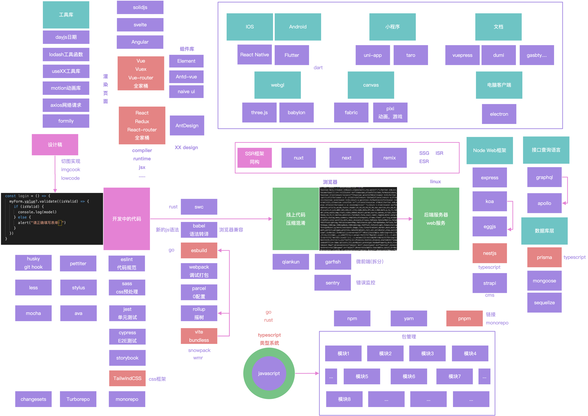

## 收尾

构建自己的知识体系

所有框架，都是为了提供更快更好的开发者体验和用户体验

【前端知识体系的全景图】

【一些方法】

迷茫的时候，多出去看看设个社会在发生什么变化，多和别人交流一下

学习

一个月看一本书，转述学习心得（写博客、录视频等等）

正确的学习方向

【学习路线：参考】

* TypeScript
* 学习同类框架，使用对比的方式学习
* 算法：leecode
* 读英文文档去巩固英语基础

【学习方法：参考】

* 良好的学习节奏
* 一定要动手
* 多反馈
* 温故知新