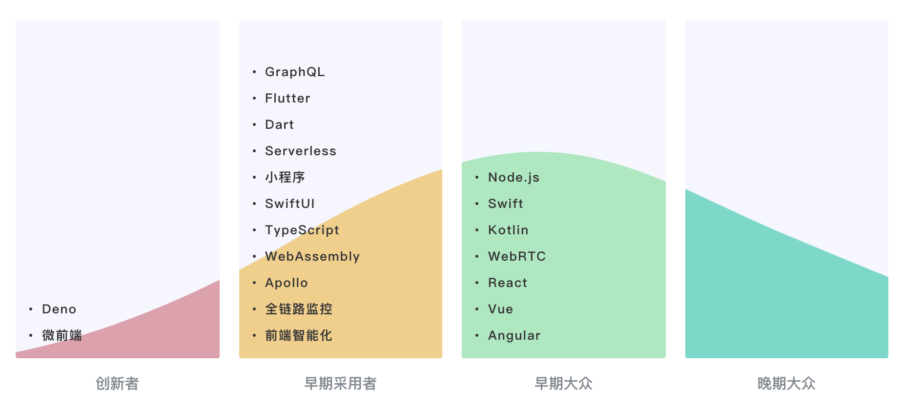

## 我们为什么要了解WebAssembly？

### 什么是WebAssembly

什么是WebAssembly？“WebAssembly是基于栈式虚拟机的虚拟二进制指令集（V-ISA）、高级编程语言的可移植编译目标。”

轻量级wasm虚拟机——TWVM（作者研发）

WCG（WebAssembly Community Group）

早期的快速实现可以让wasm在初期以“小步快跑”的方式接触前线的开发者，在不断地迭代中快速“试错”。

### wasm处于什么阶段

前端技术的生命发展周期图：

wasm正在逐渐从一个“创新者”变成一个“早期采用者“。从Web平台逐渐走向各类场景。

### wasm优势

1. 能够让我们直接在Web平台上，使用那些业界已存在许久的众多优秀的C/C++代码库
2. 能让Web应用具有更高的性能，甚至让Web应用能够与原生应用展开竞争

WASI

### wasm的发展

历史性阶段：2017年2月，四大浏览器（FireFox、Chrome、Edge、WebKit）在WebAssembly的MVP（最小可用版本）标准实现上达成共识，这意味着WebAssembly在其MVP标准上的”Browser Preview“阶段已经结束。

2019年12月，W3C正式宣布，wasm将成为除现有的HTML、CSS以及JavaScript之外的第四种，W3C官方推荐在Web平台上使用的”语言“。

知识地图：

### 怎么学？

wasm整个知识体系的内容非常庞大，且较为碎片化 => 问题导向的学习方式

#### 一、核心原理

1. Stack Machine计算模型
2. wasm使用的二进制编码方式和基本数据类型
3. 模块内部的组织结构
4. wasm的可读文本格式——WAT
5. WASI
6. wasm与Web平台的互操作性——wasm MVP标准下的JavaScript API与Web API

#### 二、wasm的应用现状

1. 能否使用wasm优化现代的Web前端框架？

   已投入生产环境的wasm案例，如何借助wasm优化产品体验

2. wasm在物联网、多媒体以及云技术等方面，一些业界正在进行的尝试

3. 目前业界最优秀的一些wasm底层基础设施，及其各自不同的特点与使用场景

   支持=> 构建稳定安全的wasm应用

4. wasm与LLVM

   LLVM：为”任意“的、基于LLVM构建的编程语言提供支持，将wasm设置为其最后的编译目标

5. wasm标准

   Post-MVP标准中的”新鲜事“

#### 三、实践

1. 完成一个线上多媒体Web应用

   使用wasm优化多媒体资源的处理过程

2. 与wasm有关的一些API及编译工具链，在实际项目中的使用方式

3. 如何调试和分析一个wasm应用

4. WASI及其相关生态的基本应用方式

### 应用场景（2017~2020）

一些作者接触过的

一项关注于底层的变革性技术