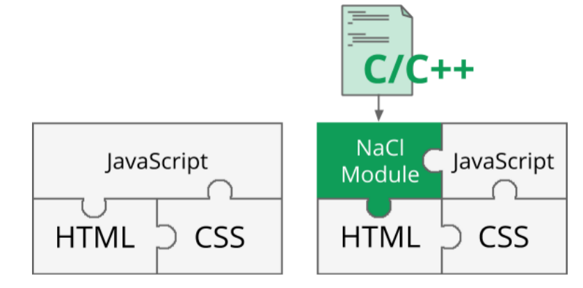
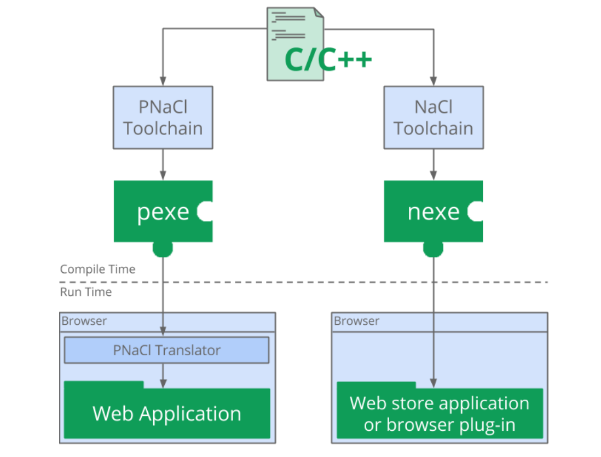

## 为什么会有WebAssembly这样一门技术

所有新兴技术的诞生都一定有它存在的意义，或者要去解决的问题。

### JavaScript的发展和困境

从Web应用层面以及JavaScript语言本身，来看看它究竟在愁些什么。

#### Web应用规模的急速增长

运行在浏览器中的各类Web应用，它们的体积与复杂性随着时间的推移在不断发展。

与日益庞大和复杂化的Web应用相比，浏览器对自身性能的优化可谓是举步维艰。

兼容旧版本浏览器产生的各类Polyfill代码，会极大地增加整个Web应用的体积。

在Web应用的实际运行过程中，大量的JavaScript代码也会降低应用的整体运行效率。

**浏览器性能优化与Web应用规模日益增大，这两者行进速度的”不协调“**

#### JavaScript的弱类型之殇

JavaScript是一个”动态类型“的编程语言。**变量具体类型的推导过程，会被推迟到代码的实际运行时再进行**。相较于静态类型语言而言，会**带来额外的运行时性能开销。**

🌰：

在ECMAScript标准中定义的”+”运算符，运行时求值流程实际上十分复杂和繁琐。这也是相对于静态语言来说，JavaScript很少能够进行优化的地方。

在现代的JavaScript引擎中，尽管可以使用诸如JIT等技术来提高代码的执行效率，但**在实际使用中，如果代码执行没有遵守JIT优化路径中特定Guard的要求，“去优化”的过程，也同样会影响引擎的整体执行效率。**这些影响都是由于JavaScript的“动态性”导致的。


### 最初的尝试——NaCl与PNaCl

NaCl（全称“Native Client”）是由Google在2011年于Chrome浏览器中发布的一项技术，该技术旨在提供一个沙盒环境，可以让基于C/C++语言编写的Native应用，安全地运行在浏览器中。

下图是**一个标准NaCl应用的组成结构**：



与普通的JavaScript Web应用十分类似。

NaCl模块作为应用的一部分，主要用来进行复杂的数据处理和计算，JavaScript则负责处理应用与外部用户的交互逻辑。NaCl实例与JavaScript代码之间可以通过“订阅/发布”模型，来互相传递消息。

理想虽好，现实却**存在很多问题。**

* 一个NaCl模块文件需要在开发者本地进行编译，才能在浏览器中使用。而本地编译的模块文件通常包含有架构相关（architecture-dependent）的代码，因此没法直接在其他类型的系统中使用。

  一个完整的NaCl应用，在分发时需要提供支持多个架构平台（X86_32/X86_64/ARM等）的模块文件。

  浏览器在实际使用时，会根据当前系统的具体架构类型，来动态地选择，对应合适的模块文件进行使用。

* 由于NaCl模块“平台依赖”的特殊性，因此NaCl模块进行分发的过程，仅能够在Chrome Web Store中进行。

* 如果想要将已经存在的C/C++代码库编译至NaCl，并在浏览器中使用，你还需要通过名为Pepper的库来对这些代码进行重写。

  Pepper提供了很多包装类型，以及用于和浏览器进行交互的API。这些API和特殊类型可以便于整合传统C/C++代码与Web浏览器的沙盒环境。

鉴于NaCl存在的“平台依赖”问题，Google在后期推出了名为PNaCl的技术，“P“代表着”Portable“，即”可移植“的意思。

PNaCl采用了不一样的生命周期，从下图可以看到，相较于**NaCl模块直接包含有平台架构相关的代码**，**PNaCl将C/C++源代码编译到一种中间代码**。这些中间代码会在浏览器实际加载这个PNaCl模块时，再被转换为对应的平台相关代码。=> 因此，对于PNaCl模块而言，分发的过程变得更加简单，且不用担心移植性的问题。



**仍然难以逾越的“大山”**：

* 需要使用Pepper重写C/C++代码
* 标准较为封闭、仅Chrome浏览器支持，等等


### wasm的前身——ASM.js

Mozilla于2013年提出的ASM.js

**ASM.js的设计目标**也是为了能够在JavaScript语言之外，为“构建更高性能的Web应用”这个目标，提供另外一种实现的可能。

**“ASM.js是什么？”**Mozilla官方给出的解答：“ASM.js是JavaScript的一个严格子集。它是一种可用于编译器的目标语言，低层次且高效。有效地为内存不安全语言（如C/C++），描述了一个沙盒虚拟机运行环境。静态和动态验证相结合的方式，使得JavaScript引擎能够使用AOT等优化编译策略来验证ASM.js代码。”

我们只需要知道两件事情：

* 第一，**ASM.js是JavaScript的严格子集。**即，对于一段ASM.js代码，JavaScript引擎可以将它视作普通的JavaScript代码来执行，这便保障了ASM.js在旧版本浏览器上的可移植性。

* 第二，ASM.js使用了**“Annotation（注解）”**的方式来标记代码中包括：函数参数、局部/全局变量，以及函数返回值在内的各类值的实际类型。

  当JavaScript引擎满足一定条件后，便会通过AOT静态编译的方式，将这些被Annotation标记的ASM.js代码，编译成对应的机器码并加以保存。

  当JavaScript引擎再次执行（甚至在第一次执行）这段ASM.js代码时，便会直接使用先前已经存储好的机器码版本。因此，引擎的性能会得到大幅的提升。

🌰：一段标准ASM.js代码的具体组成形式

```javascript
function asm(stdin, foreign, heap) {
  "use asm";
  
  function add(x, y) {
    x = x|0; // 变量x存储了int类型值
    y = y|0; // 变量y存储了int类型值
    var addend = 1.0, sum = 0.0; // 变量addend和sum默认存放了“双精度浮点“类型值
    sum = sum + x + y;
    return +sum; // 函数返回值为”双精度浮点“类型
  }
  
  return {add: add};
}
```

在以上代码中，**最为重要的是**函数"asm"在其函数体定义开头处使用的”use asm“指令。这个指令将会在代码执行过程中”告诉“JavaScript引擎，当前这个函数体内的代码可以按照ASM.js代码，来进行相应的优化和处理。

上述这样一个JavaScript函数，便定义了一个标准的ASM.js模块。模块内部可以通过return的方式，导出包含有若干内联方法的对象。这些方法可以在外部的JavaScript代码中进行调用。

在上述asm模块内定义的内联函数add中，我们在其开头的前两行代码通过“x|0”和“y|0”的方式，分别对变量x与y的值类型进行了标记。**这种方式就是ASM.js所使用的Annotation。**JavaScript引擎在编译这段代码时，会将这里的x与y的类型视为int整型。

对函数返回值的处理“+sum”，通过这样的Annotation，引擎会将变量sum的值视为双精度浮点类型。

**ASM.js在标准中还规定了其他的诸多Annotation形式，可以将变量值标记为不同的类型，甚至对值类型进行转换。**

为了确保上述的这样一个JavaScript函数，能够被当作一个标准的ASM.js模块进行必要的优化处理，JavaScript引擎通常会在实际编译加载这些模块前，进行很多必要的检查验证工作。

因此，**并不是说**只要为函数添加了“use asm”指令，并且为使用到的变量添加Annotation之后，JavaScript引擎就会通过AOT的方式来优化代码的执行。


### 从过去到未来

2015年5月，Chrome团队的Ben正在为V8设计**一种新的Prototype（**原型），而另一位团队成员Rosbery，正在为**这种Prototype设计对应的`字节码`格式**。

这个Prototype和对应的字节码格式，就是如今wasm分别对应的WAT可读文本格式与二进制字节码格式。

当时在Google内部，这两部分暂时被称为ml-proto与v8-native-prototype。

V8团队对ml-proto与v8-native-prototype的不断修改和优化，它们最终便成为了wasm早期标准的一部分。与此同时，有一个名为“sexpr-wasm”的内部工具，用于对这两种格式进行相互转换。=> 随着wasm的标准化，它也成为了wasm常用调试工具的一部分，也就是WABT。


### 总结

在wasm出现之前，人们就已经开始尝试探索各种新类型技术以赋予Web应用更高的运行效率。

从NaCl、PNaCl到ASM.js，它们主要有三点共同特征：

1. 源码中都使用了**类型明确的变量**
2. 应用都拥有**独立的运行时环境**，并且**与原有的JavaScript运行时环境分离**
3. 支持将原有的C/C++应用通过某种方式转换到基于这些技术的实现，并可以直接在Web浏览器中运行。

互联网技术迭代飞快，实际上，它们都有着基本相同的，想要去解决的目标问题，如：对于性能的执着要求；以及十分类似的技术解决方案，如：尽最大可能去确定那些能够确定、不会发生变化的部分（比如类型）；然后再以此为基础进行优化。wasm也不例外。