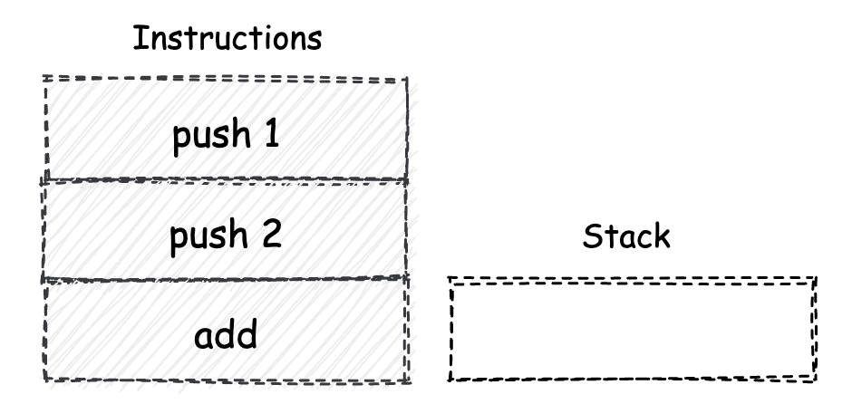
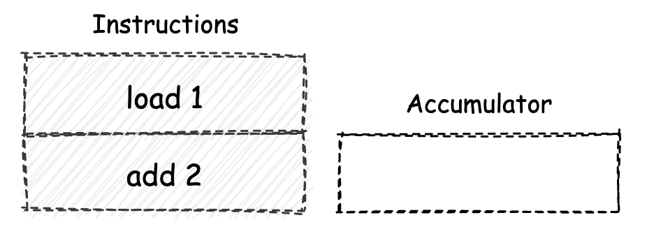
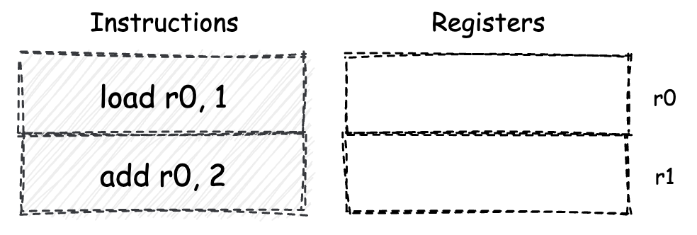

## WebAssembly是一门新的编程语言吗

“WebAssembly（缩写为wasm）是一种基于堆栈式虚拟机的二进制指令集。wasm被设计成为一种编程语言的可移植编译目标，并且可以通过将其部署在Web平台上，以便为客户端及服务端应用程序提供服务”。

以上是wasm官网对“wasm是什么”这个问题的解答。

### 三种计算模型

#### 堆栈机模型

堆栈机，全称为“堆栈结构机器”，即英文的“Stack Machine”。堆栈机本身是一种常见的计算模型。

基于堆栈机模型实现的计算机，无论是虚拟机还是实体计算机，都会使用“栈”这种结构来实现数据的存储和交换过程。

模拟：堆栈机的实际运行流程

过程中会使用到一些简单的指令，比如push、pop与add等。可以把它们想象成一种汇编指令。

大多数指令在执行时，都会从堆栈机的栈容器中取出若干个所需的操作数，然后根据指令所对应的功能，堆栈机会对取出的操作数进行一定的运算和处理；当这个过程结束后，若指令有需要返回的计算结果，这个值会被重新压入到栈容器中。

🌰：计算表达式`1+2`的值，通过栈机，这句表达式会以怎样的方式来执行呢？

**堆栈机中的栈容器，主要是作为程序执行时的数据存储和交换场所。**

对于本例中的表达式，假设没有使用任何优化策略，通常会生成类似如下几条指令。



左侧为指令集合，右侧为栈容器

push指令会将紧随其后出现的操作数直接压入栈中。

执行第三条“add”指令时，需要两个操作数，因此在执行时，堆栈机会首先检查当前的栈容器，看其中存放的元素数量是否满足“大于或等于2个”。若条件成立，会直接从栈容器的顶部取出两个操作数，然后将它们直接相加，所得到的结果会被再次压入到栈容器中。

全部指令执行完毕后，在栈容器中，会存放有表达式`1+2`在经过堆栈机求值后的结果值，即3。

#### 累加器机

累加器机是使用“累加器”，来作为指令操作数的交换场所。

它仅能够使用**可存放单一值**的累加器寄存器（简称“累加器”）单元，来作为指令操作数的暂存场所。

因此，基于累加器机模型设计的指令一般都仅支持一个操作数。

由于累加器的存储容量有限，因此对于一些需要进行暂存的中间数据，通常都只能够被存放到机器的线性内存中。由于访问线性内存的速度，一般远远低于访问寄存器的速度，因此从某种程度上来讲，累加器机的指令整体执行效率会相对较低。

🌰：对同样的表达式`1+2`求值，在累加器机中，对应的指令和执行情况，大致如下图所示。



第一条指令“load”会将其后面跟随的立即数（根据指令设计不同，后面也可能会跟随一个线性内存的地址）放到累加器中。

机器执行第二条指令“add 2”时，会将其后面跟随的立即数，累加到机器的累加器单元中。

最后一条指令完毕后，累加器中便存放着表达式`1+2`的计算终值”3“。

#### 寄存器机

基于这种计算模型的机器，将使用特定的CPU寄存器组，来作为指令执行过程中数据的存储和交换容器。

在寄存器机中，由于每一条参与到数据交换和处理的指令，都需要显式地标记操作数所在的寄存器（比如通过别名的方式），因此相较于堆栈机和累加器机，寄存器机模型下的指令相对更长。但相对地，数据的交换过程也变得更加灵活。

🌰：对同样的表达式`1+2`求值，寄存器机执行这句表达式时的具体流程，大致如下图所示。



假设在这个机器的CPU中，有”r0“与”r1“两个通用寄存器。在初始情况下，这两个寄存其中没有存放任何内容。

第一条指令”load r0, 1“。将接受两个操作数：第一个为目标寄存器的别名，第二个为一个立即数。当指令执行时，作为第二个操作数的立即数，将会被存放到由第一个操作数指定的寄存器中。

”add“指令会将作为第二个操作数的立即数，累加到由第一个操作数所指定的寄存器中。

当指令全部执行完毕后，寄存器r0中存放有表达式`1+2`的计算终值”3“。

对于某些复杂的计算流程，寄存器机可以对执行流程进行优化。而优化策略的实施便得益于其拥有的众多数据暂存容器，也就是寄存器。

#### 三种计算模型的比较

它们各自的特点与使用场景。

* 堆栈机

  使用栈结构作为数据的存储与交换容器，由于其”后进先出（LIFO）“的特性，使得我们无法直接对位于栈底的数据进行操作。因此在某些情况下，机器会使用额外的指令来进行栈数据的交换过程，从而损失了一定的执行效率。

  堆栈机模型最为简单且易于实现，对应生成的指令代码长短大小适中。

* 累加器机

  由于其内部只有一个累加器寄存器可用于暂存数据，因此在指令的执行过程中，可能会频繁请求机器的线性内存，从而导致一定的性能损耗。

  由于累加器模型下的指令最多只能有一个操作数，因此对应的指令较为精简。

* 寄存器机

  大多数与数据操作相关的指令，都需要在执行时指定目标寄存器，这无疑增加了指令的长度；过于灵活的数据操作，也意味着寄存器的分配和使用规则变得复杂。

  众多的数据暂存容器，给予了寄存器机更大的优化空间；可以生成更为高效的指令执行结构。

  

### ISA与V-ISA

对应于每一种计算模型的指令，都有着不同的基本结构。比如指令可以接受的操作数个数、可操作数据所存放的位置，以及指令与指令之间交互方式的细微差别等等。

应用在诸如i386、X86-64等实际存在的物理系统架构上的指令集，我们一般称之为ISA（Instruction Set Architecture，指令集架构）；对应使用在虚拟架构体系中的指令集，称之为V-ISA，也就是Virtual（虚拟）的ISA。

对V-ISA的设计，大多都是基于堆栈机模型进行的。而wasm就是这样的一种V-ISA。

主要原因是由于堆栈机本身的设计与实现较为简单；快速的原型实现可以为wasm的未来发展预先试错。

另一个重要原因是，借助于堆栈机模型的栈容器特征，使得wasm模块的指令代码验证过程变得更加简单。

基于堆栈机的结构化控制流，通过对wasm指令进行SSA（Static Single Assignment Form，静态单赋值形式）变换，可以保证即使是在堆栈机模型下，wasm代码也能够有着较好的执行性能。

#### wasm虚拟指令集

如下是一段标准的wasm指令。

```javascript
i32.const 1
i32.const 2
i32.add
```

`i32.const`这个指令，会将紧随其后的立即数作为一个i32类型，也就是32位整数类型的值，压入到堆栈机的栈容器中。

诸如`i32.const`与`i32.add`，其实都是wasm这个V-ISA指令集中，各个指令所对应的文本助记符（mnemonic）。

wasm虽然有着类似汇编语言的这种”助记符“形式，但在大多数情况下，它仅被作为诸如C/C++等高级编程语言的最终编译目标。（非手写）


### 总结

wasm是一种基于堆栈机设计的V-ISA指令集。

包括wasm在内的ISA与V-ISA指令集，都有着指令集所相对应的助记符形式，以及实际用于物理机器，或虚拟机执行的对应二进制字节码形式。

回答标题：

它不是一门编程语言，因为它完全不同于我们常见的高级程序设计语言，我们通常仅将其用作编译器的一种新的编译目标。

它又可以是一门”编程语言“，因为我们可以通过助记符的形式来直接进行wasm指令集程序的编写。
