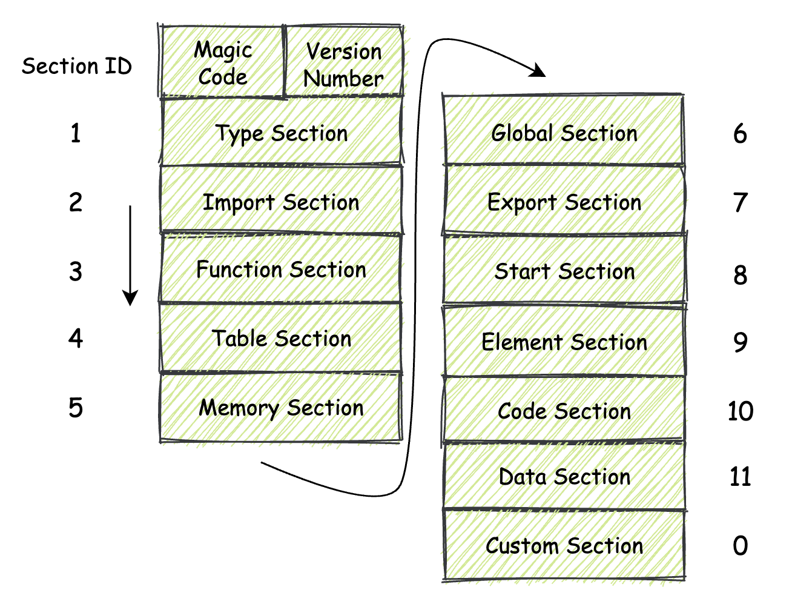
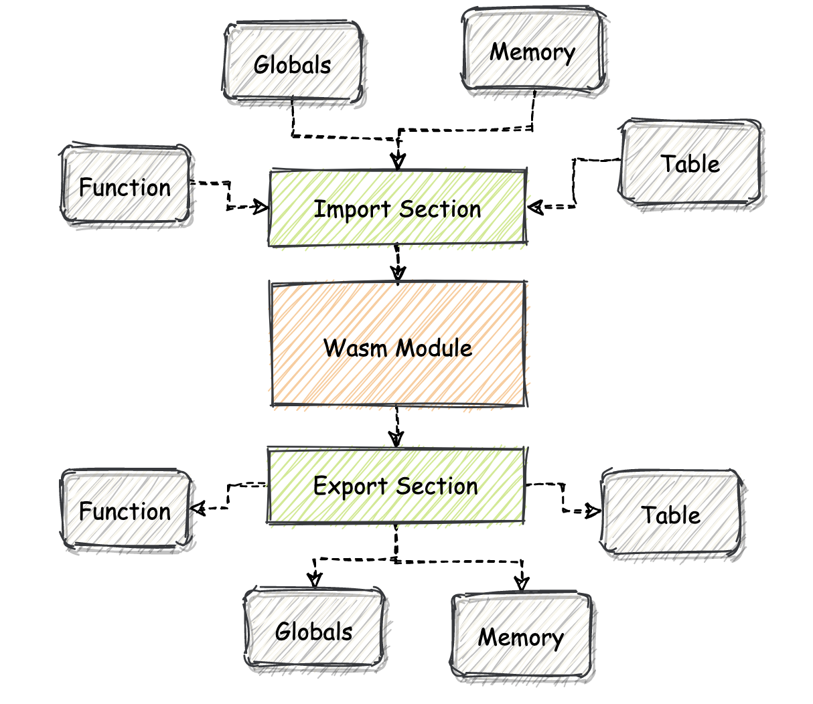
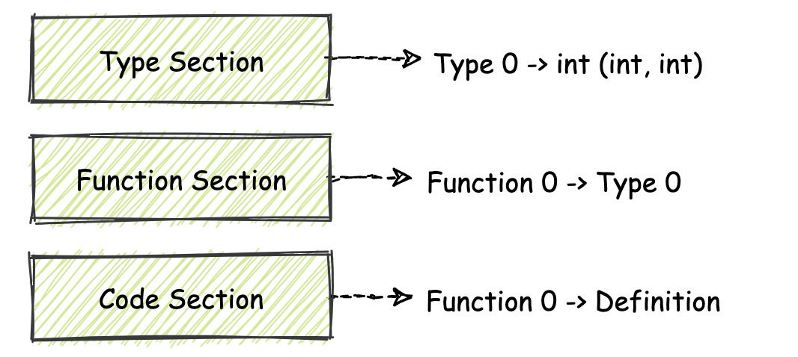
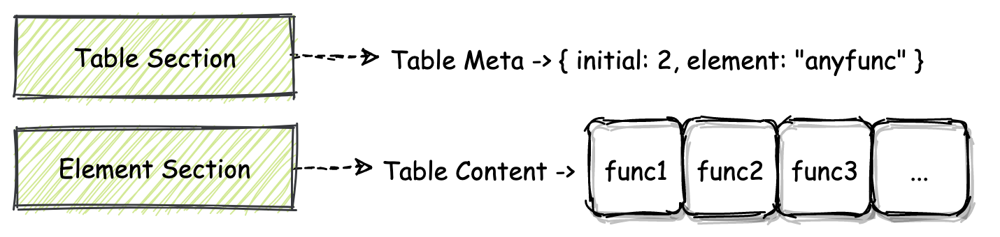
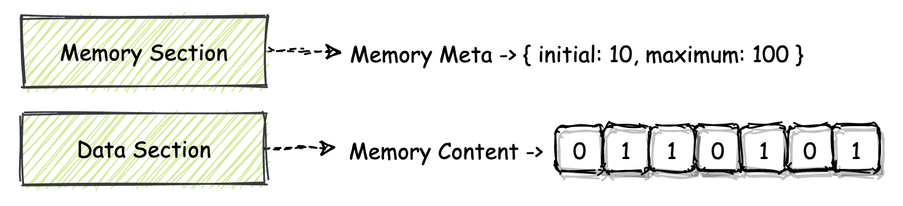
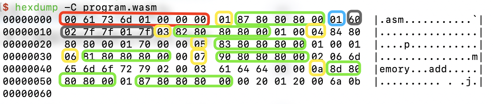

## WebAssembly模块的基本组成结构

wasm模块的字节码结构

它在二进制层面的基本布局，以及内部各个结构之间的协作方式。

只有在真正了解wasm模块的二进制组成结构之后，你才能够知道浏览器引擎在处理和使用一个wasm模块时究竟发生了什么。

wasm模块内部组成的真实面目——section

### section概览

同ELF二进制文件类似，wasm模块的二进制数据也是以section的形式被安排和存放的。

**对于section，你可以直接把它想象成，一个个具有特定功能的一簇二进制数据。**通常，为了能够更好地组织模块内的二进制数据，我们需要把具有相同功能、或者相关联的那部分二进制数据摆放到一起。而**这些被摆放在一起，具有一定相关性的数据，便组成了一个个section。**

每一个不同的section都描述了关于这个wasm模块的一部分信息。**模块内的所有section放在一起，便描述了整个模块在二进制层面的组成结构。**

在一个标准的wasm模块内，以现阶段的MVP标准为参考，可用的section有如下几种：



除了其中名为”Custom Section“，也就是”自定义段“这个Section之外，其他的section均需要按照每个section所专有的section ID，按照这个ID从小到大的顺序，从模块的低地址位到高地址位方向依次进行”摆放“。


### section的作用和结构

#### 单体section

这一类section一般可以独自描述整个模块的一部分特征（或者或是功能），同时也可以与其他section一起配合起来使用。

这种划分规则并非来源于标准或者官方

##### Type Section（ID：1）


这个Section**用来存放与“类型”相关的东西。**这里的类型，主要是指“函数类型”。

“函数”是编程语言的基本代码封装单位

函数类型一般由函数的参数和返回值两部分组成。而只要知道了这两部分，我们就能够确定在函数调用前后，栈上数据的变化情况。因此，对于“函数类型”，你也可以将其直接理解为更加常见的一个概念——“函数签名”。

我们可以将Type Section的组成内容分为如下两个部分，分别是：所有Section都具有的**通用“头部”结构**，以及各个Section所专有的、不同的**有效载荷部分**。

**每一个Section都由有着相同结构的“头部”作为起始**，在这部分结构中描述了这个Section的一些属性字段；比如其专有ID、其有效载荷长度，以及一些可选字段。关于通用头部结构的具体字段组成，可以参考下表：

| 字段             | 类型       | 描述                               |
| ---------------- | ---------- | ---------------------------------- |
| id               | varuint7   | Section专有ID                      |
| payload_len      | varuint32  | 该Section有效载荷的大小            |
| name_len（可选） | varuint32? | 用于自定义段，当id为0时存在        |
| name（可选）     | bytes?     | 用于自定义段，有效的UTF8类型字符串 |
| payload_data     | bytes      | 该Section的有效载荷                |

“字段”这一列中的“name_len”与“name”两个字段主要用于Custom Section，用来存放这个Section名字的长度，以及名字所对应的字符串数据。

> 可变长无符号整数。wasm支持三种可变长非负整数类型：varuint1、varuint7、varuint32，所谓可变长的意思是会根据具体数据大小决定使用多少bit，后面的数字表示最大可占用多少个bit
>
> varuint32 表示的是被编码的数字本身可以表示为 32bit，并不是说编码的结果是 32bit。

**紧接着排在“头部”后面的便是这个Section相关的有效载荷信息（payload_data）。**每个不同类型的section其有效载荷的结构都不相同。Type Section的有效载荷部分组成如下表所示：

| 字段            | 类型       | 描述                         |
| --------------- | ---------- | ---------------------------- |
| count           | varuint32  | Type Section中存放的Type个数 |
| entries（多个） | func_type* | 连续存放的多个Type的实体     |

可见，Type Section的有效载荷部分是由一个count字段和多个entries字段数据组合而成的。注意：entries字段对应的func_type类型，是一个复合类型，其具体的二进制组成结构又通过另外的一些字段来描述，具体可以参考下表：

| 字段                | 类型        | 描述                                         |
| ------------------- | ----------- | -------------------------------------------- |
| form                | varint7     | 类型构造符“func”对应的OpCode值               |
| param_count         | varuint32   | 函数的参数个数                               |
| param_type（可选）  | value_type? | 用于有参数的函数，函数的参数类型，依次排列   |
| return_count        | varuint1    | 函数的返回值个数                             |
| return_type（可选） | value_type? | 用于有返回值的函数，表示返回值类型，依次排列 |

##### Start Section（ID：8）


通过这个Section，我们可以**为模块指定在其初始化过程完成后，需要首先被宿主环境执行的函数。**

“初始化完成后”是指：模块实例内部的线性内存和Table，已经通过相应的Data Section和Element Section填充好相应的数据，但导出函数还无法被宿主环境调用的这个时刻。

对于Start Section来说，有一些限制是需要注意的，比如：

* 一个wasm模块只能拥有一个Start Section，也就是说只能调用一个函数
* 其调用的函数不能拥有任何参数
* 也不能有任何的返回值

##### Global Section（ID：6）


这个Section中**主要存放了整个模块中使用到的全局数据（变量）信息。**这些全局变量信息可以用来控制整个模块的状态，你可以直接把它们类比为我们在C/C++代码中使用的全局变量。

在这个Section中，对于每一个全局数据，我们都需要标记出它的值类型、可变性（即这个值是否可以被更改）以及值对应的初始化表达式（指定了该全局变量的初始值）。

##### Custom Section（ID：0）

这个Section**主要用来存放一些与模块本身主体结构无关的数据**，比如调试信息、source-map信息等等。

VM（Virtual Machine，虚拟机）在实例化并执行一个wasm二进制模块中的指令时，对于可以识别的Custom Section，将会以特定的方式为其提供相应的功能。而对于无法识别的Custom Section则会选择直接忽略。

**VM对于Custom Section的识别，主要通过它“头部”信息中的“name”字段来进行。**在目前的MVP标准中，有且仅有一个标准中明确定义的Custom Section，也就是“Name Section”。这个Section对应的头部信息中，“name”字段的值即为字符串“name”，在这个Section中存放了有关模块定义中“可打印名称”的一些信息。

#### 互补Section

每一组的两个Section共同协作，一同描述了整个wasm模块的某方面特征。

##### Import Section（ID：2）和Export Section（ID：7）



通过上图可以直观地了解这两个Section的具体功能。

**Import Section主要用于作为wasm模块的“输入接口”。**在这个Section中，定义了所有从外界宿主环境导入到模块对象中的资源，这些资源将会在模块的内部被使用。

允许被导入到wasm模块中的资源包括：函数（Function）、全局数据（Global）、线性内存对象（Memory）以及Table对象（Table）。

能够在wasm模块之间，以及wasm模块与宿主环境之间共享代码和数据。

**通过Export Section，我们可以将一些资源导出到虚拟机所在的宿主环境中。**

导出的资源应该如何被表达及处理，则需要由宿主环境运行时的具体实现来决定。

##### Function Section（ID：3）和Code Section（ID：10）



**Function Section中存放了这个模块中所有函数对应的函数类型信息。**

**在wasm标准中，所有模块内使用到的函数都会通过整型的indicies来进行索引并调用。**

可以想象一个数组，其中的每一个单元格内都存放有一个函数指针，当你需要调用某个函数时，通过“指定数组下标”的方式来进行索引就可以了。Function Section便描述了在这个数组中，从索引0开始，一直到数组末尾所有单元格内函数，所分别对应的函数类型信息。

Type Section存放了wasm模块使用到的所有函数类型（签名）；Function Section存放了模块内每个函数对应的函数类型，即具体的函数与类型对应关系；而Code Section中存放的则是每个函数的具体定义，也就是实现部分。

**Code Section的组织结构从宏观上来看，同样可以将它理解成一个数组结构，这个数组中的每个单元格都存放着某个函数的具体定义，也就是函数体对应的一簇wasm指令集合。**

每个Code Section中的单元格都对应着Function Section这个“数组”结构在相同索引位置的单元格。

上述提到的各种“数组”结构，只是从各个Section概念上的协作和数据引用方式来看，可以通过数组来模拟这样的交互流程。具体实现需要依各个VM为准。

##### Table Section（ID：4）和Element Section（ID：9）



**在MVP标准中，Table Section的作用并不大，你只需要知道我们可以在其对应的Table结构中存放类型为“anyfunc“的函数指针，并且还可以通过指令”call_indirect“来调用这些函数指针所指向的函数**，就可以了。

在实际的VM实现中，虚拟机会将模块的Table结构，初始化在独立于模块线性内存的区域中，这个区域无法被模块本身直接访问。因此Table中这些”小格子“内具体存放的值，对于wasm模块本身来说是不可见的。

在使用call_indirect指令时，只能通过indicies，也就是“索引”的方式，来指定和访问这些“小格子”中的内容。这在某种程度上，保证了Table中数据的安全性。

在默认情况下，Table Section是没有与任何内容相关联的，也就是说从二进制角度来看，**在Table Section中，只存放了用于描述某个Table属性的一些元信息**。比如：Table中可以存放哪种类型的数据？Table的大小信息？等等。

为了给Table Section所描述的Table对象填充实际的数据，我们还需要使用**名为Element Section的Section结构。通过这个Section，我们便可以为Table内部填充实际的数据。**

##### Memory Section（ID：5）和Data Section（ID：11）



**借助Memory Section，我们可以描述一个wasm模块内所使用的线性内存段的基本情况**，比如这段内存的初始大小、以及最大可用大小等等。

wasm模块内的线性内存结构，主要用来以二进制字节的形式，存放各类模块可能使用到的数据，比如一段字符串、一些数字值等等。

通过浏览器等宿主环境提供的比如WebAssembly.Memory对象，我们可以直接将一个wasm模块内部使用的线性内存结构，以”对象“的形式从模块实例中导出。

同样，**在Memory Section中，也只是存放了描述模块线性内存属性的一些元信息，如果要为线性内存段填充实际的二进制数据，我们还需要使用另外的Data Section**。


以上就是，在MVP标准下，wasm模块内Section的二进制组成结构


### 魔数和版本号

Section信息固然十分重要，但另一个更重要的问题是：我们如何识别一个二进制文件是不是一个合法有效的wasm模块文件呢？

同ELF二进制文件一样，wasm也同样使用”魔数“来标记其二进制文件类型。魔数，可以简单将它理解为具有特定含义/功能的一串数字。

一个标准wasm二进制模块文件的头部数据是由具有特殊含义的字节组成的。

* 开头的前四个字节分别为”（高地址）0x6d 0x73 0x61 0x0（低地址）“。

  这四个字节对应的ASCII可见字符为”asm“（第一个为空字符，不可见）

* 接下来的四个字节，用来表示当前wasm二进制文件所使用的wasm标准版本号

  目前来说，所有wasm模块该四个字节的值均为”（高地址）0x0 0x0 0x0 0x1（低地址）“，即表示版本1

* 在实际解析执行wasm模块文件时，VM也会通过这几个字节来判断，当前正在解析的二进制文件是否是一个合法的wasm二进制模块文件。

🌰：分析一个简单的wasm模块文件的二进制组成结构

以下为C/C++代码：

```c++
int add (int a, int b) {
  return a + b;
}
```

在此段代码中，定义一个简单的函数”add“。该函数接收两个int类型的参数，并返回这两个参数的和。

使用一个名为wasmFiddle的[在线wasm编译工具](https://wasdk.github.io/WasmFiddle/)，将其编译成对应的wasm二进制文件，并下载至本地。

使用”hexdump“命令查看这个二进制文件的字节码内容：

```shell
$ hexdump -C program.wasm 
00000000  00 61 73 6d 01 00 00 00  01 87 80 80 80 00 01 60  |.asm...........`|
00000010  02 7f 7f 01 7f 03 82 80  80 80 00 01 00 04 84 80  |................|
00000020  80 80 00 01 70 00 00 05  83 80 80 80 00 01 00 01  |....p...........|
00000030  06 81 80 80 80 00 00 07  90 80 80 80 00 02 06 6d  |...............m|
00000040  65 6d 6f 72 79 02 00 03  61 64 64 00 00 0a 8d 80  |emory...add.....|
00000050  80 80 00 01 87 80 80 80  00 00 20 01 20 00 6a 0b  |.......... . .j.|
00000060
```



可以看到，最开始红色方框内的前八个字节”0x0 0x61 0x73 0x6d 0x1 0x0 0x0 0x0“就是前面介绍的，wasm模块文件开头的”魔数“和版本号。（地址增长的方向是从左向右）

**第一个黄色框**”0x1“是Section头部结构中的”id“字段，这里的值表明接下来的数据属于模块的Type Section。接着绿色框内的五个十六进制数字“0x87 0x80 0x80 0x80 0x0”是由varuint32编码的“payload_len”字段信息，经过解码，它的值为“0x7”，表明这个Section的有效载荷长度为7个字节。

Type Section的有效载荷是由一个count字段和多个entries类型数据组成的。由此可推断，接下来蓝框内的“0x1”代表着entries的个数为1。紫色框代表内的六个十六进制数字序列“0x60 0x2 0x7f 0x7f 0x1 0x7f”代表Type实体，即一个接受两个i32类型参数，并返回一个i32类型值的函数类型。（60：OpCode，02：参数个数，7f：i32，01：返回值个数）

**第二个黄色框**“0x3"表示属于Function Section，绿色框的五个十六进制数字表示有效载荷的长度，接着”0x1“表示函数的个数，”0x0“表示function0对应签名的下标。

**第三个黄色框**”0x4“表示属于Table Section（不太懂为啥生成一个Table。。），跟着的五个十六进制数字表示有效载荷的长度，接着的“0x1”可能是个数（猜测），“0x7 0x0 0x0”是啥不知道

**第四个黄色框**“0x5”表示属于Memory Section，后面的绿色框表示有效载荷的长度，紧接的“0x1”表示内存数量，“0x0”表示设置limits变量，“0x1”表示将limits初始化为1

**第五个黄色框**“0x6”表示属于Global Section，绿色框表示有效载荷的长度，紧接的“0x0”表示全局变量数量为0？

**第六个黄色框**“0x7”表示属于Export Section，绿色框表示有效载荷的长度，紧接的“0x2”表示导出数量为2，“0x6”表示字符串长度为6，“0x6d 0x65 0x6d 0x6f 0x72 0x79”表示字符串“memory”，“0x2”表示导出类型，“0x0”表示索引位置，“0x3”表示字符串长度为3，“0x61 0x64 0x64”表示字符串“add”，“0x0”表示导出类型，“0x0”表示索引位置

**第七个黄色框**“0xa"表示属于Code Section，跟随的第一个绿色框表示有效载荷的长度，紧接的”0x1“表示函数定义数量为1，第二个绿色框表示函数体的有效载荷长度，”0x0“表示 local decl count（不知道是啥），”0x20“表示local.get，”0x1“表示local index，”0x20“表示local.get，”0x0“表示local index，”0x6a“表示i32.add，”0x0b“表示end。

[wat2wasm demo](https://webassembly.github.io/wabt/demo/wat2wasm/)

[wasm Fiddle](https://wasdk.github.io/WasmFiddle/)


### 总结

主要介绍了一个wasm模块在二进制层面的具体组成结构

除了专有Section，模块还可以通过Custom Section来支持一些自定义功能。这个Section一般可以用于提供一些VM专有的、而可能又没有被定义在wasm标准中的功能，比如一些与调试相关的特性等等。

整个wasm模块中最为重要的，位于模块二进制代码最开始位置的”魔数“以及”版本号“。这两个字段主要会被VM用于对wasm模块的类型进行识别；当VM检测到二进制文件中的某一个字段不符合规范时，则会立即终止对该模块的初始化和后续处理。


### 思考题

了解ELF格式的Section结构，与wasm Section在设计上的异同之处？

[Wiki ELF](https://en.wikipedia.org/wiki/Executable_and_Linkable_Format)：

根据Wikipedia上的描述，ELF文件有两种视图：program header显示运行时使用的segments，section header列出sections的集合。

segment包含运行时文件执行所需的信息，section包含用于链接和重定位的重要数据

根据剖析simple.arm示例图可见section包含Code、Data和Sections' names三部分，Code对应汇编指令、Data对应字符数据、Sections' names对应Section名称

> 大概看了一下wiki，ELF包含两种视图：program header显示运行时使用的segments，Section header列出section的集合；关于section的信息有code、data和section name，section包含用于链接和重定位的重要数据。
> 两种section相同处是都有header描述section的信息，以及具体的数据。不同处是elf中用于描述section的header在elf的section header table中，而wasm的header是在section内部；并且elf中的section不用按顺序排列。
> 对elf不太了解，不知道理解的对不对。


[oracle ELF](https://docs.oracle.com/cd/E37838_01/html/E61063/elf-23207.html)


