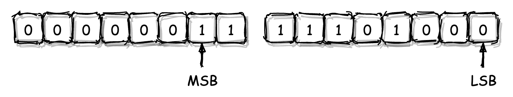
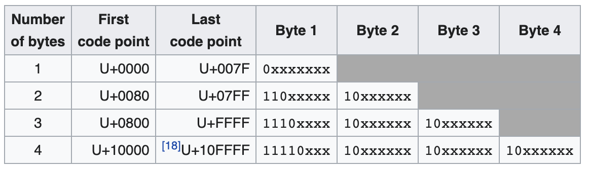

## 二进制编码：WebAssembly微观世界的基本数据规则

wasm会使用不同的编码方案来处理不同的字段数据。

对于字符串以及浮点数，wasm会分别通过UTF-8以及IEEE-754编码来将这些字面量值转换为对应的二进制编码，并存储到最终的wasm二进制模块文件中。

数据编码方式：wasm在二进制层面的具体数据存储规则

### 字节序

字节码组成方式最为重要的一个特征

在大多数现代计算机体系架构中，计算机的最小可寻址数据为8位，即1个字节。

我们通常将1字节定义为1个存储单元的大小。对于连续占用了多个存储单元的数据，我们通常称之为“多字节数据”，组成这段数据的每个字节都会地址连续地进行存放。

🌰：假设有一个short类型的变量，其值为1000。（二进制表示为：11 1110 1000）

对于一个多字节数据，我们会将其二进制形式下，用于组成该数字值的最低有效数字位与最高有效数字位，分别称为这个数据的“最低有效位（LSB，Least Significant Bit）”和”最高有效位（MSB，Most Significant Bit）“。

**将这个多字节数据存放到物理内存中时，一个对于存储方式的不同抉择便出现了。**

将多字节数据的LSB位，存放到物理内存的低地址段；还是将多字节数据的LSB位，存放到物理内存的高地址段呢？实际上两种方式均有被业界所使用，分别被称为“小端模式”与“大端模式”。

#### 小端模式（Little-Endian）

小端模式即“将多字节数据的LSB位存放到内存的低地址位，相应地将MSB位存放到内存的高地址位”。

#### 大端模式（Big-Endian）

在大端模式下，多字节数据的LSB位所对应部分会被存放到内存的高地址位，而MSB对应的部分则会被存放到内存的低地址位。

两者并没有优劣之分，这两种模式均被广泛地应用在基于不同处理器架构的计算机和一些特殊的应用场景中。

### LEB-128 整数编码

LEB-128全称为“Little Endian Base 128），是一种用于整数的、基于小端模式的可变长编码。

所谓”可变长编码“，是指源数据在经过编码后，所得到的目标编码结果长度并不固定。依据不同的输入数据会得到不同长度的编码结果。

LEB-128编码通常可以被分为两种更为具体的形式，即”Unsigned LEB-128“与”Signed LEB-128“。后者主要用于编码有符号整数。

下面是两种LEB-128编码方式的具体编码规则。

#### Unsigned LEB-128

🌰：编码一个正整数123456。编码具体步骤如下：

1. 将该十进制数转换为对应原码的二进制表示方式。

   `1 1110 0010 0100 0000`

2. 将该二进制数用额外的”0“位进行填充，直至其总位数达到最近的一个7的倍数。

   这种为无符号数进行位数扩展的方式一般称之为”零扩展“。

   `0000 1 1110 0010 0100 0000`

3. 将该二进制数以每7个二进制位为一组进行分组

   `0000111 1000100 1000000`

4. 在最高有效位所在分组的左侧填充一个值为”0“的二进制位；在其他分组的最高位左侧填充一个值为”1“的二进制位。

   `00000111 11000100 11000000`

5. 将上述二进制位分组以每组为单位，转换成对应的十六进制值，即为编码所得结果。

   `0x7 0xc4 0xc0`

对于Unsigned LEB-128编码的解码过程，实质上与编码过程完全相反。

#### Signed LEB-128

实质上与Unsigned LEB-128十分类似。

🌰：编码一个有符号的负整数-123456。编码的具体流程如下：

1. 将该数字转换为对应的二进制表示形式。（由于-123456是一个有符号数，因此在编码时需要使用它的补码形式）。第一位是符号位，”1“表示对应的十进制数是一个负数

   原码：`1 1 1110 0010 0100 0000`

   反码：`1 0 0001 1101 1011 1111`

   补码：`1 0 0001 1101 1100 0000`

2. 对这个有符号数进行”符号扩展“操作。

   所谓”符号扩展“是指对二进制数的最高位，也就是符号位，其左侧填充指定的二进制位来增加整个有符号数的总位数。对于负整数来说，填充”1“，而正整数则填充”0“。

   这里要对其进行符号扩展，直到这个二进制数的总位数达到最近的一个7的倍数。

   `111 1 0 0001 1101 1100 0000`

3. 将以上这个二进制数以每7个二进制位为一组进行分组

   `1111000 0111011 1000000`

4. 同样，在最高有效位所在分组的左侧填充一个值为”0“的二进制位；在其他分组的最高位左侧填充一个值为”1“的二进制位。

   `01111000 10111011 11000000`

5. 将上述二进制分组以每组为单位，转换成对应的十六进制值，即为编码所得结果

   `0x78 0xbb 0xc0`

可以看到，Signed LEB-128与Unsigned LEB-128在编码规则上的不同，仅体现在整个编码流程的前两步。

另外还需要注意的是，经过编码计算所得的结果，需要按照”小端模式“的方式存放在内存中，这也是LEB-128编码的一个重要特征。

当在实际应用LEB-128编码时，有时由于所编码数字有着固定的大小（比如64位），因此会导致实际的编码结果中可能会含有特殊的”填充字节“，比如”0x80“与”0xff“。

### IEEE-754 浮点数编码

IEEE-754是一种用于进行浮点数编码的行业标准。

在IEEE-754标准中规定，一个浮点数由三个不同的部分组成，即”符号位“、”指数位“与”小数位“。

🌰：以32位浮点数”1234.567“为例，得到它在IEEE-754下的实际编码结构。

* 首先，32位的最高位，也就是其MSB位会被符号位占用，以标记该浮点数的正负性；

* 紧接着符号位的是长度为8位的”指数位“。注：该位记录的是，当以”科学计数法“形式表示一个浮点数时，表示法中底数所对应的幂次值。（二进制，所以底数为”2“）。

  指数位采用一种名为”移码“的值存储方法，以便能支持负数次幂。即，当我们计算该位的实际值时，会将从上一步中得到的幂次值与127相加，以得到该位的最终结果。

  计算对应的指数位值，具体步骤如下：

  1. 将浮点数按照整数位和小数位，分别转换成对应的二进制表示形式

     `100 1101 0010.1001 0001 0010 01...`

  2. 将从上一步得到的二进制小数，以”科学计数法“的形式进行表示。

     `1.0011 0100 1010 0100 0100 1001... * 2^10`

  3. 计算指数位对应的十进制数值。即上述2的幂次值10，再加上127，得到137。换算成二级制序列即`1000 1001`。

     至此，就计算出了浮点数1234.567在IEEE-754编码下，其组成部分中指数位对应的二进制序列。

* 紧接着指数位的是剩下23位的“小数位”，该位主要用于存放浮点数在二进制科学计数法形式下，对应的小数部分序列。注：这部分只有23位大小，对于溢出的部分将会被直接截断。

* 最后，我们就可以得到浮点数1234.567在IEEE-754编码下的完整组成形式

  `0|1000 1001|0011 0100 1010 0100 0100 100`

  sign|exponent|mantissa

在wasm模块中，所有以字面量形式出现的浮点数值，都会通过IEEE-754进行编码。而进过编码生成的二进制序列，也将成为wasm二进制模块组成的一部分。

### UTF-8 字符串编码

与LEB-128类似，UTF-8也是一种可变长编码，即随着被编码内容的不同，实际产生的编码结果其长度也各不相同。

UTF-8的编码结果值可能会有着从最少1个字节到最多4个字节不等的长度。

UTF-8编码过程是基于Unicode字符集进行的。在Unicode字符集中，每一个字符都有其对应的码位值。

如，对于汉字“极”，它在Unicode字符集中的码位值为“26497”，换算为十六进制即“0x6781”。因此，我们可以说汉字“极”对应的Unicode码位值便为“U+6781”。

Unicode虽然规定了各个字符对应的码位值，但却没有规定这些值应该以怎样的格式被计算机存储。

🌰：以汉字“极”为例，介绍UTF-8编码的具体过程。

1. 先将该汉字对应的码位值展开成二进制序列的形式

   `0110 0111 1000 0001`

2. 根据上图中第三行对应的规则（码位值位于[U+0800, U+FFFF]之间），替换出UTF-8编码对应的三个字节。

   替换时，需要将从上一步获得的二进制序列中的各个二进制位，按照从左到右的顺序依次替换掉UTF-8编码中用于占位的“x“。（总共16个x）

   `1110(0110) 10(011110) 10(000001)`

3. 将替换结果转换为对应的十六进制形式，即为UTF-8编码的最终结果。

   `0xe6 0x9e 0x81`

### wasm 数字类型

以上介绍了，在wasm二进制模块中，可能会使用到的所有二进制编码方案。

对于整数的编码，wasm并没有”直接使用“LEB-128，而是在其基础之上又做了进一步的约束。

wasm将其模块内部所使用到的数字值分为以下三种类型：

* uintN（N=8|16|32）

  该类型表示了一个占用N个bit的无符号整数。（该整数由N/8个字节组成，并以小端模式进行存储）。

* varuintN（N=1|7|32）

  该类型表示一个使用Unsigned LEB-128编码，具有N个bit长度的可变长无符号整数。

  对应各类型的可取值范围为[0, 2^N-1]。

  注：当使用较大数据类型（比如N取32）来存放较小的值，比如12时，在经过Unsigned LEB-128编码后的二进制序列中，可能会存在用于占位的字节”0x80“。

* varintN（N=7|32|64）

  该类型与上述varuintN类似，只不过表示的是使用Signed LEB-128编码，具有N个bit长度的可变长有符号整数。

  对应各类型的取值范围为[-2^(N-1), +2^(N-1)-1]。

  注：当在使用一个较大类型（比如N取64）保存较小的整数值时，经过Signed LEB-128编码后的二进制序列中，可能会存在用于占位的字节”0x80“或”0xff“。

联系上一讲中，section通用头部信息的字段中，id字段对应的数据类型为”varuint7“，payload_len字段对应的为varuint32”。

上述类型只是规定了对应类型的字段其可取值范围，但并不代表对应的字段值需要以一个固定的长度来进行编码。如，一个类型为varint32的字段值，虽然此处N为32，但实际编码时并不需要把数字值先扩展为32位；但以扩展后的32位值来进行编码，结果也是一个有效的编码值。

### 总结

wasm使用了不同的编码方式来编码其内部使用到的各类字面量数据。

这些字面量值可能被使用在包括“指令立即数”、“指令OpCode”以及“Section组成结构”等组成wasm二进制模块的各个部分中。

对于整数，wasm使用LEB-128编码方式来编码具有不同长度（N），以及具有不同符号性（Signed/Unsigned）的字面量整数值；对于浮点数，wasm使用了业界最常用的IEEE-754标准进行编码；而对于字符串，wasm也同样采用了业界的一贯选择——UTF-8编码。

用于字符串的UTF-8以及用于浮点数的IEEE-754编码标准，是我们在日常开发中最为常见的两种编码方式。

基于LEB-128的可变长编码，也可以对整型数值类型有一个很好的二进制表示方式

### 课后练习

有符号数“-654321”在varint32类型下的可能编码值是多少呢？

【无扩展】

1. 获得补码

原码：`1 1001 1111 1011 1111 0001`

反码：`1 0110 0000 0100 0000 1110`

补码：`1 0110 0000 0100 0000 1111`

2. 符号扩展

刚好21位，不用扩展

3. 分组

`1011000 0001000 0001111`

4. 填充

`01011000 10001000 10001111`

5. 转为十六进制

`0x58 0x88 0x8f`

【扩展为32位】

1. 获得补码

原码：`1000 0000 0000 1001 1111 1011 1111 0001`

反码：`1111 1111 1111 0110 0000 0100 0000 1110`

补码：`1111 1111 1111 0110 0000 0100 0000 1111`

2. 符号扩展

扩展为35位

`111 1111 1111 1111 0110 0000 0100 0000 1111`

3. 分组

`1111111 1111111 1011000 0001000 0001111`

4. 填充

`01111111 11111111 11011000 10001000 10001111`

5. 转换十六进制

`0x7f 0xff 0xd8 0x88 0x8f`

