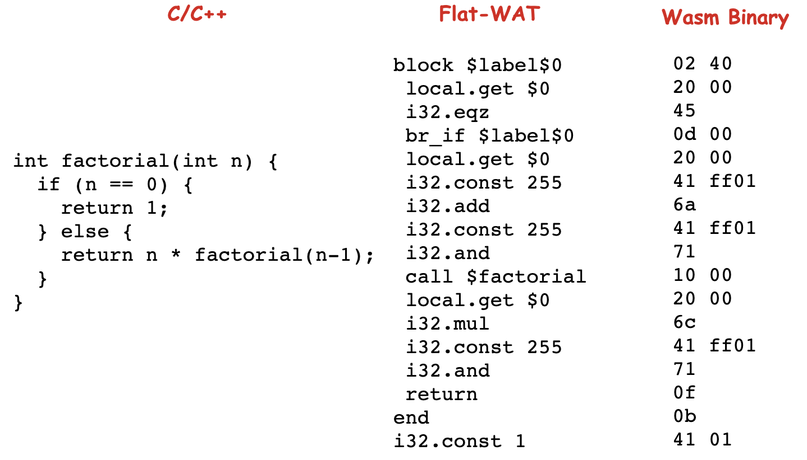

## WAT：如何让一个WebAssembly二进制模块的内容易于解读

一种更为简单、更具有可读性的方式来解读一个wasm模块的内容

### WAT（WebAssembly Text Format）

🌰：如下一段C/C++源代码，定义了一个函数factorial，该函数接受一个int类型的整数n，然后返回该整数所对应的阶乘。

```c
int factorial(int n) {
  if (n == 0) {
    return 1;
  } else {
    return n * factorial(n-1);
  } 
}
```

使用[wasmFiddle](https://wasdk.github.io/WasmFiddle/)编译成对应的WAT代码：（默认编译选项：-O3 -std=C99）

```asm
(module
 (table 0 anyfunc)
 (memory $0 1)
 (export "memory" (memory $0))
 (export "factorial" (func $factorial))
 (func $factorial (; 0 ;) (param $0 i32) (result i32)
  (local $1 i32)
  (local $2 i32)
  (block $label$0
   (br_if $label$0
    (i32.eqz
     (get_local $0)
    )
   )
   (set_local $2
    (i32.const 1)
   )
   (loop $label$1
    (set_local $2
     (i32.mul
      (get_local $0)
      (get_local $2)
     )
    )
    (set_local $0
     (tee_local $1
      (i32.add
       (get_local $0)
       (i32.const -1)
      )
     )
    )
    (br_if $label$1
     (get_local $1)
    )
   )
   (return
    (get_local $2)
   )
  )
  (i32.const 1)
 )
)

```

**WAT一般被称为“WebAssembly可读文本格式”**。它是一种**与wasm字节码格式完全等价**，可用于编码wasm模块及其相关定义的文本格式。

这种格式使用**“S- 表达式”**的形式来表达wasm模块及其定义，将组成模块各部分的字节码用一种更加线性的、可读的方式进行表达。

这种文本格式可以被wasm相关的编译工具直接使用（比如WAVM虚拟机、Binaryen调试工具等）；Web浏览器还会在wasm模块没有与之对应的source-map数据时（即无法显示模块对应的源语言代码，比如C/C++代码），使用对应的WAT可读文本格式代码来作为代替，以方便开发者进行调试。


### S- 表达式 （S- Expression）

“S- 表达式”，又被称为“S-Expression”，或者简写为“sexpr”，是一种用于表达树形结构化数据的记号方式。

最初，S- 表达式被用于Lisp语言。

🌰：在Common Lisp这个Lisp方言中，可以有如下形式的一段代码。

```lisp
(print
 (* 2 (+ 3 4)) 
)
```

这与前面例子中的WAT可读文本代码，在结构上有些许相似。

上述代码中，调用了名为print的方法，将一个简单数学表达式`2* (3 + 4)`的计算结果值，打印到了系统的标准输出流`stdout`中。

**在“S- 表达式”中，我们使用一对小括号`()`来定义每一个表达式的结构。**而表达式之间的相互嵌套关系则表达了一定的语义规则。如上述代码，子表达式`(* 2 (+ 3 4))`的值直接作为print函数的输入参数；而这个子表达式本身，也**通过内部嵌套的括号表达式及运算符，规定了求值的具体顺序和规则**。

每一个表达式在求值时，都会将该表达式将要执行的“操作”，作为括号结构的第一个元素，而对应该操作的具体操作“内容”则紧随其后。

此处你只需了解这种通过括号划分出的所属关系就可以了。

**对一个“S- 表达式”的求值会从最内层的括号表达式开始。**计算完毕后，该括号表达式的位置会由该表达式的计算结果进行替换。以此类推，从内到外，最后计算出整个表达式的值。除了求值，对于诸如print函数，也会产生一些如“与操作系统IO进行交互”之类的副作用（Side Effect）。


### 源码、字节码与Flat-WAT

WAT具有与wasm字节码完全等价的表达能力，可以完全表达通过wasm字节码定义的wasm模块内容。

为了更加直观地看清楚从源代码、wasm字节码再到WAT三者之间的对应关系，首先我们要做的第一件事就是**将对应的WAT代码“拍平（flatten）”**，将其变成“Flat-WAT”。

正常在通过“S- 表达式”形式表达的WAT代码中，我们通过“嵌套”与“小括号”的方式指定了各个表达式的求值顺序。“**拍平”的过程就是将这些嵌套以及括号结构去掉，以“从上到下”的先后顺序，来表达整个程序的执行流程。**

🌰：上述factorial函数代码被“拍平”后，可以得到如下所示的Flat-WAT代码：

```lisp
## 直接复制课程内代码
(func $factorial (param $0 i32) (result i32)
 block $label$0
  local.get $0
  i32.eqz
  br_if $label$0
  local.get $0
  i32.const 255
  i32.add
  i32.const 255
  i32.and
  call $factorial
  local.get $0
  i32.mul
  i32.const 255
  i32.and
  return
 end
 i32.const 1)
```

将对应“factorial”函数的C/C++源代码、wasm字节码以及上述WAT经过转换生成的Flat-WAT代码放到一起。

可以看到Flat-WAT代码与wasm字节码会有着直观的“一对一”关系。




### 模块结构与WAT

对了前面看到的，WAT可以通过”S- 表达式“的形式，来描述一个定义在wasm模块内的函数定义以外，WAT还可以描述与wasm模块定义相关的其他部分，比如模块中各个Section的具体结构。

```lisp
(module
 (table 0 anyfunc)
 (memory $0 1)
 (export "memory" (memory $0))
 (export "factorial" (func $factorial))
 ...
)
```

使用”S- 表达式“的形式，通过为子表达式指定不同的”操作“关键字，进而赋予每个表达式不同的含义。

如：带有”table“关键字的子表达式，定义了table Section的结构，紧随的“0”表示该Section的初始大小为0，“anyfunc”表示该Section可以容纳的元素类型为函数指针类型；其他如“memory”表达式定义了memory Section，“export”表达式定义了export Section，以此类推。


### WAT与WAST

在wasm的发展初期，曾出现过一种以“.wast”为后缀的文本文件格式

实际上，以“.wast”为后缀的文本文件通常表示着“.wat”的一个超集。即，在该文件中可能会包含一些，基于WAT可读文本格式代码标准扩展而来的其他语法结构。比如一些与“断言”和“测试”有关的代码，而这部分语法结构并不属于wasm标准的一部分。

相反的，以“.wat”为后缀结尾的文本文件，通常只能够包含有wasm标准语法所对应的WAT可读文本代码；并且在一个文本文件中，我们也只能够定义单一的wasm模块结构。

**在日常的wasm学习、开发和调试过程中，更推荐使用“.wat”这个后缀，来作为包含有WAT代码的文本文件扩展名；**这样可以保障该文件能够具有足够高的兼容性，能够适配大多数的编译工具，甚至是浏览器来进行识别和解析。


### WAT相关工具

与WAT相关的编译工具

为了使用下面这些工具，需要安装名为WABT（The WebAssembly Binary Toolkit）的wasm工具集。

如何安装可以参考[github 文档](https://github.com/WebAssembly/wabt#building-using-cmake-directly-linux-and-macos)。

```shell
# Cloning
$ git clone --recursive https://github.com/WebAssembly/wabt
$ cd wabt  
$ git submodule update --init  
# Building using CMake directly
$ mkdir build 
$ cd build
$ cmake .. 
$ cmake --build .
# Test
$ cd ..
$ mkdir demos
$ cd demos
## ---start 从Download里把program复制到demos目录下
# ying.ye @ xieyingdeMacBook-Pro in ~/Downloads [14:04:54] 
$ cp program.wat ~/CodeProjects/wabt/demos
## end--
$ ../bin/wasm2wat program.wasm    
(module
  (type (;0;) (func (param i32 i32) (result i32)))
  (func (;0;) (type 0) (param i32 i32) (result i32)
    local.get 1
    local.get 0
    i32.add)
  (table (;0;) 0 funcref)
  (memory (;0;) 1)
  (export "memory" (memory 0))
  (export "add" (func 0)))
```

安装完毕后，就可以使用如下这些工具来进行WAT代码的相关处理。

* wasm2wat：用于将指定文件内的wasm二进制代码转译为对应的WAT可读文本代码
* wat2wasm：将输入文件内的WAT可读文本代码转译为对应的wasm二进制代码
* wat-desugar：将输入文件内的，基于“S- 表达式”形式表达的WAT可读文本代码“拍平”成对应的Flat-WAT代码。

默认情况下，转译生成的目标代码将被输出到操作系统的标准输出流中；当然，你也可以通过“-o”参数来指定输出结果的保存文件。


### 总结

WAT，这是一种可以将wasm二进制字节码基于“S- 表达式”的结构，用“人类可读”的方式展现出来的文本代码格式。

WAT使用嵌套的“括号表达式”结构来表达wasm字节码的内容，表达式由”操作“关键字与相应的”内容“两部分组成。

wasm字节码与WAT可读文本代码两者之间是完全等价的。

WAT还有与之相对应的Flat-WAT形式的代码。在这个类型的代码中，WAT内部嵌套的表达式结构（主要是指函数定义部分）将由按顺序平铺开的、由上至下的指令执行结构作为代替。

在日常编写WAT的过程中，建议以”.wat“作为保存WAT代码的文本文件后缀。

最后是几个可以用来与WAT格式打交道的工具；均来自于名为WABT的wasm二进制格式工具集。


### 课后练习

使用C/C++编写一个”计算第n项斐波那契数列值“的函数Fibonacci，然后在wasmFiddle上编译，并查看对应生成的WAT可读文本代码。

```c
int fibonacci(int n) {
  if (n == 0) return 1;
  else if (n == 1) return 2;
  else return fibonacci(n-1) + fibonacci(n-2);
}
```

使用wasm2wat命令行工具

```shell
$ ../bin/wasm2wat p-fibonacci.wasm 
(module
  (type (;0;) (func (param i32) (result i32)))
  (func (;0;) (type 0) (param i32) (result i32)
    block  ;; label = @1
      block  ;; label = @2
        local.get 0
        i32.eqz
        br_if 0 (;@2;)
        local.get 0
        i32.const 1
        i32.ne
        br_if 1 (;@1;)
        i32.const 2
        return
      end
      i32.const 1
      return
    end
    local.get 0
    i32.const -1
    i32.add
    call 0
    local.get 0
    i32.const -2
    i32.add
    call 0
    i32.add)
  (table (;0;) 0 funcref)
  (memory (;0;) 1)
  (export "memory" (memory 0))
  (export "fibonacci" (func 0)))
```


