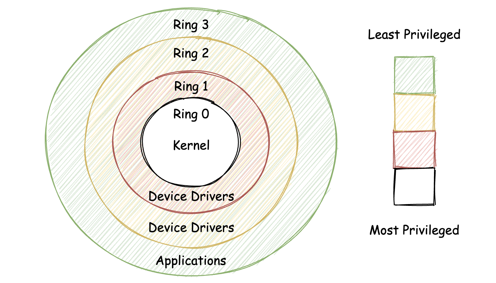
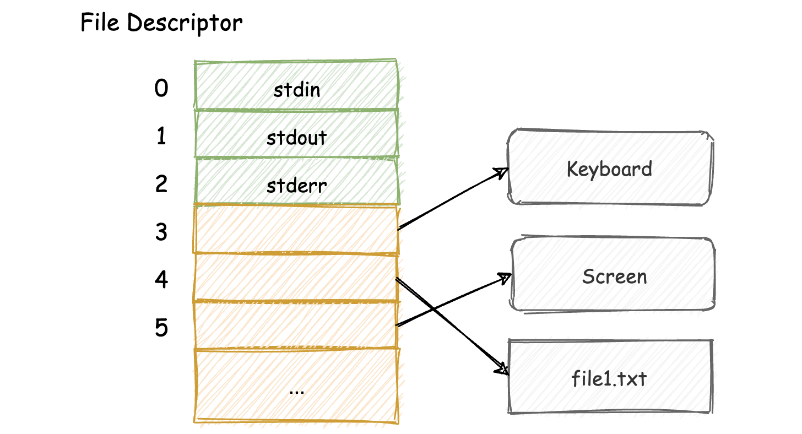
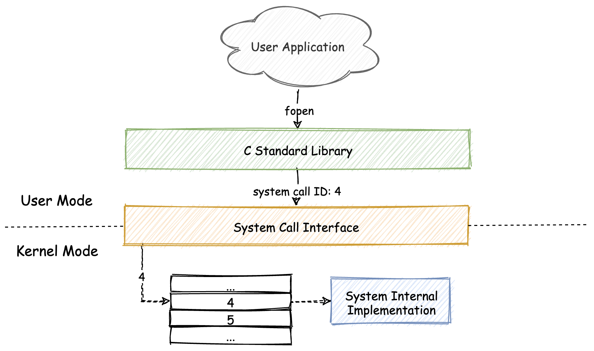
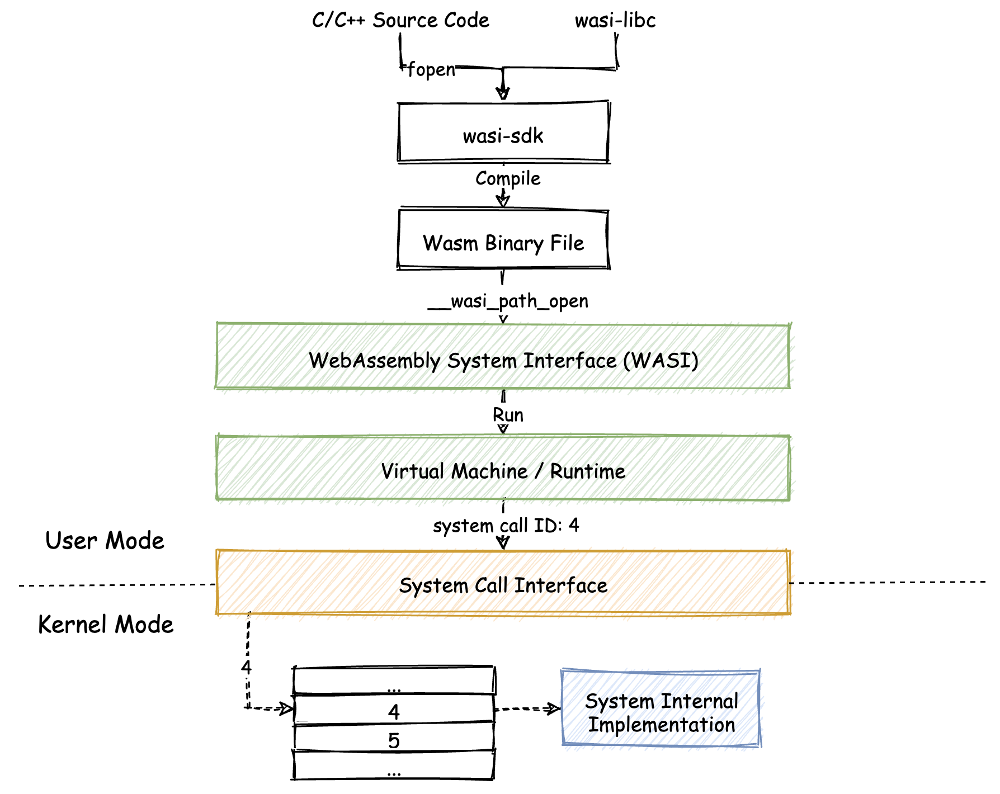
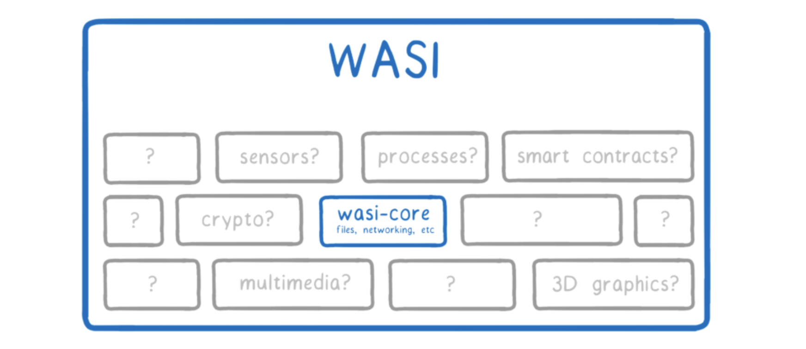

## WASI：WebAssembly操作系统接口

”Web“表明了wasm的出身，也就是说它发明并最早应用于Web浏览器中，”Assembly“则表明了wasm的本质，这个词翻译过来的意思是”汇编“，也就是指代它的V-ISA属性。

**鉴于wasm所拥有”可移植“、”安全“及”高效“等特性，wasm也逐渐被应用在Web领域之外的一些其他场景中。**

WASI（WebAssembly System Interface，wasm操作系统接口）便是可以将wasm应用到out-of-web环境中的一项新的标准。通过这项标准，wasm将可以直接与操作系统打交道。

### 几个与WASI相关的重要概念

#### Capability-based Security

一个在”计算机安全“领域中十分重要的概念——”Capability-based Security“，翻译过来为”基于能力的安全“。

Capability-based Security是一种已知的、常用的安全模型。在计算机领域中，我们所提及的capability可以指代如Token、令牌等概念。

capability是一种用于表示某种权限的标记，它可以在用户之间进行传递且无法被伪造。

在一个使用了Capability-based Security安全模型的操作系统中，任何用户对计算机资源的访问，都需要通过一个具体的capability来进行。

**Capability-based Security同时也指代了一种规范用户程序的原则。**比如这些用户程序可以根据”最小特权原则“（该原则要求计算环境中的各个模块仅能够访问当下所必需的信息或资源）来彼此直接共享capability，这样可以使得操作系统仅分配用户程序需要使用的权限，并且可以做到”一次分配，多次使用“。

Capability-based Security这个安全模型，通常会跟另外一种基于”分级保护域“方式实现的安全模型形成对比。

基于”分级保护域“实现的安全模型，被广泛应用于类Unix的各类操作系统中。

🌰：下图中操作系统Ring0层和Ring3层（Ring1/Ring2一般不会被使用）便是”分级保护域“的一种具体实现形式。



在传统意义上，Ring0层拥有最高权限，一般用于内核模式；而Ring3层的权限则会被稍加限制，一般用于运行用户程序。当一个运行在Ring3层的用户程序，试图去调用只有Ring0层进程才有权限使用的指令时，操作系统会阻止调用。这就是”分级保护域“的大致概念。

**反观Capability-based Security，capability通过替换在分级保护域中使用的”引用“，来达到提升系统安全性的目的。**（此处的”引用“是指用于访问资源的一类”定位符“，比如用于访问某个文件资源的”文件路径字符串“便是一个引用。）

引用本身并没有指定实际对应资源的权限信息，以及哪些用户程序可以拥有这个引用。因此，每一次尝试通过该引用来访问实际资源的操作，都会经由操作系统来进行基于”分级保护域“的权限验证。

**在具有capability概念的操作系统中，只要用户程序拥有了这个capability，那它就拥有足够的权限去访问对应的资源。**

为了实现上述capability的能力，每一个capability不再是单一的由”字符串“组成的简单数据结构；并且我们还需要保障，capability的内部结构不会被用户程序直接访问和修改，以防止capability本身被伪造。

**相对应的，用户程序只能够通过capability暴露出的特定”入口“，来访问对应的系统资源。**可以用操作系统中常见的一个概念——”文件描述符（File Descriptor）“来类比capability的概念。如下图所示：



🌰：当应用程序在通过C标准库中的”fopen“函数去打开一个文件时，函数会返回一个非负整数，来表示一个特定文件资源对应的文件描述符。

在拥有了这个描述符后，应用程序便可以按照在调用”fopen“函数时所指定的操作（比如”w“），来相应地对这个文件资源进行处理。

当函数返回负整数时，则表示无法获得该资源。

**最为重要的一点是，拥有某个capability的用户程序，可以”任意地“处理这个capability。**操作系统有义务确保某个特定的capability只能够对应系统中的某个特定的资源或操作，以**保证安全策略的完备性**。

#### 系统调用（System Call）

当我们在调用这个fopen函数打开某个文件时，实际上发生了什么？fopen函数是如何访问操作系统的文件资源的呢？

fopen函数是C标准库中定义的一个函数，那就从某个特定的C标准库实现所对应的源代码入手，来看看fopen函数的具体实现细节。此处以`musl`这个libc的实现为例，以下为关键的部分。

```c
FILE *fopen(const char *restrict filename, const char *restrict mode) {
  //...
  /* Compute the flags to pass to open() */
  flags = __fmodeflags(mode);
  
  fd = sys_open(filename, flags, 0666);
  if (fd < 0) return 0;
  // ...
}
```

具体细节不做深究，唯一需要注意的，是函数调用语句`fd = sys_open(filename, flags, 0666);`。这样语句中，调用了一个名为”sys_open“的函数，而这个函数的背后，就是”系统调用“。

实际上，任何其他需要**与操作系统资源打交道**的C，甚至是C++标准库函数（包括fopen在内），都需要通过”系统调用“来间接访问和使用这些系统资源。

sys_open函数其实是对系统调用进行了封装，在函数内部会使用内联的汇编代码，去实际调用某个具体的”系统调用“。这里sys_open对应的，便是指”用于打开本地文件资源“的那个系统调用。

每一个系统调用，都对应着需要与操作系统打交道的某个特定功能，并且有着唯一的”系统调用ID“与之相对应。

**在不同的操作系统中，对应同一系统调用的系统调用ID可能会发生变化。而C/C++标准库的作用，便是为我们提供了一个统一、稳定的编程接口**，让我们的程序可以做到”一次编写，到处编译“。从某种程度上来讲，**标准库的出现为应用程序源代码提供了”可移植性“。**

除此之外，标准库还会帮助我们处理系统调用前后需要做的一些事情。关于**用户应用程序与操作系统调用之间的关系**，可以参考下图。




### WebAssembly操作系统接口（WASI）

从WASI对应的全称中，可以猜测到，它与前面介绍的”系统调用“有着某种联系（System Call与System Interface）。

#### 如何在Web场景之外使用wasm？

wasm是一套新的V-ISA（也就是”虚拟指令集架构“），其中的这些虚拟指令无法被真实的物理CPU硬件直接执行。

**如果想要在浏览器之外使用wasm，就需要提供一种基础设施，来解释并执行这些被存放在wasm二进制模块中的虚拟指令。**这样的基础设施，通常被称为”虚拟机（Virtual Machine）“，或是”运行时引擎（Runtime Engine）“。

假设此时已经有了这样的一个虚拟机；然后我们希望将一段C/C++代码经过编译后，以wasm的形式在这个虚拟机中运行。在这段C/C++代码中，使用了前面提到的fopen函数。

在如`musl`这类C标准库的实现中，类似fopen函数，最后会被编译为对某个特定平台（IA32、X86-64等）系统调用的调用过程。这对于wasm来说，会丧失”天生自带“的可移植性。

**对于某个wasm模块，并不知道将会被运行在什么类型的操作系统上，因此无法将平台相关的具体信息放到wasm模块中。那如何解决这个问题呢？WASI给了我们答案。**

**WASI在wasm字节码与虚拟机之间，增加了一层”系统调用抽象层“。**比如，对于在C/C++源码中使用的fopen函数，当我们将这部分源代码与专为WASI实现的C标准库”wasi-libc“进行编译时，源码中对fopen的函数调用过程，其内部会间接通过调用名为”`__wasi_path_open`“的函数来实现。这个`__wasi_path_open`函数，便是对实际系统调用的一个抽象。

`__wasi_path_open`函数的具体实现细节会交由各个虚拟机自行处理。即，**虚拟机需要在其Runtime运行时环境中提供，对wasm模块字节码所使用到的`__wasi_path_open`函数的解析和执行能力的支持**。

虚拟机在实际实现这些系统调用抽象层接口时，也需要通过实际的系统调用来进行。

以上提到的**wasi-libc、wasm二进制模块、WASI系统调用抽象层，以及虚拟机基础设施之间的关系**，可以参考下图：



类似`__wasi_path_open`这类以`__wasi`开头的，用于抽象实际系统调用的函数，便是WASI的核心组成部分。

WASI根据不同系统调用所提供的不同功能，将这些系统调用对应的WASI抽象函数接口，分别划分到了不同的子集合中。

可以理解为，WASI所描述的抽象系统调用，是针对wasm V-ISA描述的抽象机器而言。针对这部分抽象系统的具体实现，则会依赖一部分实际的系统调用。



#### 两个基本原则

WASI在设计和实现时，需要遵守wasm的“可移植性”及“安全性”这两个基本原则。

##### 可移植性（Portability）

**WASI通过在wasm二进制字节码与虚拟机基础设施之间，提供统一的“系统调用抽象层”来保证wasm模块的可移植性。**

上层的wasm模块可以不用考虑平台相关的调用细节，统一将对实际系统调用的调用过程，转换为对“抽象系统调用”的调用过程。

**“抽象系统调用”的实现细节，则由下层的相关基础设施来负责处理。**

但，并不是所有的抽象系统调用都需要被映射到真实的系统调用上，因为对于某些抽象系统调用而言，基础设施只是负责提供相应的实现即可。

这样，一个经过编译生成的wasm二进制模块便可以在浏览器之外也同样保证其可移植性。**“抽象”便是解决这个问题的关键。**

##### 安全性（Security）

基础设施在真正实现WASI标准时，便会采用“Capability-based Security”的方式来控制每一个wasm模块实例所拥有的capability。

🌰：假设一个wasm模块想要打开一个计算机本地文件，这个模块由使用了fopen函数的C/C++源代码编译而来。

对应的虚拟机在实例化该wasm模块时，便会将fopen函数对应的WASI系统调用抽象函数`__wasi_path_open`以某种方式（比如通过包装后的函数指针），当作一个capability从模块的Import Section传递给该模块进行使用。

**通过这种方式，基础设施掌握了主动权。它可以决定是否要将某个capability提供给wasm模块进行使用。**掌握这样的主动权，正适合如今我们基于众多不知来源的第三方库进行代码开发的现状。


### 总结

**WASI通过增加“抽象层”的方式，解决了wasm抽象机器（V-ISA）与实际操作系统调用之间的可移植性问题。**可以保证基于WASI编写的wasm应用（模块）真正做到“一次编译，到处运行”。

抽象出的“wasm系统调用层”将交由具体的底层基础设施（虚拟机/运行时）来提供实现和支持。

**基于Capability-based Security模型，WASI得以在最大程度上保证wasm模块的运行时安全。**通过配合wasm模块的Import Section与Export Section，运行时便可以细粒度地控制模块实例所能够使用的系统资源。

每一个wasm模块在运行时都**仅**能够使用被授权的capability，而WASI中定义的这些系统调用抽象接口便属于众多的capability中的一种。

相对来说，“最小特权原则”使得Capability-based Security模型对权限的控制力度会更加精细，而“分级保护域”模型则是操作系统中广泛使用的一种安全策略。


