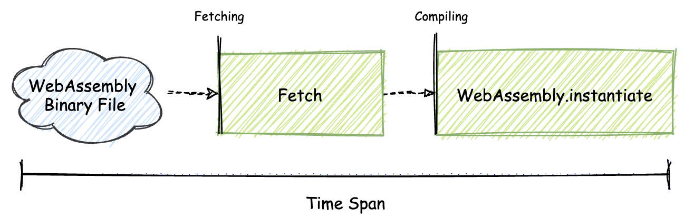
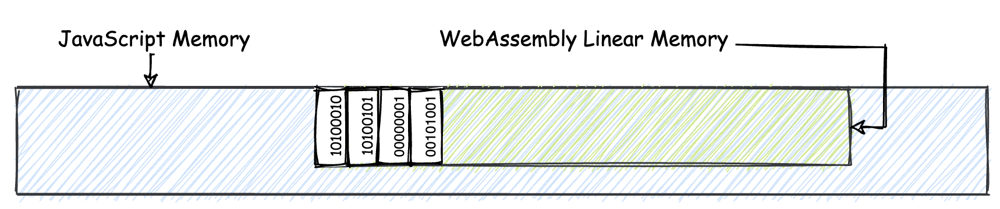
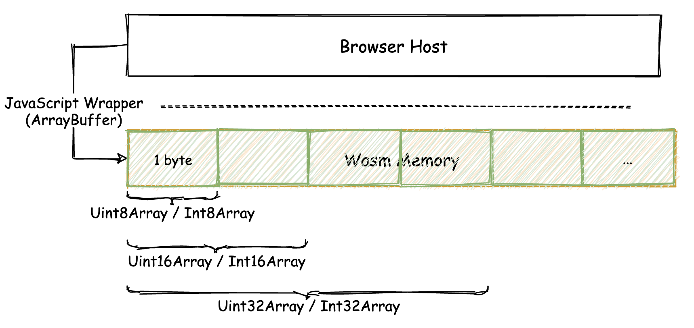

## API：在WebAssembly MVP标准下能做到哪些事？

在目前与wasm相关的一系列标准中，可以将这些标准主要分为两个部分：wasm核心标准（Core Interfaces）以及嵌入接口标准（Embedding Interfaces）。

wasm核心标准主要定义了与“wasm字节码”、“wasm模块结构”、“WAT可读文本格式”以及模块验证与指令执行细节等相关的内容。

另一个标准“嵌入接口标准”，则定义了有关wasm在Web平台上，在与浏览器进行交互时所需要使用的相关Web接口以及JavaScript接口。

在当前的MVP标准下，我们能够使用wasm在Web平台上做些什么？哪些又是wasm暂时无法做到的？

### wasm浏览器加载流程

一个wasm二进制模块需要经过怎样的流程，才能够最终在Web浏览器中被使用？

可以参考下图，这些流程可以被粗略地划分为以下四个阶段。


* 首先是“Fetch”阶段。

  将被使用到的wasm二进制模块，从网络上的某个位置通过HTTP请求的方式，加载到浏览器中。

  这个加载过程，同在浏览器中加载JavaScript脚本文件等静态资源的过程，没有任何区别。

* 接下来是“Compile”阶段。

  浏览器会将从远程位置获取到的wasm模块二进制代码，编译为可执行的平台相关代码和数据结构。

  此时，浏览器引擎只是将wasm的字节码编译为平台相关的代码，而这些代码还并没有开始执行。

* 紧接是最为关键的“Instantiate”阶段。

  浏览器引擎开始执行在上一步中生成的代码。
  
  在这一阶段中，浏览器引擎在执行wasm模块对应的代码时，会将那些wasm模块规定需要从外界宿主环境中导入的资源，导入到正在实例化中的模块（通过“Import Section”），以完成最后的实例化过程。
  
  **该阶段完成后，便可以得到一个动态的、保存有状态信息的wasm模块实例对象。**
  
* 最后一步便是“Call”。

  可以直接使用上一阶段生成的动态wasm模块对象，来调用从wasm模块内导出的方法。

以下介绍与第二步”Compile编译“和第三步”Instantiate实例化“这两个阶段相关的JavaScript API与Web API。


### wasm JavaScript API

#### 模块对象

第一个问题，如何在JavaScript环境中表示”Compile编译“与”Instantiate实例化“这两个阶段的”产物“？

wasm在JavaScript API标准中为我们提供了如下两个对象与之分别对应：

* WebAssembly.Module
* WebAssembly.Instance

这两个JavaScript对象本身也可以被作为类型构造函数使用，以用来直接构造对应类型的对象。

#### 导入对象

wasm二进制模块内部”Import Section“的作用。通过这个Section，模块便可以在实例化时接收并使用来自宿主环境中的数据。

Web浏览器作为wasm模块运行时的一个宿主环境，通过JavaScript的形式提供了可以被导入到wasm模块中使用的数据类型；包括函数（Function）、全局数据（Global）、线性内存对象（Memory）以及Table对象（Table）。

除“函数”类型外，其他数据类型分别对应着以下由JavaScript对象表示的包装类型：

* WebAssembly.Global
* WebAssembly.Memory
* WebAssembly.Table

对于函数类型，我们可以直接使用JavaScript语言中的“函数”来作为代替。

同理，我们也可通过“直接构造”的方式来创建上述这些JavaScript对象。

🌰：以“WebAssembly.Memory”为例，我们可以通过如下方式，来创建一个WebAssembly.Memory对象：

```javascript
let memory = new WebAssembly.Memory({
  initial: 10,
  maximum: 100
});
```

以上代码中，memory对象所表示的wasm线性内存其初始大小为10页，其最大可分配大小为100页。

注意！wasm线性内存的大小必须是“wasm页”大小的整数倍，而一个“wasm页”的大小在MVP标准中被定义为“64KiB”（注意和KB的区别。KiB为1024字节，而KB为1000字节）。

#### 错误对象

与“Error”有关的表示某种错误的“错误对象”。

这些错误对象用以表示在整个wasm加载、编译、实例化及函数执行流程中，在其各个阶段中所发生的错误。

这些错误对象分别是：

* WebAssembly.CompileError

  表示在wasm模块编译阶段（Compile）发生的错误。如，字节码编码格式错误、魔数不匹配

* WebAssembly.LinkError

  表示在wasm模块实例化阶段（Instantiate）发生的错误。如，导入到wasm模块实例Import Section的内容不正确

* WebAssembly.RuntimeError

  表示在wasm模块运行时阶段（Call）发生的错误。如，常见的“除零异常”

上面这些错误对象也都有对应的构造函数，可以用来构造对应的错误对象。

[MDN文档](https://developer.mozilla.org/en-US/docs/WebAssembly/JavaScript_interface)

#### 模块实例化方法

用来实例化一个wasm模块对象。该方法原型如下：

* WebAssembly.instantiate(bufferSource, importObject)

返回一个将被解析为WebAssembly.Module的Promise对象。

WebAssembly.Module对象，代表着一个被编译完成的wasm静态模块对象。

第一个参数，对应一个包含有效wasm模块二进制字节码的ArrayBuffer或TypedArray对象

第二个参数为一个JavaScript对象，在其中包含有需要被导入到wasm模块实例中的数据，这些数据将通过wasm模块的“Import Section”被导入到模块实例中使用。

**方法在调用完成后会返回一个将被解析为ResultObject的Promise对象。**ResultObject对象包含有两个字段，分别是“module”以及“instance”。

module表示一个被编译好的WebAssembly.Module静态对象；instance表示一个已经完成实例化的WebAssembly.Intance动态对象。

**基于这个方法实现的wasm模块初始化流程图如下。**整个流程是完全串行的。



WebAssembly.instantiate方法还有另外一个重载形式，就是第一个参数，从含有wasm模块字节码数据的bufferSource，转为已经编译好的静态WebAssembly.Module对象。通常用于WebAssembly.Module对象已经被提前编译好的情况。

#### 模块编译方法

WebAssembly.instantiate方法，主要用于从wasm字节码中一次性进行wasm模块的编译和实例化过程。

**我们也可以将编译和实例化两个步骤分开来进行。**对于单独编译阶段，可以使用下面这个JavaScript API：

* WebAssembly.compile(bufferSource)

接受一个参数，为含有有效wasm字节码数据的bufferSource，ArrayBuffer或TypedArray对象。

返回的Promise对象在Resolve之后，会得到一个编译好的静态WebAssembly.Module对象。


### wasm Web API

wasm的JavaScript API标准，主要定义了一些与wasm相关的类型和操作，这些类型和操作与具体的平台无关。

为了能够在最大程度上利用Web平台的一些特性，来**加速wasm模块对象的编译和实例化过程**，wasm标准又通过添加wasm Web API的形式，为Web平台上的wasm相关操作提供了新的、高性能的编译和实例化接口。

#### 模块流式实例化方法

Web API中定义的“流式接口”可以让我们提前开始对wasm模块进行编译和实例化过程，你也可以称此方式为“流式编译”。如以下对应wasm模块的“流式实例化”接口：

* WebAssembly.instantiateStreaming(source, importObject)

为了能够支持“流式编译”，该方法的第一个参数，将不再需要已经从远程加载好的完整wasm模块二进制数据（bufferSource），取而代之的是一个尚未Resolve的Response对象。

Response对象，代表了某个远程HTTP请求的响应数据；是Fetch API的重要组成部分。

通过此种方式，Web浏览器可以在从远程位置开始加载wasm模块文件数据的同时，也一并启动对wasm模块的编译和初始化工作。**流式编译无疑在某种程度上提升了Web端运行wasm应用的整体效率。**

**基于流式编译进行的wasm模块初始化流程如下图所示。**


wasm模块的编译和初始化可以提前开始，而不用再等待模块的远程加载完全结束。因此应用的整体初始化时间也会有所减少。

#### 模块流式编译方法

“流式编译方法”如下所示：

* WebAssembly.compileStreaming(source)

使用方式与流式实例化方法类似。API调用后返回的Promise对象在Resolve之后，会返回一个编译好的静态WebAssembly.Module对象。

”流式编译方法“也可以在浏览器加载wasm二进制模块文件的同时，提前开始对模块对象的编译过程。


### wasm运行时（Runtime）

此处提到的”运行时“，主要存在于流程图中”Call“阶段。

在这个阶段中，我们可以调用从wasm模块对象中导出的函数。

**每一个经过实例化的wasm模块对象，都会在运行时维护自己唯一的”调用栈“。**

所有模块导出函数的实际调用过程，都会影响着栈容器中存放的数据，这些数据代表着每条wasm指令的执行结果。

**调用栈一般是”不透明“的；**即，无法通过任何API或者方法直接接触到栈容器中存放的数据。这也是wasm保证执行安全的众多因素之一。

**除了调用栈，每一个实例化的wasm模块对象都有着自己的（在MVP下只能有一个）线性内存段。**在这个内存段中，以二进制形式存放着wasm模块可以使用的所有数据资源。

这些资源可以是来自于对wasm模块导出方法调用后的结果；也可以是在进行模块实例化时，我们将预先填充好的二进制数据资源以WebAssembly.Memory导入对象的形式，提前导入到模块实例中。

#### 内存管理

**浏览器在为wasm模块对象分配线性内存时，会将这部分内存与JavaScript现有的内存区域进行隔离，并单独管理。**可以参考下图。



在以往的JavaScript Memory中，我们可以存放JavaScript中的一些数据类型，这个数据同时也可以被相应的JavaScript / Web API直接访问；当数据不再使用时，它们便会被JavaScript引擎的GC进行垃圾回收。

绿色部分的WebAssembly Memory则不同。这部分内存可以被wasm模块内部诸如”i32.load“与”i32.store“等指令直接使用，而外部浏览器宿主中的JavaScript / Web API则无法直接进行访问；分配在这部分内存区域中的数据，受限于MVP中尚无GC相关的标准，因此需要wasm模块自行进行清理和回收。

#### 内存访问安全性

当浏览器在执行”i32.load“与”i32.store“等内存访问指令时，会首先检查指令所引用的内存地址偏移，是否超出了wasm模块实例所拥有的内存地址范围。这个检查过程一般称为**”Bound Check“**。

#### wasm内存模型

看一看WebAssembly Memory是如何与”浏览器“这个Web宿主环境中的JavaScript API进行交互的。

**每一个wasm模块实例都有着自己对应的线性内存段。**准确来讲，也就是由”Memory Section“和”Data Section“共同”描述“的一个线性内存区域。**在这个区域中，以二进制形式存放着模块所使用到的各种数据资源。**

每一个wasm实例所能够合法访问的线性内存范围，仅限于上述的这一部分内存段。对于宿主环境中的任何变量数据，如果wasm模块实例想要使用，一般可以通过以下两种常见的方式：

1. 简单（字符/数字值等）数据类型

   可以选择将其视为全局数据，通过”Import Section“导入到模块中使用

2. 复杂数据

   需要将其以”字节“的形式，拷贝到模块实例的线性内存段中来使用

**在Web浏览器这个宿主环境中，一个内存实例通常可以由JavaScript中的ArrayBuffer类型来进行表示。**ArrayBuffer中存放的是原始二进制数据，因此在读写这段数据时，必须指定一个”操作视图（View）“。**可以把”操作视图“理解为：在对这些二进制数据进行读写操作时，数据的”解读方式“。**

🌰：假设我们想要将字符串”Hello, world!"，按照逐个字符的方式写入到线性内存段中，那么在进行写操作时，如何知道一个字符所应该占用的数据大小呢？

一个字符可能会占用1个字节到多个字节不等的大小。这个“占用大小“就是前面提到的数据“解读方式”。

**wasm模块线性内存与Web浏览器宿主环境，或者说与JavaScript之间的互操作关系**，可以参考下图：



当我们拥有了填充好数据的ArrayBuffer或TypedArray对象时，便可以**构造自己的WebAssembly.Memory导入对象。然后在wasm模块进行实例化时，将该对象导入到模块中，来作为模块实例的线性内存段进行使用。**


### 局限性

MVP全称为“Minimum Viable Product（最小可用产品）”，既然是“最小可用”，也就意味着它还有很多的不足。

目前可以观测到的“局限性”主要集中在以下几个方面：

* 无法直接引用DOM

  **在MVP标准下，我们无法直接在wasm二进制模块内引用外部宿主环境中的“不透明”数据类型**（即，数据内部的实际结构和组成方式未知），比如DOM元素。

  目前通常的一种间接实现方式，是使用JavaScript函数来封装相应的DOM操作逻辑，然后将该函数作为导入对象，导入到模块中，由模块在特定时机再进行间接调用来使用。

  这种借助JavaScript的间接调用方式，在某种程度上会产生无法弥补的性能损耗。

* 复杂数据类型需要进行编码

  对于除“数字值”以外的“透明”数据类型（比如字符串、字符），当**要将它们传递到wasm模块中进行使用时**，需要首先对这些数据进行编码；再将编码后的结果以二进制数据的形式存放到wasm的线性内存段中；**模块内部指令在实际使用时**，再将这些数据进行解码。

  就目前MVP标准而言，wasm模块的线性内存段是与外部宿主环境进行直接信息交换的最重要“场所”。


### 总结

wasm MVP相关标准中的JavaScript API与Web API。借助这些API，我们可以在Web平台上通过JavaScript代码来与wasm模块进行一系列的交互。

**一句话总结目前wasm MVP标准在Web浏览器上的能力**：凡是能够使用wasm来实现的功能，现阶段都可以通过JavaScript来实现；而能够使用JavaScript来实现的功能，其中部分还无法直接通过wasm实现（比如调用Web API）。

JavaScript API提供了众多的包装类型，这样便能够在JavaScript环境中表示wasm模块的不同组成部分。

JavaScript API中还提供了诸如WebAssembly.compile以及WebAssembly.instantiate方法，以用于编译及实例化一个wasm模块对象。

Web API则提供了与Web平台相关的一些特殊方法。比如WebAssembly.compileStreaming与WebAssembly.instantiateStreaming方法；可以更加高效地完成对wasm模块对象的编译和实例化过程。

wasm模块在运行时的一些特征，比如“内存模型”。

目前在MVP标准下应用wasm时的一些局限性。


[TWVM module](https://github.com/Becavalier/TWVM/blob/e0e9c263bd33d8d8f32f7986838b57ae35ec9fd1/lib/include/structs.hh#L45)
