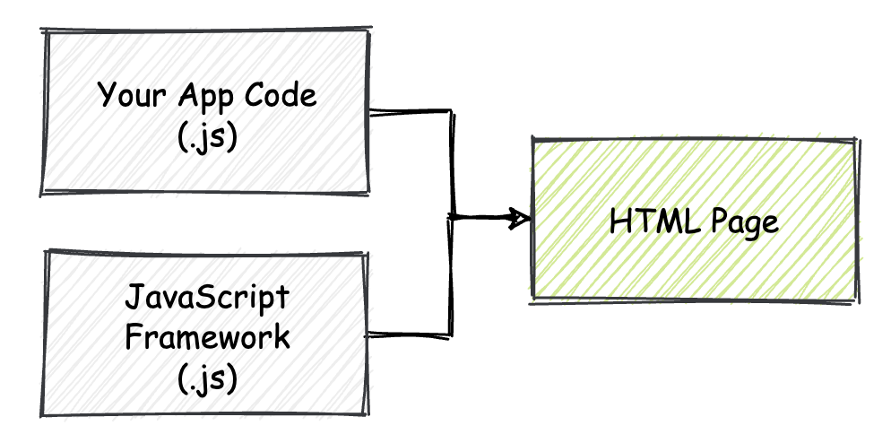
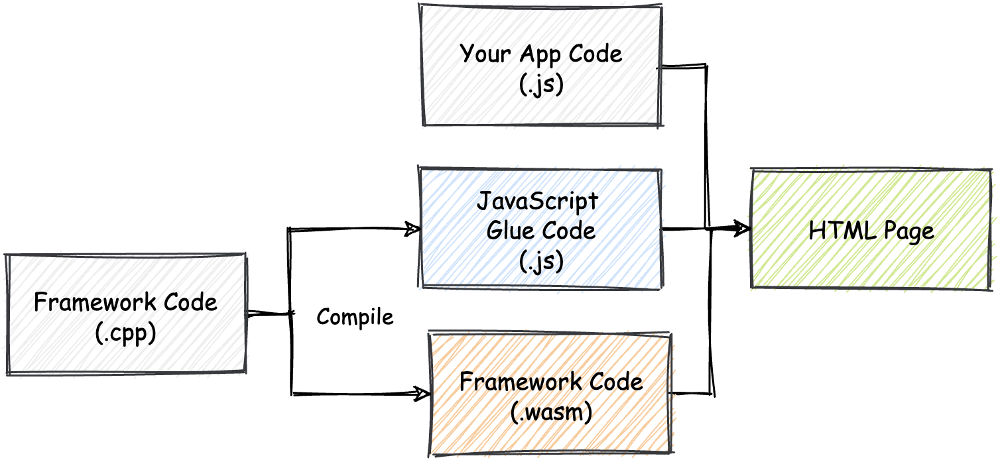
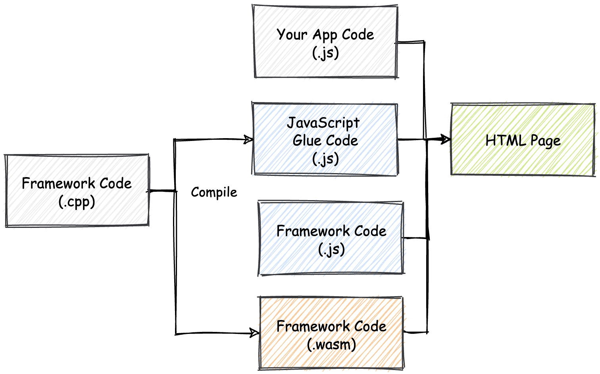
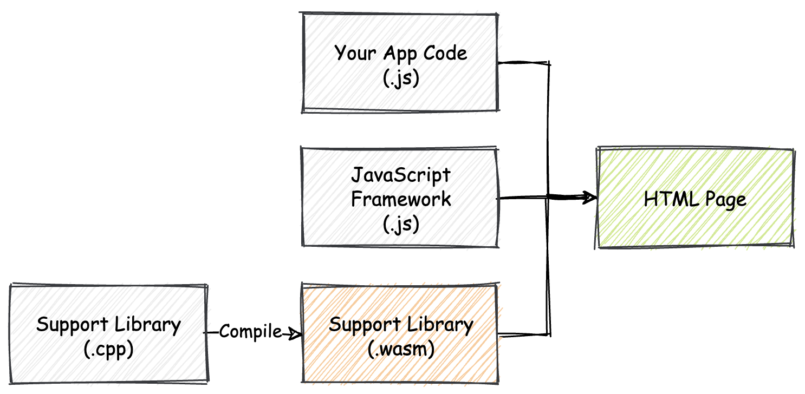
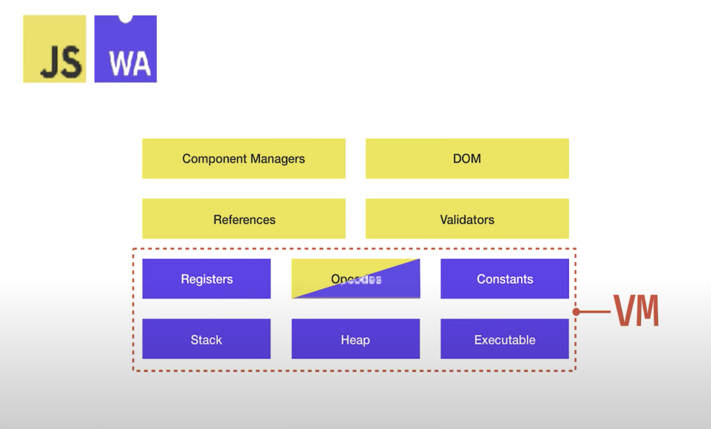

## WebAssembly能够为Web前端框架赋能吗

“Assembly”在我们所熟悉的编程语言体系中，可以理解为“汇编”。

汇编语言给人的第一感觉便是“底层，外加高性能”。

对于现阶段在我们日常工作中承担“主力“角色的Web前端框架来说，wasm会给它们带来怎样的变化呢？未来的Web前端开发框架会以怎样的方式与wasm紧密融合呢？

看一看，在如今的wasm MVP标准下，对于这些基于JavaScript编写的现代Web前端框架我们能够做些什么。

### 几种方案的思考

”借助Web平台提供的相关接口，我们可以在Web浏览器中高效地调用从wasm模块中导出的函数。“

那就根据wasm现阶段所具有的能力，讨论一下wasm对现代Web前端开发框架可以产生怎样的影响。

根据wasm与框架之间的可能融合程度，来从不同的角度加以讨论。总结出如下四种方案：

* 使用wasm完全重写现有框架
* 使用wasm重写现有框架的核心逻辑
* 使用wasm配合框架增强应用的部分功能
* 使用其他语言构建Web前端框架

#### 使用wasm完全重写现有框架

在这个方案下，我们将使用wasm完全重写现有的Web前端框架。这就需要我们通过JavaScript之外的诸如C/C++、Rust等第三方静态类型语言，将框架的逻辑全部重写。

先不谈能否实现，先来看看在这种方案下，前端框架的使用方式会发生怎样的改变。

**在此之前，Web前端框架的使用方式**大致如下图所示。



除去样式文件以外，Web应用程序仅由”框架代码“和”应用程序代码“两部分组成。这两部分代码全部由JavaScript语言进行编写。HTML文件负责将这些JavaScript代码整合在一起，并确保在页面加载时执行它们。

**将Web前端框架使用wasm完全重写后，此时的Web应用组成结构**将如下图所示。



除了使用JavaScript编写的”应用程序代码“，以及经过编译生成的wasm字节码格式的框架代码以外，还会多出来一部分用作”Glue Code“的JavaScript代码。Glue Code主要用来做什么呢？这和现阶段的wasm标准与Web浏览器的可交互性有关。

##### 无法剥离的JavaScript代码（作用）

在现阶段wasm的MVP标准中，需要通过各类JavaScript API与Web API来在Web平台上与wasm代码（模块）进行交互。所有**这些需要与wasm模块直接进行的交互（互操作），都是由包含有API调用的Glue Code代码完成的。**

在目前wasm的MVP标准中，同样**无法直接在wasm字节码中操作HTML页面上的DOM元素**。对于这部分Web框架最核心的功能，也是需要通过借助Glue Code调用Web API来帮助我们完成。

**框架代码与Glue Code之间的协作方式**可能会类似如下形式。🌰：

首先是框架对应的C++代码。

```c++
// framework.cpp
extern void createEmptyDivElement(); // "extern"
int main(int argc, char** argv) {
  createEmptyDivElement(); // 创建一个空的”div“标签
  // ...
  return 0;
}
```

然后是Glue Code对应的JavaScript代码。

```javascript
// glue.js
WebAssembly.instantiateStreaming(wasmBytes, {
  env: {
    // 将函数导入到wasm模块中
    createEmptyDivElement: () => document.createElement('div'),
    // ...
  }
});
```

在框架所对应的C++代码中，所有通过”extern“指定的外部函数，都将会在编译至wasm二进制模块后，从模块对应的Import Section中获取实际的函数体。

故，即使将Web前端框架完全重写并编译至wasm，也无法在完全脱离JavaScript Glue Code的情况下使用框架。

##### 跨上下文频繁调用的开销（问题）

使用Glue Code带来的问题在某些情况下可能会显得更加”致命“，那就是”wasm与JavaScript两个上下文环境之间的函数调用开销“。

早期的Firefox浏览器（版本62以前）上，在某些情况下，同样的函数调用过程会比JavaScript之间的函数调用过程慢约20倍。

Firefox在62之后的版本中，修复了这个问题，甚至在某些情况下，JavaScript与wasm之间的函数调用效率要高于JavaScript之间的函数调用效率。

虽然这个问题在Firefox得到了修复，但不可否认，在其他浏览器厂商的wasm实现中，也可能会出现类似的性能问题。

Web前端框架作为一个需要与DOM元素，以及相关Web API强相互依赖的技术产品，可想而知其在实际使用过程中，必然会通过Glue Code去完成wasm与JavaScript之间的频繁函数调用；故无法忽视这些由于频繁函数调用带来的性能损耗。

#### 使用wasm重写现有框架的核心逻辑

使用wasm重写Web前端框架的核心逻辑，并非全部代码。

此种情况下，Web应用的主要组成结构与上一方案类似，唯一的不同是增加了Web框架所对应的JavaScript代码实现部分。



仅实现框架的核心逻辑部分，可以说更具有现实意义，而这也是现阶段大多数的框架开发者都在实践的方向。

所谓”核心逻辑“，依框架的具体实现不同，无法通过统一、准确的描述来定义；可以遵循的原则是，这部分逻辑不会涉及与DOM或者Web API的频繁交互，但其本身却又是”计算密集（compute-intensive）“的。

这里的”计算密集“可以理解为：包含有大量的纯数学计算逻辑。而wasm十分擅长处理这样的计算密集型逻辑。

#### 使用wasm配合框架增强应用的部分功能

递减wasm与框架的”耦合“程度。

从本质上来看，框架本身的代码不会有任何的变化。而wasm也不再着重于优化框架本身的性能。相对地，框架与wasm将会配合起来使用，以优化整个应用的某一部分功能。

在这个方案下，一个Web应用的基本组成结构如下图所示。



这里wasm本身只是作为一个模块，用于优化应用的某方面功能。

这是wasm在Web上的一种最为典型和常见的应用方式。通过利用其优势来补足或者加以提升Web应用在某方面的短板。一个最为常见的例子便是前端的”数据编解码“（十分单纯的数学计算）。

通过替换Web应用中原有的基于JavaScript实现的编解码逻辑，使用wasm来实现这部分逻辑会有着明显的性能提升。由于这个过程不涉及与Web API的频繁交互，wasm所能够带来的性能提升程度更是显而易见的。

#### 使用其他语言构建Web前端框架

相较于之前的几种方案可能会稍显激进。但随着wasm发展，不断出现了一批批基于此方案实现的Web前端框架

在此方案下，将使用诸如C++和Rust等静态类型语言来实现Web前端框架；不仅如此，我们同样需要使用这些语言来编写Web应用。

以相对较为流行的Yew框架（基于Rust语言）为例，使用它来编写Web前端应用的大致思路，与React和Vue.j等传统JavaScript Web前端框架的形式十分类似。

🌰：以下代码展示了如何使用Rust语言基于Yew框架，来构建一个基本的Web前端应用。

```rust
use yew::prelude::*;

pub struct App{}
pub enum Msg {}

impl Component for App {
  type Message = Msg;
  type Properties = ();
  // 应用创建时执行的生命周期函数；
  fn create(_: Self::Properties, _: ComponentLink<Self>) -> Self {
    App {}
  }
  // 应用视图更新时执行的生命周期函数；
  fn update(&mut self, _msg: Self::Message) -> ShouldRender {
    true
  }
  // 定义应用视图结构；
  fn view(&self) -> Html {
    html! {
      <p>{ "Hello, world!" }</p>
    }
  }
}
```

即使你不懂Rust，但如果你熟悉React，仍然可以发现基于Yew构建的Web前端应用，它的代码组织结构与React十分类似，整个应用也同样被划分为不同的”生命周期“。

相对来说，抛开语言本身带来的成本不谈，单从性能来看，在目前wasm的MVP标准下，Yew这类框架的潜力还没有实际地显露出来。

鉴于目前MVP标准下的一些限制，实际上在最后的编译产物中，**Glue Code执行时所带来的成本则会与wasm带来的性能提升相互抵消。**

不仅如此，考虑到**目前JavaScript在构建Web应用时的丰富生态和资源**，单从性能角度进行考量而使用Yew等框架也不是一个实际可行的方案。


### 已有的讨论

流行的几种JavaScript Web前端框架有没有进行与wasm结合的相关尝试？

#### React

React暂时还没有计划进行任何与wasm相关的尝试。

由于目前wasm还无法直接操作DOM元素等标准上的限制，导致我们可预见，现阶段即使使用wasm重写React的Fiber算法，框架在实际处理UI更新时，可能也不会有显著的性能提升。

#### Vue.js

与React不同，Vue.js与wasm的”结合“方式根据框架的具体实现细节，可能有着更多的可能。

但一个不可否认的事实，wasm仍然处在快速的发展阶段；同样的，基于wasm构建的各类应用也同样处在不稳定的维护状态中。

#### Ember.js

它是第一个宣布尝试与wasm进行”深度融合“的Web前端框架。

Ember.js在内部使用了名为Glimmer VM的渲染引擎。Glimmer VM通过将模板的构建过程分解为独立的虚拟机”OpCode“操作，来对UI中呈现的动态值进行细粒度更新。



通过上图（来自于EmberConf 2018）可以看到，除了OpCode模块相关的部分逻辑仍然在使用JavaScript构建以外，整个VM的大部分功能都已经完成到wasm的迁移；并且该wasm版本的Glimmer VM也已经通过了所有的测试集case。

Ember.js在与wasm进行整合的过程中，其实遇到了很多问题，比如不支持GC导致wasm线性内存中使用的资源无法被及时清理。


### 总结

”wasm能否影响，或者说会如何影响现有的、基于JavaScript构建的现代Web前端框架呢？“这是一个被很多Web前端工程师所提及的问题。本篇将两者能够相互结合的可能方式大致分为了四种方案。

第一种方案中，当Glue Code的代码越来越多时，JavaScript函数与wasm导出函数之间的相互调用会更加频繁，在某些情况下，这可能会产生严重的性能损耗。

第二种方案中，相对纯粹的计算逻辑更易于wasm能力的发挥。现阶段大多数Web框架正在尝试的方式

第三种方案，仅使用wasm来作为Web框架的辅助，以优化Web应用的某一方面功能。这也是传统Web应用在利用wasm时的最常规方式

第四种方案，是一个更为激进的方式；包括Web框架和应用代码本身，都会由除JavaScript以外的，如Rust、C++和Go等静态语言来编写。但受限于现阶段wasm MVP标准的限制，框架本身仍然离不开JavaScript Glue Code的帮助。考虑到实际的语言使用成本以及JavaScript生态的舍弃，这种方案的实际可行性仍有待时间的验证。

