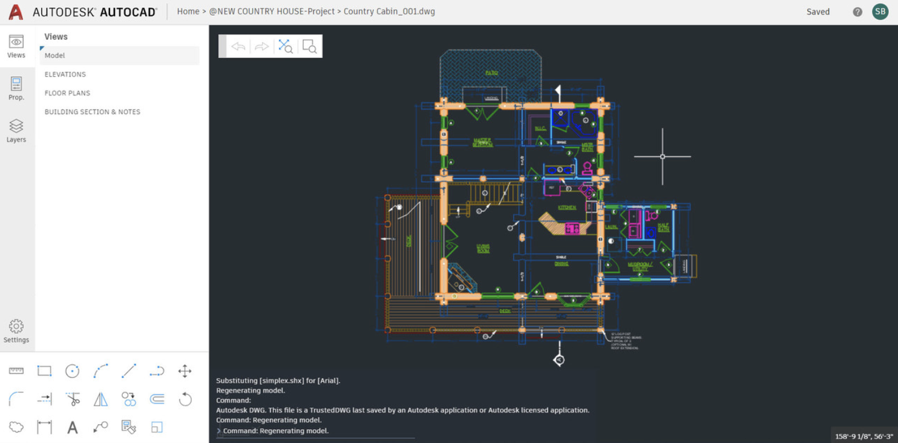

## 已经投入生产的WebAssembly真实案例

从技术标准走向生产实践

现实世界中有哪些已经投入生产的wasm真实案例？这些案例又是怎样利用wasm，解决了哪方面的实际问题呢？

### eBay - Barcode Scanner

人们可以通过eBay来在线出售自己的商品。

作为一家知名的购物网站，为了优化用户录入待售商品的操作流程，eBay在自家的iOS与Android原生应用中提供了”条形码扫描“功能。

#### 问题所在

随着eBay HTML5应用的使用人数越来越多，为了能够使用户的商品录入流程与Native应用保持一致，”**如何为HTML5应用添加高效的条形码扫描功能？**“便成为了eBay工程师团队亟待解决的一个问题。

初期：技术团队使用了Github上的开源JavaScript版本条形码扫描器，来为HTML5应用支持UPC条形码的解析功能。

随着不断收到的用户反馈，团队发现**JavaScript版本的条形码扫描器仅能够在20%的时间里表现良好**，而在剩下80%的时间里，条形码的实际解析效率却不尽如人意，用户的每一次扫码过程都无法得到一致、流畅的用户体验。

出现这个问题的一个重要原因，是由于JavaScript引擎在实际优化代码执行的过程中，无法确保用户的每一次扫描过程都能够得到JIT的优化。

JavaScript引擎采用的”启发式“代码执行和优化策略，通常会首先通过Profiling来判断出”热代码“的具体执行路径，然后再调用JIT引擎来优化这段代码。而实际上，究竟哪段代码能够被优化，谁也无从得知。

#### 可能的解决方案

其中的一个是WICG（Web Incubator Community Group，Web孵化社区群组）曾提出的”Shape Detection API“提案。可以让Web平台应用直接利用硬件加速或者系统相关的资源，来支持如人脸识别、条形码识别等功能。但该提案仍处于起步阶段

另一个方案便是wasm。

* 相较于JavaScript而言，浏览器引擎在执行wasm字节码时不需要经过诸如”生成AST“、”生成Bytecode字节码“、”生成IR“以及”收集运行时信息“等多个步骤。

  

* wasm字节码在实际的执行过程中，也不会存在类似JavaScript代码的”去优化“过程，因此性能表现会更加稳定

* 借助于wasm相关编译工具链的帮助，eBay技术团队可以直接使用曾经为Native平台设计开发的C++条形码扫描库

  仅需要对已有的代码库进行少量改动即可

#### 项目架构

按照上述方案，条形码扫描功能的具体工作流程如下：

* 使用Web Worker API从主线程创建一个工作线程（Worker Thread）

  用于通过JavaScript胶水代码来加载和实例化wasm模块

* 主线程将从摄像头获取到的视频流数据传递给工作线程，工作线程将会调用从wasm模块实例中导出的特定函数，来处理这些视频流像素

  返回UPC字符串或者空字符串

* 应用在运行时会通过设置”阈值时间“的方式，来检测是否读取到有效的条形码信息

使用到的wasm模块以及JavaScript胶水代码，均是通过Emscripten工具链编译已有的C++条形码扫描库得来的。

**整个方案的工作流程**如下：


#### 一致化的编译管道

如何**将wasm模块的开发和编译流程，也一并整合到现有的Web前端项目开发流程中**，是每个实际生产项目都需要考虑的事情。

一个wasm模块，或者说是wasm Web应用的完整开发流程涉及到多个部分。（最基本的HTML、CSS以及JavaScript代码；由Rust和C++等编程语言编写的模块源文件、相关的标准库；用于编译源代码的编译工具链如Emscripten）

为了确保每次都能够在一个一致的环境中来编译和生成wasm模块，同时简化整个项目中wasm相关开发编译环境的部署流程。**eBay技术团队尝试采用了Docker来构建统一的wasm编译管道**。

通过结合NPM下”package.json“文件中的自定义脚本命令，我们还可以让wasm模块的开发与编译流程，与现有的Web前端应用开发编译流程，更加无缝地进行整合。

🌰：可以按照如下形式来组织”package.json“文件中的应用编译命令。

```json
{
  "name": "my-wasm-app",
  "scripts": {
    "build:emscripten": "docker run --rm -v ${pwd}/src:/src trzeci/emscripten ./build.sh",
    "build:app": "webpack .",
    "build": "npm run build:emscripten && npm run build:app"
  }
}
```

命令`build:emscripten`主要用于启动一个带有完整Emscripten工具链开发环境的Docker容器，容器启动后，通过执行脚本`./build.sh`，来编译当前目录下”src“文件夹内的源代码到对应的wasm二进制模块。

将两部分build命令进行整合，便得到了最终的”build“命令。

#### 并不理想

以上基于wasm的方案看起来十分理想。

但经过实际测试后，eBay技术团队发现，虽然基于wasm的实现可以在1秒内处理多达50帧的画面，但实际的识别成功率却只有**60%**。

**自研的C++条形码扫描库其一大特征**为条形码的识别解析算法效率高，但仅适用于条形码成像质量较高的情况。因此，急需一种方式来弥补在成像质量偏低时的条形码识别。

此时，团队将目光锁定到了另外一个业界十分有名的、基于C语言编写的开源条形码扫描库——ZBar。实验发现，使用后，在所设置的阈值时间范围内，整个应用的扫描成功率**提高到了80%**。

团队继续对ZBar和自研的C++条形码扫描库进行测试。经过一段时间后，他们发现在某些ZBar超时的情况下，自研的C++库却能够快速地得到扫描结果。显然，基于不同的条形码图像质量，这两个库的执行情况有所不同。

#### 竞争取胜

为了能够同时利用ZBar和自研的C++库，eBay技术团队选择了一个”特殊的方案“。

在这个方案中，应用会启动两个工作线程，一个用于ZBar，另一个用于自研的C++库，两者同时对接收到的视频流进行处理。

经过测试，条形码在不同模拟测试场景中的识别成功率，可以**提高到95%**。

当尝试把JavaScript版本的条形码扫描器实现同样作为工作线程，加入到竞争”队列“中时，整个应用的条形码扫描识别成功率**达到了将近100%**。

**应用的最终架构**如下图所示：


产品上线使用了一段时间后，经过统计，53%的成功扫描来自于ZBar，34%来自于自研的C++库，剩下的13%来自于第三方的JavaScript库。

实际上，设备对wasm的兼容性也是需要考量的一个因素。


### AutoCAD Web

AutoCAD是一款由Autodesk公司设计研发的，用于进行2D绘图设计的应用软件，它被广泛地用于土木建筑、装饰装潢、工业制图等多个领域中。

#### 历史负担

AutoCAD桌面端软件的发展有着将近40年的历史。

随着应用的不断发展，随之而来的便是逐渐变大的代码库体积，以及不断复杂化的软件架构。

#### 移动互联网浪潮

感知到趋势的Autodesk，便开始着手将自家的AutoCAD应用从PC端的原生应用逐渐向Web应用进行移植。

初期，由于AutoCAD原生应用本身的代码库过于庞大，AutoCAD团队决定从头开始编写AutoCAD的Web版应用。AutoCAD移植Web应用的第一版本是基于Adobe Flash重新编写的，这个应用**发布于2010年**。

为了能够进一步利用Web标准，来优化AutoCAD Web应用的性能，并使得整个Web应用的技术架构更加贴近基于JavaScript构建的Web应用标准，AutoCAD团队**于2013年开始着手进行AutoCAD标准Web应用的移植工作**。

* 他们首先基于C++，重写了为iOS移动端Native应用准备的轻量版代码库。

* 然后通过交叉编译（Tangible）的方式，将这些C++代码编译为了Java代码供Android设备使用。

* 最后在Google Web Toolkit的帮助下，又将这些Java代码转译为了Web平台可用的JavaScript代码。

由于GWT本身作为转译工具，会产生很多额外的胶水代码，并且经由C++交叉编译而来的Java代码本身质量也并不高，这就导致了最后生成的Web应用代码库十分庞大，且在浏览器中的运行性能并不可观。这个”粗糙版“的Web应用**发布于2014年**。

来到2015年，彼时ASM.js作为wasm的”前辈“正展露着头角。AutoCAD团队借此机会，在Emscripten工具链的帮助下，直接从AutoCAD PC版原有的C++代码库中移植了一部分主要功能到Web平台上。

**2018年3月**，基于wasm构建的AutoCAD Web应用诞生。



#### 应用架构

整个AutoCAD Web应用的组成结构可以参考下图。


应用右侧是绘图区域，该区域由HTML中的Canvas元素与相关Web API进行渲染，运行在独立工作线程中的wasm模块实例则负责控制这部分区域的实际绘图效果。

左侧的UI控制区域由TypeScript基于React框架进行构建。

UI部分的交互操作会通过”postMessage“等Web API通知到工作线程中的wasm实例，并对输出到Canvas中的画面进行实时处理。


### 总结

举了两个比较有代表性、在现实生活中的wasm生产实践案例。

第一个是eBay在其Web H5应用中添加的条形码扫描功能。

第二个案例介绍了，AutoCAD在移动互联网浪潮兴起的这十年时间里，不断尝试将其Native应用移植到Web平台所使用的一些方式。


### 扩展（评论区）

[Blazor](https://docs.microsoft.com/zh-cn/aspnet/core/blazor/?view=aspnetcore-5.0#blazor-webassembly-1)

华为、阿里云，全民K歌，Figma