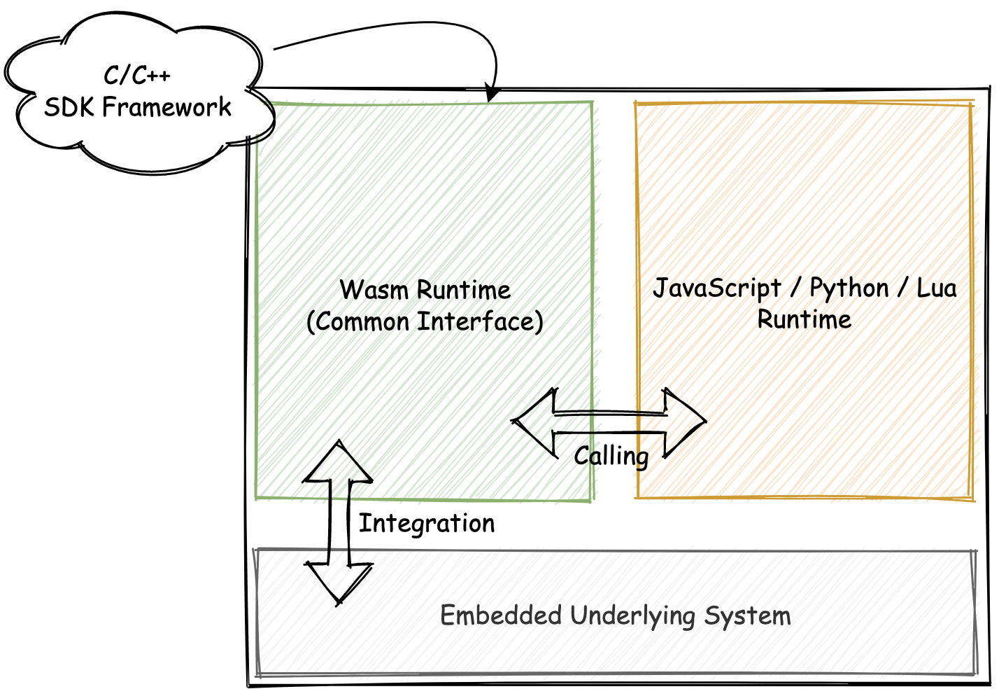
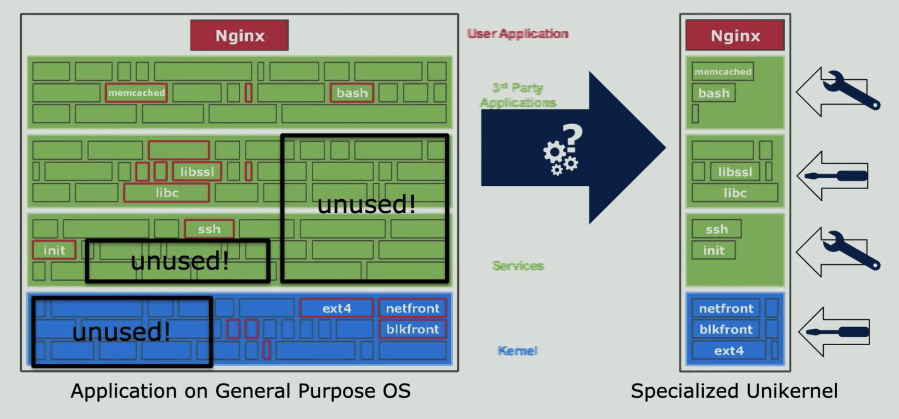
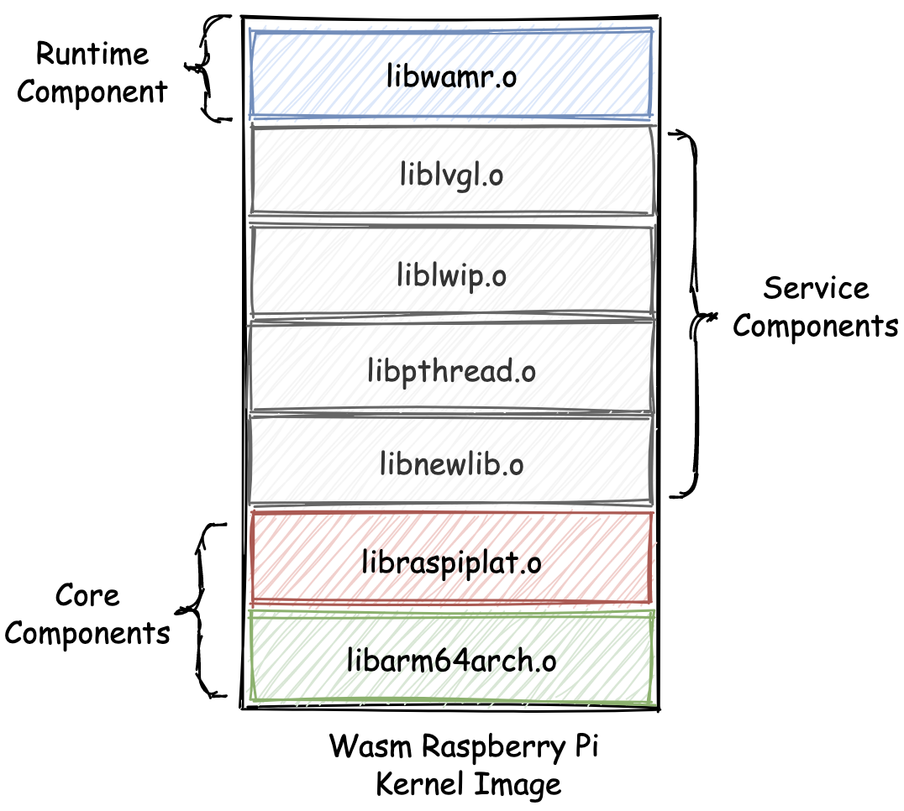
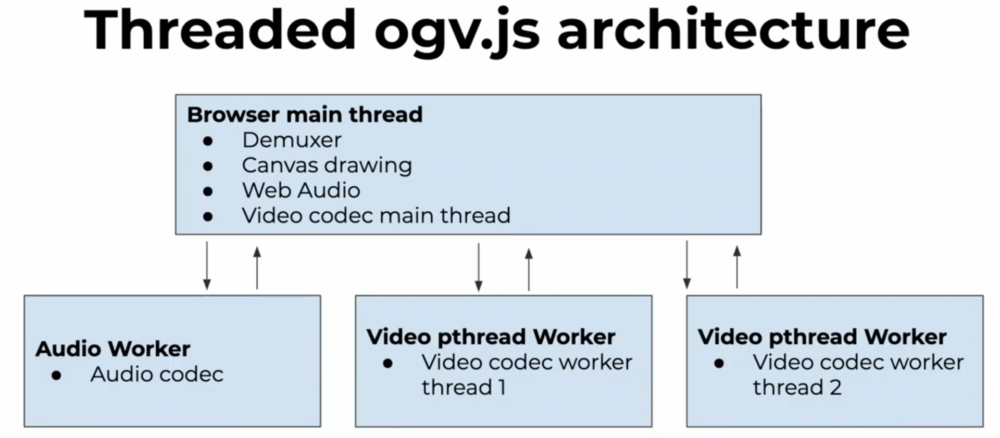

## WebAssembly在物联网、多媒体与云技术方面的创新实践

wasm在应用实践领域有哪些”新鲜事“。

一些比较典型且具有一定现实意义的创新性实践

### 物联网（IoT）

物联网（Internet of Things），一般简称为IoT；指相对于传统的手机、笔记本电脑等大型电子设备来说，其**可使用资源被有所限制**（比如单核的CPU、仅有几百KB的内存和硬盘容量、有限的网络上传速度，或仅需纽扣电池进行供电等）的小型嵌入式设备。

为嵌入式设备开发程序需要特殊的编程实践方法，以应对有限的软硬件资源。

#### 统一的编程接口

最初几年，人们通常只能够使用C/C++甚至是汇编语言，来为这些物联网嵌入式设备编写应用程序。

随着互联网技术的不断发展，以及从易用性、流行程度、生态系统等其他多方面进行考虑，诸如JavaScript、Lua以及Python等高抽象层次的脚本语言，也被逐渐应用在嵌入式设备上。

但，并非所有的嵌入式设备，都可以直接满足这些高级编程语言的使用要求。**由于不同语言的运行时差异，并且考虑到实现成本，嵌入式设备无法独立地为每种语言运行时都提供单独的编程接口（一般为C/C++），以供其与嵌入式设备进行交互。**

wasm字节码的高密度、高性能以及可移植性，使得人们有了可尝试的新选择。

如下图所示：通过**将wasm字节码作为嵌入式设备的中间媒介表示形式（IR），来向所有的外部高级编程语言宿主运行时，提供统一的基于wasm的编程接口**。

对相关wasm编程接口的调用，将会由嵌入式设备上的独立wasm运行时来执行。



我们不仅可以直接利用已有的C/C++编程接口（编译到wasm字节码），同时还能够向外界的宿主运行时提供统一的编程接口调用方式。可以类比Web浏览器中JavaScript与wasm二进制模块之间的交互方式。

#### 微内核 — Unikernel

一个曾在IoT，或者说嵌入式领域比较火的概念。

在传统的操作系统内核架构中，有着用来支持各类功能的底层驱动、框架、接口以及组件库。

是否可以**只**把整个嵌入式硬件需要使用的内核底层组件单独提取出来，使其成为一个**面向某一类特定功能或应用的专有内核**呢？答案是当然可以，这就是“微内核”的概念。



相较于传统的类Unix操作系统内核（一般称之为宏内核），微内核有着许多优势，比如：更快的启动速度、更小的ROM体积，以及更高的硬件资源使用率。

[Unikraft](https://unikraft.org/)便是一款可以用来制作微内核的系统工具。

通过使用Unikraft，我们可以构建一个基于wasm运行时的操作系统微内核。

相较于其他基于JavaScript等高级编程语言运行时（比如V8）构建的微内核而言，基于wasm的微内核将有着更高的程序执行效率、更少的硬件资源占用率，以及更快的操作系统冷启动速度。（V-ISA带来的优势）

🌰：比如，我们可以为“树莓派（一种嵌入式开发板）“，构建一个拥有如下”服务栈“的wasm微内核。



在这个微内核中，除了最下层必要的内核组件外，还为其添加了用于支持”图形界面”、”多线程“、”网络通信“以及“C标准库”等功能的必要组件。

最上层便是由wasm虚拟机（WAMR）构建出的“执行层”。在此处，可以通过提供wasm字节码的方式，来与整个微内核的其他组件功能进行交互。

在这样一个架构中，整个微内核的大小只有468KB。当上述wasm微内核被运行在一个普通的树莓派开发板上时，整个内核的启动时间仅需要20毫秒；并且内存资源的使用率以及应用程序代码的大小，也都处在一个对于嵌入式设备来说十分可观的量级下。


### 多媒体（Multimedia）

“音视频及图像的在线处理”是wasm在基于现阶段MVP标准的情况下，可以大显身手的一个重要场景。

因为**对多媒体资源的处理始终离不开“编解码”的需求**，编解码过程本身又是一个“计算密集”的数据处理过程。

就目前的大多数Web浏览器实现而言，当wasm不再需要频繁地与JavaScript环境之间传递大量数据时，JavaScript引擎便可以按照“最优”的策略来执行wasm代码，从而减少在两个上下文环境间相互切换时所产生的性能损耗。

基于wasm的Web端音视频处理方案

#### [ogv.js](https://github.com/brion/ogv.js)

一个由“维基百科”技术团队开发的，可以在Web浏览器中使用的多媒体播放器。

整体架构设计如下图所示。



位于主线程中的Demuxer作为整个播放器的核心组件，主要用于解码并提取各类型媒体文件中的音视频内容。

位于各个工作线程中的音视频解码过程，也同样属于整个播放器的核心逻辑。

这两部分**计算密集的逻辑便交由wasm来进行处理**。

为了保证性能和兼容性，ogv.js还**使用了ASM.js实现来作为wasm的一个兼容性补偿**，以便在一些不支持wasm的浏览器中，通过ASM.js来进行加速。在最不济的情况下，ogv.js便**可以直接退回到JavaScript的方案**（将ASM.js代码视作普通JavaScript来执行）。

ogv.js还可以同时**利用浏览器支持的“Multi-Cores Worker”特性**（每一个工作线程都使用CPU上的一个独立核心），来对整个解码过程进行加速。

**wasm最新的SIMD标准**被越来越多的浏览器实现，ogv.js在处理视频像素矩阵以及各类相关编解码工作时，还可以利用该特性来做到进一步的加速。

另一个值得讲的便是ogv.js对*第三方编解码库（libogg、libvorbis、libtheora等）的复用*。ogv.js在构建时，直接使用了已有的一些C/C++编解码库来完成对音视频流的编解码过程；ogv.js的整个开发过程变得更加方便快速。

#### WXInlinePlayer

也是一个Web端的音视频播放器。

国内的大多数移动端浏览器厂商（或者提供者）通常会在其自家浏览器内，对HTML5网页中基于`<video>`标签进行的视频播放行为，采用很多的“魔改”。

在某些视频无法正常播放的情况下，开发者甚至无法捕捉到任何的异常信息；这便为那些**需要提供一致性用户体验的产品**设置了阻碍。WXInlinePlayer的诞生便源于对此的迫切需求。

**WXInlinePlayer会自行解码收到的FLV视频流，然后再通过WebGL与WebAudio的方式，来将视频画面与音频播放出来。**

在实际的解码过程中，WXInlinePlayer便会利用wasm进行加速；同样的，它也使用了ASM.js作为wasm的降级方案。解码时，也同样利用了诸如“de265“等现有的C/C++解码库。

大多数公司采用的是”直接将FFmpeg编译到wasm来进行视频解码”的解决方案：

FFmpeg由于其自身的代码库体积过大，导致Web浏览器在实际加载和实例化wasm模块时，会消耗更多的时间；并且FFmpeg天生并非针对Web场景，因此其内部的很多优化策略可能无法直接在Web平台上使用。

而WXInlinePlayer**仅把涉及到解码和Remux的部分单独提取出来**，因此可以有效地针对某个解码方案进行优化。

WXInlinePlayer与其他同类型方案的视频播放性能对比如下（来自Github）：


### 云（Cloud）

wasm在云技术领域的一些实践。

#### [Krustlet](https://github.com/krustlet/krustlet)

Kubernetes是目前云原生领域中，最常用的一种容器编排引擎。通过它，我们可以方便地管理云平台上众多物理主机中运行的容器化应用。

Krustlet旨在作为一个Kubernetes Kubelet，以运行在整个Kubernetes集群中的各个服务节点上。其设计与Virtual Kubelet十分类似。

**根据指定的Kubernetes Toleration**，Kubernetes API能够将**特定的Pod**调用到Krustlet上，然后将它们运行在基于WASI的wasm运行时上。因此**借助于Krustlet，我们可以方便快捷地在Kubernetes集群中部署wasm应用**。

#### [Embly](https://www.embly.run/)

一个基于wasm的Serverless框架。

使我们**可以在服务器上执行wasm字节码（函数），并访问完成任务所需要的网络和系统资源。**

*通过一种“声明式”的配置文件来定义不同的wasm服务*；配置文件中包含有对服务函数的编译、部署以及声明所需依赖等多种任务流程的配置项。

Embly还实现了Actor模型（一种并发计算模型），可以*允许一个wasm函数生成另一个wasm函数*，并且函数之间可以相互传递数据。这使Embly足以应对更加复杂的计算模式。

基于wasm模块的沙箱机制也使得Embly可以*支持多租户的特性*。

🌰：一个简单的Embly示例配置文件

```rust
function "hello" {
  runtime = "rust"
  path    = "./hello"
}

gateway {
  type = "http"
  port = 8765
  route "/" {
    function = "${function.hello}"
  }
}
```

该文件中，定义了一个名为“hello”的函数，以及一个HTTP类型的网关。

根据网关的配置项“route“字段，声明了所有通过端口8765发送进来的、对根目录的HTTP请求，都会被转发到函数”hello“的对应实现中进行处理。

**在Embly中使用到的所有wasm函数，均需要由Rust语言进行编写。**在函数定义中，我们可以使用由Embly提供的用于访问各类系统资源（包括HTTP对应的请求和响应）的数据类型。


### 总结

随着将近5年时间的发展，对wasm的应用实践已经不再单单局限于Web平台，而是已经开始向各种各样的其他领域进军。虽然其中的大部分实践项目都还处于”实验性“阶段


### 扩展（评论区）

树莓派+wasm构建的demo：

* 可以搜索，WebAssembly Summit的视频，有一场介绍wasm与树莓派

[webpack对wasm的试验性支持](https://webpack.js.org/configuration/experiments/#experiments)

[Parcel对wasm的支持](https://parceljs.org/webAssembly.html)

在云原生领域还有一个比较重要的应用方向，即istio团队目前在大力推广的基于wasm plugin机制的envoy扩展方式，这是目前istio团队主推的扩展模式，用于取代原有的mixer组件。
