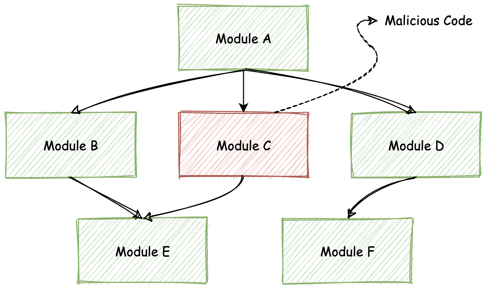
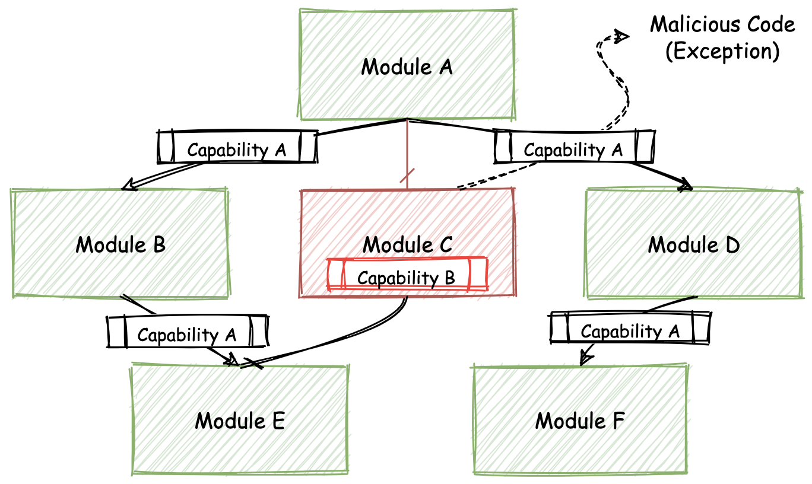

## 优秀的WebAssembly编译器与运行时

wasm可以在out-of-web领域大显身手的最基本保障。

它们其中有些支持WASI抽象系统接口，有些支持wasm Post-MVP标准中的部分提案，还有一些可以被专门用在诸如嵌入式、IoT物联网以及甚至云、AI和区块链等特殊的领域和场景中。

不仅如此，还有一些更具创新性的尝试，比如“wasm包管理”。

### 字节码联盟（Bytecode Alliance）

联盟旨在通过协作的方式，来共同实现wasm及WASI相关标准，并通过提出新标准的方式来共同打造wasm在浏览器之外的未来。

联盟希望能够为开发者提供健全的、基于各类**安全策略**构建的成熟开发工具链（虚拟机、编译器以及底层库）生态。

#### 背景——问题所在

诸如NPM、PyPi等代码包管理平台，让我们不再需要从头到尾完全“独立”地开发一个完整应用。

模块化的软件开发模式，让我们可以大量重用社区中现存的、已经十分成熟的第三方代码库。但，也不得不面对另外一个问题，那就是随着第三方代码而来的**代码安全性问题**。

在基于传统软件的开发模式中（譬如Node.js应用），第三方代码同样共享着应用程序所拥有的各类系统接口权限（如Socket网络通信、File文件系统等），以及资源访问（内存、硬盘等）权限。

如下图所示，**由于模块化的开发方式，使得代码的整体依赖成为了树状关系，因此整棵依赖树上的所有模块代码，都会共享同样的代码权限**。

这种共享无疑大大降低了应用整体的安全性，给第三方代码中所可能包含的恶意代码或漏洞以可乘之机。

🌰：一个真实的、第三方模块恶意代码窃取用户数字货币的案例的总结

攻击者通常会按照以下时间顺序（仅关键节点）来对终端用户逐步发起攻击。

* 第0天：攻击者创建了一个模块
* 第2天：攻击者将该模块作为可复用的第三方底层依赖库
* 第17天：攻击者为模块添加恶意外码
* 第42-66天：目标应用通过依赖升级而引入了恶意代码
* 第90天：攻击被用户察觉

通常来说，以上述案例为例，恶意代码需要同时具备以下两类权限才能够对终端用户成功地发起攻击：

1. 操作系统**资源的访问**权限。如用于存放诸如“密钥“等敏感数据的内存资源
2. 操作系统**接口的调用**权限。如对文件资源的读写权限

据Github官方调查统计，自2017年到2019年，NPM上包含有恶意代码的模块数量逐年增加，并且攻击者的恶意代码攻击目标逐渐向具体的某类终端用户聚焦。

有超过40%的代码库依赖于拥有至少包含一个已知漏洞的NPM第三方模块。

**从现实的情况来看，此类”恶意代码“或者”代码漏洞“问题无法被完全避免，因此我们需要考虑其他的方式来保证应用的运行时安全**。

发生类似的安全性问题其主要原因在于，恶意代码拥有了本不该拥有的系统资源和系统接口访问权限。**基于wasm，我们可以在一定程度上解决这个问题。**

每一个wasm模块在out-of-web环境中实例化运行时，也都有着自己独立的运行时沙盒环境，并且对应着独立的可用内存资源以及调用栈。

wasm模块之间的隔离不一定需要通过独立进程的方式来实现，因此从运行模型上来看，wasm的方式会更加轻量且高效。

与传统操作系统中的”进程“不同，每一个实例化的wasm模块，都**只**能够在实例化时使用被主动分配的系统资源（内存）与接口能力（系统调用），因此对于模块实例所拥有权限的控制力度会更为细腻。

相对于传统进程需要通过”序列化“与”反序列化“才能够在进程间传递信息（IPC）的方式不同，wasm实例之间的消息传递可以通过更加轻量的方式来完成。

#### 解决方案——纳米进程（Nano-Process）

根据上面讲过的wasm在资源及权限控制上的相对优势，我们可以提出一种新的wasm应用构建模式——”wasm NanoProcess“。

一个完整的大型wasm应用，可能会同时包含有多个相互依赖的底层wasm模块。由于每一个模块实例都拥有着自己独立的数据资源及可用权限，因此我们可以称每一个实例化的模块为一个独立的”nanoprocess“，翻译过来就是”纳米进程“。

**应用各依赖模块所能够使用的资源及系统接口权限，全部来自于最上层的调用者**；也就是说需要在应用运行的入口模块中被指定，然后再由该模块向下层依赖模块进行分发。

当恶意模块的内部代码需要使用某种未经授权的额外资源或能力时，整个模块依赖树的”Import Section“签名便会发生错误，这个错误会在运行时向上层用户抛出对应异常，提示某个模块的某些特定资源或者权限没有被导入。此时，特殊的权限调用便会引起注意。

即便恶意代码获得了特定操作系统接口的执行权限，但恶意代码想要从其他应用依赖模块的实例中，获取对应内存段中的敏感信息，也并非易事。

每个wasm模块实例都拥有独立、隔离的线性内存段来存储数据，因此只有在模块主动向外部暴露（通过”Export Section“）特定数据，或者直接调用（动态链接）目标模块内的方法时，才能够将自身内存段中的数据传递过去。

通过限制恶意代码对数据以及系统接口权限的访问和使用，”wasm nanoprocess“这种应用构建模式，可以在最大程度上保证wasm应用及其所依赖第三方模块的运行时安全性。如下图所示。

### 虚拟机运行时

为了能够基于“nanoprocess”模式来构建安全可靠的wasm应用，一定少不了在out-of-web领域提供wasm字节码解析和执行能力的基础设施；并且在一定程度上，我们还需要它们为我们提供WASI系统接口的访问能力。

“字节码联盟”负责培养和发展这样一批，能够提供这些能力的优秀基础设施及相关组件；主要包括：wasm运行时（虚拟机）、wasm运行时组件（实现）以及wasm语言相关的工具。

#### [wasmtime](https://wasmtime.dev/)

字节码联盟旗下的一个独立的wasm运行时，它可以被独立作为CLI命令行工具进行使用，或者是被嵌入到其他的应用程序或系统中。

有很高的可配置性和可扩展性，因此可以被应用到很多的场景中，譬如IoT与云原生领域。

基于优化的Cranelift引擎构建，因此它可以在运行时快速地生成高质量的机器码；可以将与目标无关的中间代码表示形式（IR）转换为可执行的机器代码。

wasm还支持部分的WASI系统接口以及wasm Post-MVP提案，以及对于诸如C和Python等语言的运行时绑定——这样你便可以在这些语言的代码中，直接使用wasmtime所提供的能力。

lucet和wasmtime合并

#### [WAMR](https://github.com/bytecodealliance/wasm-micro-runtime)

全称WebAssembly Micro Runtime，同样是一款字节码联盟旗下的独立wasm运行时，基于C语言开发。

更倾向于被应用在诸如IoT、嵌入式芯片等对功耗和硬件资源要求较为严格的wasm场景中。

支持多种wasm字节码的运行时“翻译”模式，比如JIT模式、AOT模式以及解释器模式。

可以在将近100微秒的时间内启动应用，并在最小100KB的内存资源下，便可以启动一个wasm实例。

同样支持WASI以及部分的wasm Post-MVP提案；它还提供了一个用于快速构建wasm应用的WAMR应用框架。

#### [wasmer](https://wasmer.io/)

一款独立于字节码联盟优秀的wasm运行时。

wasmer基于Rust编写，在支持wasm核心标准、部分WASI系统接口以及部分wasm Post-MVP标准的基础之上，还同时提供了对多达数十种编程语言的wasm运行时绑定支持，即，你可以在其他编程语言中使用wasmer的能力来解释和执行wasm字节码。

除此之外，wasmer有一个很有趣的尝试，提供和维护wasm包管理平台——wapm。通过这个平台，你可以发布新的或直接使用已有的wasm包；这些包都借助于WASI抽象操作系统接口，提供了与本地应用相同的系统资源访问能力。

#### [SSVM](https://github.com/WasmEdge/WasmEdge)

更名为WasmEdge。

一个专门针对云、AI以及区块链应用程序设计的高性能、可扩展且经过硬件优化的wasm虚拟机。

其wasm运行时针对ONNX AI模型进行了硬件优化，也可以作为区块链平台的智能合约运行时引擎。

### 总结

伴随wasm发展而出现的一个新的组织——“字节码联盟”：通过协作的方式来共同打造wasm在out-of-web领域的未来发展。

字节码联盟出现的背景，也就是当前传统应用构建模式在安全性上的不足。

基于wasm与WASI的天然安全特性，我们可以按照“nanoprocess”纳米进程模型，来构建更加安全的wasm应用。

字节码联盟出现的目的之一，就是提供、培养一系列必备的底层基础设施与相关组件，这样我们可以在未来轻松便捷地构建这类安全应用。

介绍的一些优秀的运行时，都支持wasm的MVP标准以及部分Post-MVP 标准中的提案，还有选择性地支持了部分的WASI操作系统接口，并以不同的实现方式擅长于一个或多个不同的实际应用场景，比如嵌入式、IoT、AI甚至是云计算领域。

### 扩展（评论区）

开发一款wasm运行时：

* 实现模型：参考[spec](https://webassembly.github.io/JS-BigInt-integration/core/exec/index.html)，更高性能：参考已有的实现，比如LuaJIT、WABT等提供的简易wasm解释器
* VM组成结构：《Advanced Design and Implementation of VMs》
* GC：《垃圾回收算法与实现》
* JIT：LLVM给出的例子

SIMD优化：

[Using SIMD to Optimize x86 Assembly Code in Array Sum Example](https://www.codeproject.com/Articles/5298048/Using-SIMD-to-Optimize-x86-Assembly-Code-in-Array)