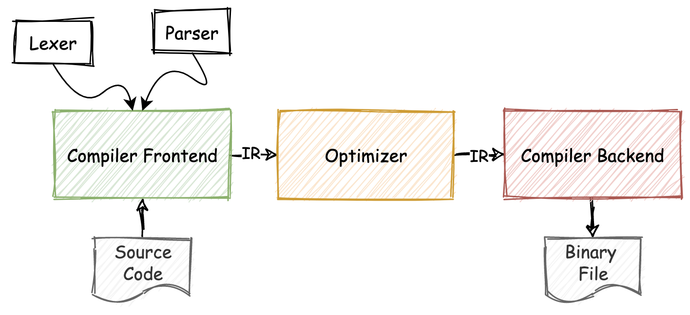
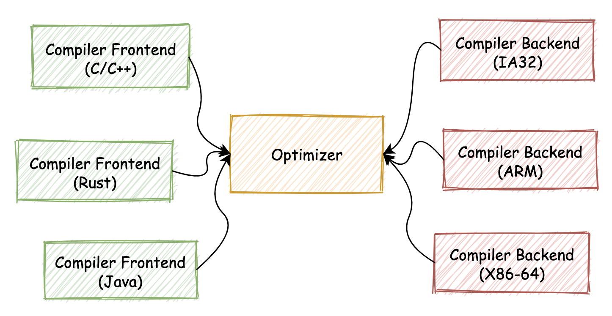
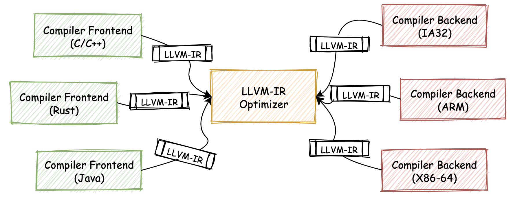

## LLVM：如何将自定义的语言编译到WebAssembly

应用wasm的常见方式：

* 一种方式是通过Web浏览器提供的JavaScript API与Web API，来在Web应用中调用从wasm模块中导出的函数

* 另一种方式是通过WASI抽象系统调用接口，以便在out-of-web应用中使用wasm

  使用方式与Web端大同小异，区别是可以借助底层运行时的能力，使得构建出的wasm应用可以在Web浏览器外的Native环境中与操作系统打交道。

现在有另外一个wasm的应用场景。

假设此时我们想要设计开发一款自定义的静态编程语言，那么怎样才能够方便快捷地为它的编译器添加一个能力，可以让编译器支持将wasm作为编译目标呢？

### 传统的编译器链路

对于传统的静态语言编译器来说，通常会采用较为流行的“三段式”链路结构。如下图所示：



三段式结构分别对应着整个编译器链路中最为重要的组成部分：编译器前端（Compiler Frontend）、中间代码优化器（Optimizer），以及编译器后端（Compiler Backend）。

* ”编译器前端“

  主要用于对输入的源代码进行诸如：词法、语法以及语义分析，并生成其对应的AST抽象语法树，然后再根据AST来生成编译器内部的中间代码表示形式（IR）

* ”中间代码优化器“

  主要用于对这些IR代码进行一定的优化，以减少最后生成的二进制文件大小，并同时提高二进制代码的执行效率

* ”编译器后端“

  负责进行与本地架构平台相关的代码生成工作。主要根据优化后的IR代码来进行寄存器分配和调优之类的工作，并生成对应的机器码，存储在构建出的二进制可执行文件中。

**分段式编译器链路的优势**在于：

当我们想要为其添加多种源语言或目标编译平台的支持时，只需要重新编写其中的一个”分段“，便可以很轻松地复用整个编译链路中的其他部分。如下图所示：



**满足这种”链路可分离“要求的一个前提**：需要整个链路中用于对接各个阶段的”中间产物（IR）“，其存在形式必须是确定且不变的。

一个现实的情况是：在LLVM出现之前，在各类编程语言的编译器链路中，并没有采用完全统一的中间产物表示形式（包括IR、AST等）。

编译器链路的**分段模式还有另外一个好处**，可以让编译器开发者的分工更加明确。这对于需要投入到商业化运作中的编译器来说，十分有利。


### LLVM

LLVM全称为”Low Level Virtual Machine“，翻译成中文即”低层次虚拟机“。

包含了众多可用于开发者使用的相关组件，这些组件包括语言编译器、链接器、调试器等操作系统底层基础构建工具。

LLVM在开发初期，被定位为一套具有良好接口定义的可重用组件库。这意味着：我们可以在所开发的第三方应用程序中，使用由LLVM提供的众多成熟高效的编译链路解决方案。这些方案以”组件化“的形式被管理在整套LLVM工具集中，可用于支持整个编译链路中各个阶段遇到的各种问题。

LLVM还提供了众多可以直接使用的命令行工具。通过这些工具（如llvm-as、llc、llvm-dis等等），我们也可以快速地对经由LLVM组件生成的中间表示产物，进行一定的变换和处理，极大地方便了应用开发和调试流程。

#### LLVM-IR

在整个LLVM工具链体系中，最重要的组成部分，便是其统一的、用于**表示编译器中间状态的代码格式**——LLVM-IR。

在一个基于LLVM实现的编译器链路中，位于链路中间的优化器将会使用LLVM-IR来作为统一的输入与输出中间代码格式。

在整个LLVM项目中，扮演着重要角色的LLVM-IR被定义成为一类具有明确语义的轻量级、低层次的类汇编语言，其具有足够强的表现力和较好的可扩展性。

通过更加贴近底层硬件的语义表达方式，它可以将高级语言的语法清晰地映射到其自身；不仅如此，通过语义中提供的明确变量类型信息，优化器还可以对LLVM-IR代码进行更进一步的深度优化。

通过将LLVM-IR作为**连接**编译器链路各个组成部分的重要中间代码格式，开发者便可以以此为纽带，来利用整个LLVM工具集中的任何组件。唯一的要求，是**所接入的源语言**需要被转换为LLVM-IR的格式（编译器前端）；同样，对任何**新目标平台的支持**，也都需要从LLVM-IR格式开始，再转换成具体的某种机器码（编译器后端）。

在LLVM-IR的基础上，分段式编译链路可以被描绘成下图的形式。



#### 命令行：基于LLVM生成wasm字节码

wasm可以作为一种目标平台，被实现在LLVM中（wasm作为一种V-ISA，其本身与i386、X86-64等架构平台没有太大的区别）。

在LLVM中，已经存在了可用于wasm目标平台的编译器后端。

🌰：尝试把一段C/C++代码通过LLVM转换为wasm字节码

为了完成整个编译流程，将使用LLVM工具集中的一个CLI命令行工具——llc，以及用于将C/C++源代码编译为LLVM-IR中间代码的编译器Clang。Clang是一个业界知名的、基于LLVM构建的编译器，可用于编译C/C++以及Objective-C等语言代码。

0. 前置，安装llvm

   clone项目本地编译

   [Docs](https://llvm.org/docs/GettingStarted.html#getting-the-source-code-and-building-llvm)，[Mac安装LLVM](https://blog.csdn.net/Charliewolf/article/details/101284923)

   ```shell
   $ git clone git@github.com:llvm/llvm-project.git # 拉取git源码
   Cloning into 'llvm-project'...
   remote: Enumerating objects: 5552250, done.
   remote: Counting objects: 100% (1227/1227), done.
   remote: Compressing objects: 100% (382/382), done.
   remote: Total 5552250 (delta 903), reused 1025 (delta 843), pack-reused 5551023
   Receiving objects: 100% (5552250/5552250), 1.92 GiB | 2.21 MiB/s, done.
   Resolving deltas: 100% (4517433/4517433), done.
   Updating files: 100% (133484/133484), done.
   $ cd llvm-project
   $ mkdir build # 创建build目录
   $ cd build  
   $ cmake -G "Unix Makefiles" -DLLVM_ENABLE_ASSERTIONS=ON -DCMAKE_BUILD_TYPE=Release ../llvm # 配置
   $ make -j 8 # 编译
   $ sudo make install # 安装
   $ which llvm-config # 查询安装位置
   /usr/local/bin/llvm-config
   $ llvm-config --version
   18.0.0git
   ```

1. 编写如下C/C++代码。

   ```shell
   $ mkdir demos
   $ cd demos
   $ vim add.cc
   $ cat add.cc  
   extern "C" {
     int add (int a, int b) {
       return a + b;
     }
   }
   ```

2. 通过以下命令，将上述代码编译为LLVM-IR中间代码对应的文本格式。

   ```shell
   clang -S -emit-llvm add.cc
   ```

   ```shell
   $ clang -S -emit-llvm add.cc 
   $ ls
   add.cc add.ll
   ```

   通过指定“-S“与”-emit-llvm”两个参数，使Clang在编译源代码时生成对应的LLVM-IR文本格式。

   命令执行完毕后，可以得到一个名为“add.ll”的文件。通过文本编辑器打开该文件，可以看到LLVM-IR的内容。

   ```shell
   $ cat add.ll                
   ; ModuleID = 'add.cc'
   source_filename = "add.cc"
   target datalayout = "e-m:o-p270:32:32-p271:32:32-p272:64:64-i64:64-f80:128-n8:16:32:64-S128"
   target triple = "x86_64-apple-macosx13.0.0"
   
   ; Function Attrs: noinline nounwind optnone ssp uwtable
   define i32 @add(i32 noundef %0, i32 noundef %1) #0 {
     %3 = alloca i32, align 4
     %4 = alloca i32, align 4
     store i32 %0, i32* %3, align 4
     store i32 %1, i32* %4, align 4
     %5 = load i32, i32* %3, align 4
     %6 = load i32, i32* %4, align 4
     %7 = add nsw i32 %5, %6
     ret i32 %7
   }
   
   attributes #0 = { noinline nounwind optnone ssp uwtable "darwin-stkchk-strong-link" "frame-pointer"="all" "min-legal-vector-width"="0" "no-trapping-math"="true" "probe-stack"="___chkstk_darwin" "stack-protector-buffer-size"="8" "target-cpu"="penryn" "target-features"="+cx16,+cx8,+fxsr,+mmx,+sahf,+sse,+sse2,+sse3,+sse4.1,+ssse3,+x87" "tune-cpu"="generic" }
   
   !llvm.module.flags = !{!0, !1, !2, !3, !4}
   !llvm.ident = !{!5}
   
   !0 = !{i32 2, !"SDK Version", [2 x i32] [i32 13, i32 3]}
   !1 = !{i32 1, !"wchar_size", i32 4}
   !2 = !{i32 7, !"PIC Level", i32 2}
   !3 = !{i32 7, !"uwtable", i32 2}
   !4 = !{i32 7, !"frame-pointer", i32 2}
   !5 = !{!"Apple clang version 14.0.3 (clang-1403.0.22.14.1)"}
   ```

3. 继续使用“llc”工具，将LLVM-IR中间代码转换为对应的wasm字节码

   “llc”是LLVM的静态编译器，可以将输入的LLVM-IR代码编译到平台相关的机器码。

   可以通过命令“llc --version”来查看它所支持的编译目标平台。

   ```shell
   $ llc --version
   LLVM (http://llvm.org/):
     LLVM version 18.0.0git
     Optimized build with assertions.
     Default target: x86_64-apple-darwin22.4.0
     Host CPU: icelake-client
   
     Registered Targets:
       aarch64     - AArch64 (little endian)
       aarch64_32  - AArch64 (little endian ILP32)
       aarch64_be  - AArch64 (big endian)
       amdgcn      - AMD GCN GPUs
       arm         - ARM
       arm64       - ARM64 (little endian)
       arm64_32    - ARM64 (little endian ILP32)
       armeb       - ARM (big endian)
       avr         - Atmel AVR Microcontroller
       bpf         - BPF (host endian)
       bpfeb       - BPF (big endian)
       bpfel       - BPF (little endian)
       hexagon     - Hexagon
       lanai       - Lanai
       loongarch32 - 32-bit LoongArch
       loongarch64 - 64-bit LoongArch
       mips        - MIPS (32-bit big endian)
       mips64      - MIPS (64-bit big endian)
       mips64el    - MIPS (64-bit little endian)
       mipsel      - MIPS (32-bit little endian)
       msp430      - MSP430 [experimental]
       nvptx       - NVIDIA PTX 32-bit
       nvptx64     - NVIDIA PTX 64-bit
       ppc32       - PowerPC 32
       ppc32le     - PowerPC 32 LE
       ppc64       - PowerPC 64
       ppc64le     - PowerPC 64 LE
       r600        - AMD GPUs HD2XXX-HD6XXX
       riscv32     - 32-bit RISC-V
       riscv64     - 64-bit RISC-V
       sparc       - Sparc
       sparcel     - Sparc LE
       sparcv9     - Sparc V9
       systemz     - SystemZ
       thumb       - Thumb
       thumbeb     - Thumb (big endian)
       ve          - VE
       wasm32      - WebAssembly 32-bit
       wasm64      - WebAssembly 64-bit
       x86         - 32-bit X86: Pentium-Pro and above
       x86-64      - 64-bit X86: EM64T and AMD64
       xcore       - XCore
   ```

   可以看到其支持名为”wasm32“与”wasm64“两种wasm的目标平台，此处我们使用第一个”wasm32“。

   通过以下命令行，就可以将上述生成的LLVM-IR代码编译为最终的wasm字节码。

   ```shell
   $  llc add.ll -filetype=obj -mtriple=wasm32 -o add.wasm
   'penryn' is not a recognized processor for this target (ignoring processor)
   '+cx16' is not a recognized feature for this target (ignoring feature)
   '+cx8' is not a recognized feature for this target (ignoring feature)
   '+fxsr' is not a recognized feature for this target (ignoring feature)
   '+mmx' is not a recognized feature for this target (ignoring feature)
   '+sahf' is not a recognized feature for this target (ignoring feature)
   '+sse' is not a recognized feature for this target (ignoring feature)
   '+sse2' is not a recognized feature for this target (ignoring feature)
   '+sse3' is not a recognized feature for this target (ignoring feature)
   '+sse4.1' is not a recognized feature for this target (ignoring feature)
   '+ssse3' is not a recognized feature for this target (ignoring feature)
   '+x87' is not a recognized feature for this target (ignoring feature)
   'penryn' is not a recognized processor for this target (ignoring processor)
   'penryn' is not a recognized processor for this target (ignoring processor)
   '+cx16' is not a recognized feature for this target (ignoring feature)
   '+cx8' is not a recognized feature for this target (ignoring feature)
   '+fxsr' is not a recognized feature for this target (ignoring feature)
   '+mmx' is not a recognized feature for this target (ignoring feature)
   '+sahf' is not a recognized feature for this target (ignoring feature)
   '+sse' is not a recognized feature for this target (ignoring feature)
   '+sse2' is not a recognized feature for this target (ignoring feature)
   '+sse3' is not a recognized feature for this target (ignoring feature)
   '+sse4.1' is not a recognized feature for this target (ignoring feature)
   '+ssse3' is not a recognized feature for this target (ignoring feature)
   '+x87' is not a recognized feature for this target (ignoring feature)
   'penryn' is not a recognized processor for this target (ignoring processor)
   ```

4. 查看wasm字节码

   ```shell
   $ hexdump -C add.wasm          
   00000000  00 61 73 6d 01 00 00 00  01 87 80 80 80 00 01 60  |.asm...........`|
   00000010  02 7f 7f 01 7f 02 af 80  80 80 00 02 03 65 6e 76  |.............env|
   00000020  0f 5f 5f 6c 69 6e 65 61  72 5f 6d 65 6d 6f 72 79  |.__linear_memory|
   00000030  02 00 00 03 65 6e 76 0f  5f 5f 73 74 61 63 6b 5f  |....env.__stack_|
   00000040  70 6f 69 6e 74 65 72 03  7f 01 03 82 80 80 80 00  |pointer.........|
   00000050  01 00 0a a8 80 80 80 00  01 26 01 01 7f 23 80 80  |.........&...#..|
   00000060  80 80 00 41 10 6b 22 02  20 00 36 02 0c 20 02 20  |...A.k". .6.. . |
   00000070  01 36 02 08 20 02 28 02  0c 20 02 28 02 08 6a 0b  |.6.. .(.. .(..j.|
   00000080  00 9a 80 80 80 00 07 6c  69 6e 6b 69 6e 67 02 08  |.......linking..|
   00000090  8b 80 80 80 00 02 00 00  00 03 61 64 64 02 10 00  |..........add...|
   000000a0  00 90 80 80 80 00 0a 72  65 6c 6f 63 2e 43 4f 44  |.......reloc.COD|
   000000b0  45 03 01 07 06 01 00 c3  80 80 80 00 09 70 72 6f  |E............pro|
   000000c0  64 75 63 65 72 73 01 0c  70 72 6f 63 65 73 73 65  |ducers..processe|
   000000d0  64 2d 62 79 01 0b 41 70  70 6c 65 20 63 6c 61 6e  |d-by..Apple clan|
   000000e0  67 1d 31 34 2e 30 2e 33  20 28 63 6c 61 6e 67 2d  |g.14.0.3 (clang-|
   000000f0  31 34 30 33 2e 30 2e 32  32 2e 31 34 2e 31 29 00  |1403.0.22.14.1).|
   00000100  ac 80 80 80 00 0f 74 61  72 67 65 74 5f 66 65 61  |......target_fea|
   00000110  74 75 72 65 73 02 2b 0f  6d 75 74 61 62 6c 65 2d  |tures.+.mutable-|
   00000120  67 6c 6f 62 61 6c 73 2b  08 73 69 67 6e 2d 65 78  |globals+.sign-ex|
   00000130  74                                                |t|
   00000131
   ```

#### 组件库：wasm编译器后端

上例中，通过使用LLVM工具链提供的命令行工具，将基于C/C++代码编写的函数”add“编译成了对应的wasm字节码。

既然LLVM中存在着命令行工具可以进行类似的转换，那么在代码层面，便也存在着相应的组件库，能够实现从LLVM-IR到wasm字节码的转换过程。

在实际的编码过程中，可以通过”llvm::TargetRegistry::lookupTarget“这个API来设置和使用wasm对应的目标编译器后端，以编译中间的LLVM-IR格式代码。可以参考LLVM的[官方文档](https://llvm.org/docs/)来查阅更多的细节信息。


### 总结

传统”三段式“编译器链路的一些特点：即分段式的结构更易于编译链路中对各重要组件的复用；能够让编译链路的扩展变得更加轻松。

LLVM是一套综合性的软件工具链。内部提供了一系列基于LLVM-IR、可用于构建编译相关系统工具的各类组件，比如代码优化器、生成器等等；还为我们提供了诸如”llc“等命令行工具，可用于方便地对LLVM-IR等格式进行转换和编译。

LLVM整合了可用于编译LLVM-IR到wasm字节码的编译器后端，因此，只要能够将我们自定义的编程语言代码编译到LLVM-IR，那么我们就可以直接利用LLVM已有的wasm后端，来将这些IR编译到wasm字节码格式。


### 思考题

wasm32与wasm64 两者的区别


### 扩展（评论区）

LLVM与Emscripten的区别？

LLVM对 wasi-libc 的支持目前还不是很完善。相比 Emscripten 来说，直接使用 LLVM 的版本会有比较多的冗余字节码，且编译流程较为复杂，比如需要使用单独的 wasm-ld 进行链接以导出 C/C++ 代码中的函数。而 Emscripten 则会帮助你简化整个编译流程到 emcc 中，同时也会自动生成可用的 JavaScript Glue 来帮助你简化 Wasm 模块的使用方式。相较之下，LLVM 就不会帮你去模拟 Web 上的 POSIX 环境了。因此诸如 fopen 这些函数在通过 LLVM 编译到 Wasm 后就无法直接在 Web 浏览器上使用了。


存在 wasm32 和 wasm64的平台， 应该可以操作系统 中存在64和32 位的原因是一样的 1:  64 有更大的 CPU 位宽，可以进行更大的数值的计算 2:  内存寻址空间大小不一样


类似操作系统的 32 位与 64 位之分. 简而言之, wasm32 与 wasm64 的区别主要在于内存寻址范围的不同, 对于 wasm32 仅能对 2 的 32 次方(大约 4GB) 的线性内存范围进行寻址, 而 wasm64 能够在更大范围的内存中寻址. 虽然现在我们的操作系统基本都是 64 位, 但对于 wasm 来说, 区分 wasm32 和 wasm64 两个编译目标的主要的原因在于: 绝大多数 wasm 应用都不需要使用到超过 4GB 的内存. 参考: https://webassembly.org/docs/faq/
