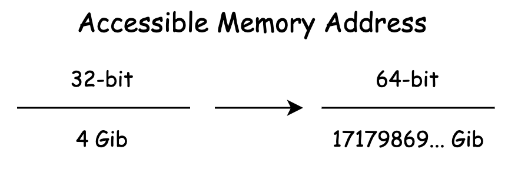

## 有哪些正在行进中的WebAssembly Post-MVP提案

wasm有哪些行进中的后续标准正在被设计和实现？这些标准将会分别影响整个wasm生态的哪些组成部分？借助于这些新的标准，现有的wasm应用能否被进一步得到优化？

MVP标准并不代表着wasm的最终版本，相反，它正是标志着wasm从枯燥的技术理论走向生产实践的一个起点。

### MVP

在这个版本中，包含有能够支持该产品正常使用的最少、同时也是最重要的组成部分。

wasm在MVP标准中都定义了哪些”功能“？

#### 可编译目标

wasm实际上是一种新的V-ISA标准。”ISA“我们都知道，翻译过来即”指令集架构“。

wasm指令集架构中的指令并不是为真实的物理硬件设计的。这些虚拟指令被设计和应用于一种”概念性“的机器；对于这个概念性机器的具体实现细节，则交由各个VM虚拟机以及Runtime运行时来负责。

这便是MVP标准”赋予“wasm的第一个能力——可编译目标。

作为一种指令集架构，MVP标准下的wasm**仅**提供了包括：“分支指令”、“内存操作指令”、“数学运算指令”以及“类型转换指令”等几种最为常用的指令类型。

#### 字节码格式

下一个需要在MVP标准中确定的部分就是，我们应该如何在计算机中表示这些指令的一个集合呢？

这也是wasm MVP标准中最为重要的一部分定义，即“wasm字节码组成结构”。其中定义了wasm以“Section”为单元的模块内部组成结构，以及这些结构在二进制层面的具体编码方式等。

#### Web可交互性

“如何使用wasm？”

MVP标准为我们提供了相应的JavaScript API与Web API以用于实现wasm与Web的可交互性。

但MVP标准中所定义的“可交互性”，仅满足了Web与wasm之间的最简单“交流方式“。在这种交流方式下，JavaScript环境与wasm环境之间仅能够传递最基本的数字值。

对于复杂数据类型的传递，则需要通过wasm线性内存段进行中转；甚至，对于诸如JavaScript引擎等宿主环境中的”不透明数据“，也无法直接在wasm模块中使用。

### Post-MVP

对于wasm的MVP版本标准来说，它并不在于想要一次性提供一个大而完整的新技术体系。相反，它希望能够在人们的实际生产实践中，去逐渐验证wasm这项新技术是否真的有效，是否真的可以解决现阶段开发者遇到的问题，然后再同时根据这些来自实际生产实践的反馈，与开发者共同制定wasm的未来发展方向。

以下来看，wasm发展出了哪些新的提案，这些提案目前都处于怎样的进展中。

#### [多线程与原子操作](https://github.com/WebAssembly/threads/blob/master/proposals/threads/Overview.md)

为wasm提供了多线程与原子内存操作相关的能力。

该提案为wasm标准提供了一个新的”共享内存模型“，以及众多的”内存原子操作指令“。使开发者可以方便地在Web端构建出wasm的多线程应用。

基于此提案构建的wasm Web多线程应用的基本结构，如下图所示。

”共享内存模型“，可以理解为，一块可以同时被多个线程共享的线性内存段。

在Web平台中，SharedArrayBuffer对象便被用来作为这样的一个”共享内存对象“，以便支持在多个Worker线程之间数据共享能力。

多线程模式的一个特征，就是每个Worker线程都将会实例化自己独有的wasm对象，并且每个wasm对象也都将拥有自己独立的栈容器用来存储操作数据。

如果再配合浏览器的”Multi-Cores Worker“特性，我们便能够真正地做到基于多个CPU核心的wasm多线程，而到那个时候wasm应用的数据处理能力便会有着更进一步的提升。

”原子内存操作“，可以理解为，在多个线程中通过这些原子内存操作指令来同时访问同一块内存中的数据时，不会发生”数据竞争“的问题。

每一个操作都是独立的事务，无法被中途打断，这就是”原子“的概念。通过这些原子内存操作，我们还能够实现诸如”互斥锁“、”自旋锁“等各类并发锁结构。

该提案已经可以在Chrome可Firefox的最新版本中使用。

#### [SIMD](https://github.com/WebAssembly/simd/blob/master/proposals/simd/SIMD.md)

全称为”Single Instruction，Multiple Data“，即”单指令多数据流“；是一种可以通过单一指令，对一组向量数据同时进行操作的一种并行性技术。

🌰：SIMD下的乘法与普通标量乘法运算之间的区别

在左侧的”标量乘法运算“中，对于这四组操作，需要使用四条指令。

而在右侧的SIMD版本中，可以仅通过一条SIMD指令，就能够同时完成针对这四组数字的对应乘法运算。

相较于普通的标量乘法运算来说，SIMD会使用特殊的寄存器来存储一个向量中的一簇数据，然后再以整个”向量“为单位进行运算。

在wasm Post-MVP标准中提供了这样的一系列指令，可以**让wasm利用硬件的SIMD特性来对特定的向量计算过程进行加速**。这对于需要同时对大量数据单元（如像素点）进行相同计算过程的应用场景（如”静态图像及视频处理“），会有着十分明显的性能提升。

目前该提案还暂时无法在任何浏览器中使用。

#### [wasm64](https://github.com/WebAssembly/memory64/blob/master/proposals/memory64/Overview.md)

在目前的MVP标准中所有关于内存操作的相关指令，都仅能够使用32位长度的”偏移地址”，来访问wasm模块线性内存中某个位置上的数据。即，我们能够在wasm实例中使用的内存资源最多仅能有4GiB。因此我们一般会将MVP标准下的wasm模型称为“wasm32”。

随着Post-MVP的不断发展，wasm也将开始支持64位长度的内存指针（偏移），来访问大于4GiB的内存资源。相信更多更加庞大和复杂化的wasm Web应用，也将会伴随着“wasm64”模型的出现而逐渐涌现；Web端的能力将逐渐与native平台靠拢。

现阶段，该提案还没有被任何浏览器实现。

#### [wasm ES Module](https://github.com/WebAssembly/esm-integration/tree/main/proposals/esm-integration)

作为一种官方的JavaScript模块化方案，“ES Module”使得我们能够通过“export”与“Import”两个关键字，来定义一个JavaScript模块所需要导入，以及可以公开导出给外部使用的资源。

借助于该提案，我们可以简化一个wasm模块的加载、解析与实例化过程。并且可以通过与JavaScript一致的方式，来使用从wasm模块中导出的资源。

相较于之前介绍的通过JavaScript API来加载和实例化wasm模块的方式，使用import的方式会相对更加简洁；在该提案下，我们也可以通过`<script type="module">`标签的方式来加载和使用一个wasm模块。

现阶段，该提案还没有被任何浏览器实现。

#### [Interface Type](https://github.com/WebAssembly/interface-types/tree/main/proposals/interface-types)

在目前的wasm MVP标准中，wasm与宿主环境（比如JavaScript）之间只能够互相传递“数字值”类型的数据。对于诸如“字符串”、“对象“等复杂、特殊的数据类型，则需要通过编解码的方式来在两个不同环境之间传递和使用。这无疑增加了应用的整体执行成本和开发者的负担。

该提案通过**在宿主环境与wasm模块之间添加”接口适配层“，来满足从wasm模块的”低层次“数据类型，到外界宿主环境”高层次“数据类型之间的相互转换过程**。借助于这个提案，wasm模块与宿主环境之间的可交换数据类型将会变得更加丰富，同时数据的交换成本也会变得更低。

目前该提案仍然处在不断地修改和变化当中，能够支持的高层次数据类型还有待最终的确定。

现阶段，该提案还没有被任何浏览器实现。

### wasm W3C提案流程

自wasm成为W3C的一项”官方“标准之后，核心团队对wasm Post-MVP提案的发布也有了相应的标准化流程。这个流程与TC39所使用的”Stage0-4“的”分阶段式“提案发布流程大同小异。

#### 六个流程

一项新的wasm提案从想法的诞生到最后被正式加入标准，一共需要经历如下六个阶段：

0. Pre-Proposal【Individual Contributor】
1. Feature Proposal【Community Group】
2. Feature Description Text Available【Community + Working Group】
3. Implementation Phase【Community + Working Group】
4. Standardize the Feature【Working Group】
5. The Feature is Standardized【Working Group】

关于这六个阶段的”进入条件”，以及每个阶段要做的事情，可以查阅[文档](https://github.com/WebAssembly/meetings/blob/main/process/phases.md)

#### 提案总览

[Proposals](https://github.com/WebAssembly/proposals)

### 总结

主要介绍了wasm从MVP标准到Post-MVP标准所经历的变化。

在MVP标准中，主要定义了关于wasm的一些核心基础性概念。

对于Post-MVP的众多提案，则将会在MVP的基础之上再进一步拓展wasm的能力。

尽管大部分提案看起来都十分复杂，但wasm被作为一种高级语言的最终编译目标，无论是对于MVP还是Post-MVP标准中的大多数提案，它们都不会对我们日常使用wasm的方式产生任何改变。

这些提案所带来的新特性或优化机制，将由各个编译器和虚拟机来为我们实现。

扩展（评论区）

浏览器的支持情况或者 node 的支持情况 可以使用这个 npm 库进行判断： https://github.com/GoogleChromeLabs/wasm-feature-detect