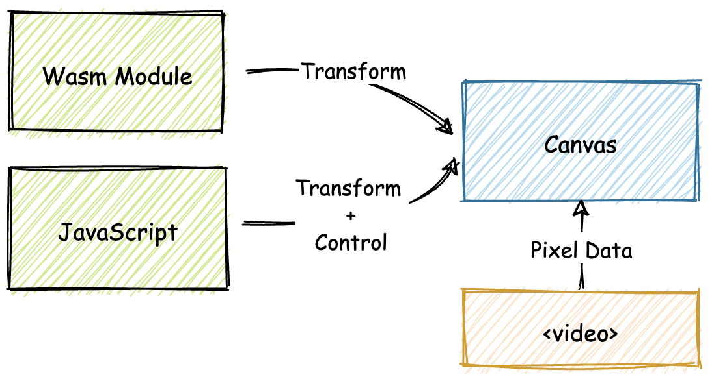
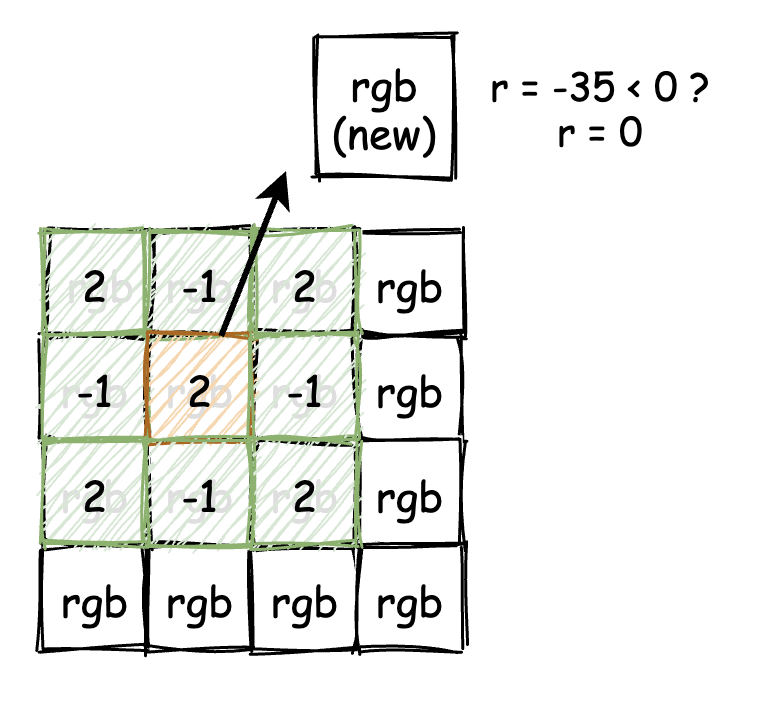
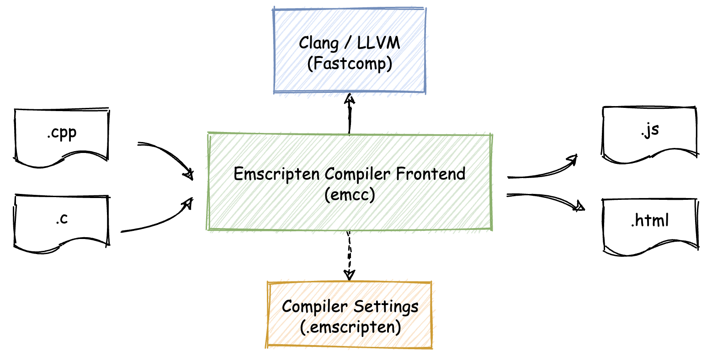
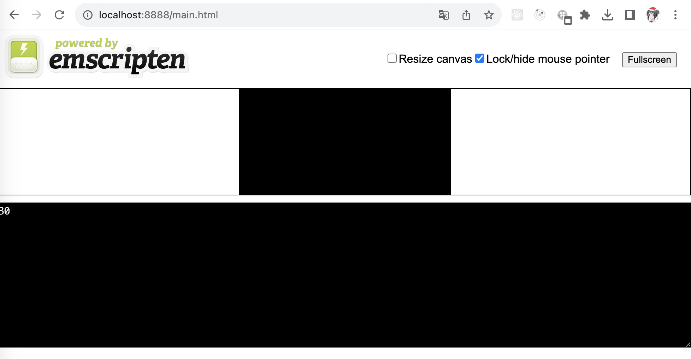
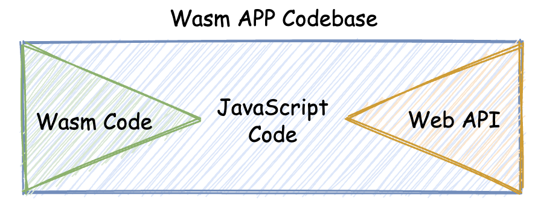

## 实现一个WebAssembly在线多媒体处理应用（一）

之前曾谈到wasm在Web多媒体资源处理领域所具有的极大优势；接下来将尝试构建的应用，就是一个基于wasm的在线DIP应用。

### DIP应用概览

DIP全称为“Digital Image Processing”，即“数字图像处理”。

我们将构建的这个Web应用中，将会**为在线播放的流媒体资源，去添加一个特定的实时“图像处理滤镜”**，以改变视频本身的播放显示效果。

由于添加实时滤镜需要在视频播放时，同步地对当前某一帧画面上的所有像素点，进行一定的像素值的数学处理变换，因此整个应用从某个角度来说，是一个“计算密集型”应用。

以下为实现效果图：


根据上图，可将整个应用的运行界面划分为三个部分。

* 最上方的是视频显示区域。

  循环播放一段视频，并根据用户是否选择添加滤镜，来实时动态地改变这里的视频显示效果。

* 视频下方的区域用来显示当前视频的实时播放帧率。

  通过显示播放帧率，我们将能够在应用运行时明显地看出，当在分别采用JavaScript以及wasm为视频资源“添加”滤镜时，两者在计算性能上的差异。

* 再往下就是整个应用的控制区域。

  控制是否为视频添加滤镜效果；以及是使用JavaScript还是wasm来处理滤镜的添加过程。

整个应用的结构图如下所示。



首先，为了能够实时地处理视频数据，我们需要将HTML `<video>`标签所承载视频的每一帧，都绘制在一个Canvas对象上，并通过Web API——“requestAnimationFrame”来让这些帧“动起来”。

然后，这些数据将会根据用户所选择的设置，分别传递给wasm模块或JavaScript进行相应的滤镜处理。JavaScript同时兼具控制整个应用UI交互的作用，比如处理“点击事件”，处理用户所选择的设置等等。


### 滤镜的基本原理

当说到”为视频添加滤镜“时，这一操作里的”滤镜“，主要是指什么？只有了解了，才能够知道相应的JavaScript代码，或者wasm代码需要做些什么。

为了了解什么是滤镜，需要先学习DIP领域中的一个基本概念——”卷积“。

直观来看，对图像进行卷积的过程，其实就是通过一个具有固定尺寸的矩阵，来对该图像中的每一个像素点的值进行重新计算的过程。这个过程通常也被称为”滤波“。

上述介绍的”固定尺寸的矩阵“，一般被称为”卷积核“。

卷积的计算过程十分简单，主要分为以下几个步骤：

* 首先将卷积核矩阵翻转180度
* 然后将图像上除最外一圈（考虑到”边缘效应“，直接忽略边缘像素）的其他各像素点的灰度值，与对应的卷积核矩阵上的数值相乘，然后对所有相乘后得到的值求和，并将求和结果作为卷积核中间像素点对应图像上像素的灰度值。（此处”灰度值“也可以由每个像素点的各RGB分量值来进行代替）。
* 重复上述步骤，直至图像中所有像素点均完成此计算过程。

🌰：

* 首先，给出一个 3 x 3大小的卷积核矩阵：

| 2    | -1   | 2    |
| ---- | ---- | ---- |
| -1   | 2    | -1   |
| 2    | -1   | 2    |

第一步，对该矩阵进行180度的旋转。由于该矩阵是中心对称的，因此旋转后的矩阵与原矩阵相比，没有任何变化。

* 接下来，给出一个4 x 4像素大小的图像：

| rgb(0, 0, 0) | rgb(0, 0, 0)    | rgb(0, 0, 0)       | rgb(0, 0, 0) |
| ------------ | --------------- | ------------------ | ------------ |
| rgb(0, 0, 0) | rgb(10, 10, 10) | rgb(255, 0, 0)     | rgb(0, 0, 0) |
| rgb(0, 0, 0) | rgb(0, 0, 255)  | rgb(100, 100, 100) | rgb(0, 0, 0) |
| rgb(0, 0, 0) | rgb(0, 0, 0)    | rgb(0, 0, 0)       | rgb(0, 0, 0) |

* 直接忽略图像最外层像素的卷积处理。需要从第二行第二列的像素点开始进行卷积计算：

  * 首先，将翻转后的卷积核矩阵中心，与第二行第二列位置的像素点对齐。

    此时可以发现，卷积核矩阵中的各个单元，正好与图像左上角3 x 3范围内的像素一一对应；如果对图像最外一层像素点进行卷积计算，卷积核矩阵覆盖的像素范围会超过图像的边界。

    可参考下图来理解这个步骤。

    

  * 接着，开始计算。

    首先，把卷积核矩阵对应的9个单元格内，各像素点的RGB分量值与对应单元内的数值相乘；

    然后，将这九个值进行求和。

    得到的结果值就是在卷积核矩阵中心单元格内，所对应像素的RGB分量值的卷积结果值；其他分量的卷积计算过程可以以此类推。

  * 🌰：以第二行第二列的像素点为例，计算这个像素点R分量的卷积结果R(c)

    `R(c) = 2x0 + -1x0 + 2x0 + -1x0 + 2x10 + -1x255 + 2x0 + -1x0 + 2x100 = -35`

    一个RGB分量的有效取值范围为[0, 255]，而负数则明显是不正确的。

    因此在实际的卷积计算过程中，还需增加另外一个规则，就是：对于小于0的计算结果，用0代替，大于255的计算结果，则用255进行代替。按照该规则，此像素点的R分量经过卷积计算后的实际结果值应该为0。

本次实践中，将使用下面这个3 x 3大小的卷积核：

| -1   | -1   | 1    |
| ---- | ---- | ---- |
| -1   | 14   | -1   |
| 1    | -1   | -1   |


### Emscripten的基本用法

Emscripten是一个”源到源”语言编译器工具集，这个工具集可以将C/C++代码编译成对应JavaScript代码。

除了最为重要的编译器组件emcc外，Emscripten还同时为我们提供了包含有特定功能宏定义的C/C++头文件、一些Python脚本以及其他的附属命令行工具等。

emcc的基本组成结构如下图所示。



可以看到，emcc能够将输入的C/C++代码，编译成对应的JavaScript代码以及用于组成Web应用的HTML文件。

起初，Emscripten主要用于将C/C++代码编译成对应的ASM.js代码，随着后来wasm的逐渐发展和流行，Emscripten也开始支持将这些输入代码编译成wasm二进制代码。**这部分代码的转换功能，主要依赖于LLVM为支持wasm而特意添加的编译器后端**。

**整个转换的大致流程可以简单归结为：C/C++源代码 -> LLVM-IR -> wasm**

**emcc直接使用了Clang编译器的前端**，把输入的C/C++源代码转换到LLVM-IR中间代码。

上图中可以看到一个名为“Fastcomp”的组件，这个组件是Emscripten在旧版本中用于生成ASM.js代码的编译器后端，它也兼有生成wasm代码的功能；在最近的版本中，**Emscripten已经完全使用LLVM的后端，来代替Fastcomp生成wasm二进制代码。**从某种程度上来看，使用LLVM的wasm编译器后端，将逐渐成为在主流静态编译器中，将wasm作为编译目标的首选实现方式。

#### Emscripten的安装

[官方文档](https://emscripten.org/docs/getting_started/downloads.html)

```shell
## get the emsdk repo
$ git clone https://github.com/emscripten-core/emsdk.git
Cloning into 'emsdk'...
remote: Enumerating objects: 3754, done.
remote: Counting objects: 100% (644/644), done.
remote: Compressing objects: 100% (106/106), done.
remote: Total 3754 (delta 560), reused 595 (delta 533), pack-reused 3110
Receiving objects: 100% (3754/3754), 2.18 MiB | 848.00 KiB/s, done.
Resolving deltas: 100% (2475/2475), done.
# enter that directory
$ cd emsdk 
# fetch the latest version of the emsdk
$ git pull                                              
Already up to date.
# download and install the latest SDK tools.
$ ./emsdk install latest          
Resolving SDK alias 'latest' to '3.1.44'
Resolving SDK version '3.1.44' to 'sdk-releases-b90507fcf011da61bacfca613569d882f7749552-64bit'
Installing SDK 'sdk-releases-b90507fcf011da61bacfca613569d882f7749552-64bit'..
Installing tool 'node-16.20.0-64bit'..
Downloading: /Users/ying.ye/CodeProjects/emsdk/downloads/node-v16.20.0-darwin-x64.tar.gz from https://storage.googleapis.com/webassembly/emscripten-releases-builds/deps/node-v16.20.0-darwin-x64.tar.gz, 31381655 Bytes
Unpacking '/Users/ying.ye/CodeProjects/emsdk/downloads/node-v16.20.0-darwin-x64.tar.gz' to '/Users/ying.ye/CodeProjects/emsdk/node/16.20.0_64bit'
Done installing tool 'node-16.20.0-64bit'.
Installing tool 'python-3.9.2-64bit'..
Downloading: /Users/ying.ye/CodeProjects/emsdk/downloads/python-3.9.2-3-macos-x86_64.tar.gz from https://storage.googleapis.com/webassembly/emscripten-releases-builds/deps/python-3.9.2-3-macos-x86_64.tar.gz, 31899321 Bytes
Unpacking '/Users/ying.ye/CodeProjects/emsdk/downloads/python-3.9.2-3-macos-x86_64.tar.gz' to '/Users/ying.ye/CodeProjects/emsdk/python/3.9.2_64bit'
Done installing tool 'python-3.9.2-64bit'.
Installing tool 'releases-b90507fcf011da61bacfca613569d882f7749552-64bit'..
Downloading: /Users/ying.ye/CodeProjects/emsdk/downloads/b90507fcf011da61bacfca613569d882f7749552-wasm-binaries.tbz2 from https://storage.googleapis.com/webassembly/emscripten-releases-builds/mac/b90507fcf011da61bacfca613569d882f7749552/wasm-binaries.tbz2, 326412583 Bytes
Unpacking '/Users/ying.ye/CodeProjects/emsdk/downloads/b90507fcf011da61bacfca613569d882f7749552-wasm-binaries.tbz2' to '/Users/ying.ye/CodeProjects/emsdk/upstream'
Done installing tool 'releases-b90507fcf011da61bacfca613569d882f7749552-64bit'.
Done installing SDK 'sdk-releases-b90507fcf011da61bacfca613569d882f7749552-64bit'.
# make the "latest" SDK "active" for the current user. (writes .emscripten file)
$ ./emsdk activate latest
Resolving SDK alias 'latest' to '3.1.44'
Resolving SDK version '3.1.44' to 'sdk-releases-b90507fcf011da61bacfca613569d882f7749552-64bit'
Setting the following tools as active:
   node-16.20.0-64bit
   python-3.9.2-64bit
   releases-b90507fcf011da61bacfca613569d882f7749552-64bit

Next steps:
- To conveniently access emsdk tools from the command line,
  consider adding the following directories to your PATH:
    /Users/ying.ye/CodeProjects/emsdk
    /Users/ying.ye/CodeProjects/emsdk/upstream/emscripten
- This can be done for the current shell by running:
    source "/Users/ying.ye/CodeProjects/emsdk/emsdk_env.sh"
- Configure emsdk in your shell startup scripts by running:
    echo 'source "/Users/ying.ye/CodeProjects/emsdk/emsdk_env.sh"' >> $HOME/.zprofile
# activate PATH and other environment variables in the current terminal
$ source ./emsdk_env.sh
Setting up EMSDK environment (suppress these messages with EMSDK_QUIET=1)
Adding directories to PATH:
PATH += /Users/ying.ye/CodeProjects/emsdk
PATH += /Users/ying.ye/CodeProjects/emsdk/upstream/emscripten

Setting environment variables:
PATH = /Users/ying.ye/CodeProjects/emsdk:/Users/ying.ye/CodeProjects/emsdk/upstream/emscripten:/Users/ying.ye/.nvm/versions/node/v10.24.1/bin:/usr/local/bin:/System/Cryptexes/App/usr/bin:/usr/bin:/bin:/usr/sbin:/sbin:/var/run/com.apple.security.cryptexd/codex.system/bootstrap/usr/local/bin:/var/run/com.apple.security.cryptexd/codex.system/bootstrap/usr/bin:/var/run/com.apple.security.cryptexd/codex.system/bootstrap/usr/appleinternal/bin
EMSDK = /Users/ying.ye/CodeProjects/emsdk
EMSDK_NODE = /Users/ying.ye/CodeProjects/emsdk/node/16.20.0_64bit/bin/node
EMSDK_PYTHON = /Users/ying.ye/CodeProjects/emsdk/python/3.9.2_64bit/bin/python3
SSL_CERT_FILE = /Users/ying.ye/CodeProjects/emsdk/python/3.9.2_64bit/lib/python3.9/site-packages/certifi/cacert.pem

$ emcc -v        ## verifying emscripten                                                                              
emcc (Emscripten gcc/clang-like replacement + linker emulating GNU ld) 3.1.44 (bec42dac7873903d09d713963e34020c22a8bd2d)
clang version 17.0.0 (https://github.com/llvm/llvm-project a8cbd27d1f238e104a5d5ca345d93bc1f4d4ab1f)
Target: wasm32-unknown-emscripten
Thread model: posix
InstalledDir: /Users/ying.ye/CodeProjects/emsdk/upstream/bin
```

#### demo

🌰：尝试使用Emscripten编译如下这段C/C++代码

```c++
// main.cc
#include <iostream>
#include <emscripten.h>

extern "C" {
    EMSCRIPTEN_KEEPALIVE
    int add(int x, int y) {
        return x + y;
    }
}

int main(int argc, char **argv) {
    std::cout << add(10, 20) << std::endl;
    return 0;
}
```

上述代码声明了一个函数“add”，函数的定义被放置在`extern "C" {}`结构中，以防止函数名被C++ Name Mangling改变；以确保当在宿主环境（比如浏览器）中调用该函数时，可以用基本与C/C++源代码中保持一致的函数名，来直接调用这个函数。

代码中还使用了名为“EMSCRIPTEN_KEEPALIVE”的宏标记了该函数；这个宏定义在头文件“emscripten.h”中；通过使用它，能够确保被“标记”的函数不会在编译器的编译过程中，被DCE（Dead Code Elimination）过程处理掉。

最后是定义了主函数main，调用了add函数，通过`std::cout`将该函数的调用结果输出到`stdout`。

* 使用命令行来编译以上代码

  ```shell
  $ source "/Users/ying.ye/CodeProjects/emsdk/emsdk_env.sh"
  $ emcc main.cc -s WASM=1 -O3 -o main.html
  ```

  通过"-s"参数，为emcc指定了编译时选项“WASM=1”；该选项可以让emcc将输入的C/C++源代码编译为对应的wasm格式目标代码；“-o”指定了产出文件的格式为“.html”，这样Emscripten就会生成一个可以直接在浏览器中使用的Web应用。

  这个应用中，包含了所有我们需要使用到的wasm模块代码、JavaScript代码以及HTML代码。

* 为了能够在本地运行这个简单的Web应用，准备一个简单的Web服务器

  使用Node.js创建一个简易的版本。代码如下：

  ```javascript
  // server.js
  const http = require('http');
  const url = require('url');
  const fs = require('fs');
  const path = require('path');
  
  const PORT = 8888; // 服务监听的端口号
  
  const mime = {
      "html": 'text/html;charset=UTF-8',
      "wasm": 'application/wasm' // 遇到“.wasm”格式文件的请求时，返回特定的MIME头
  };
  
  http.createServer((req, res) => {
      let realPath = path.join(__dirname, `.${url.parse(req.url).pathname}`);
      console.log(realPath);
      // 检查所访问文件是否存在，并且是否可读
      fs.access(realPath, fs.constants.R_OK, err => {
          if (err) {
              res.writeHead(404, { 'Content-TYpe': 'text/plain' });
              res.end();
          } else {
              fs.readFile(realPath, "binary", (err, file) => {
                  if (err) {
                      console.log(err);
                      // 文件读取失败时返回 500
                      res.writeHead(500, { 'Content-Type': 'text/plain' });
                      res.end();
                  } else {
                      // 根据请求的文件返回相应的文件内容
                      let ext = path.extname(realPath);
                      ext = ext ? ext.slice(1) : 'unknow';
                      let contentType = mime[ext] || 'text/plain';
                      res.writeHead(200, { 'Content-Type': contentType });
                      res.write(file, "binary");
                      res.end();
                  }
              });
          }
      });
  }).listen(PORT);
  console.log("Server is running at port: " + PORT + ".");
  ```

  上述代码中最为重要的一个地方：就是对“.wasm”格式文件请求的处理。

  当服务器收到一个对“.wasm”格式文件的HTTP请求时，会返回特殊的MIME类型“application/wasm”。

  通过这种方式，我们可以明确告诉浏览器，这个文件是一个wasm格式的文件，进而浏览器便可以允许应用使用针对wasm文件的“流式编译”方式（WebAssembly.instantiateStreaming这个Web API），来加载和解析该文件。

* 启动服务器，并通过8888端口来访问由Emscripten编译生成的main.html文件。

  

  可以看到上面这个界面。

  可以发现，在C/C++代码的main函数中，通过`std::cout`打印的、函数add的调用结果，被显示在了最下方的黑色区域中。

#### wasm App codebase

众所周知，在C/C++代码中，可以通过标准库提供的一系列API来直接访问主机上的文件，甚至也可以通过调用本地主机的系统调用来使用多线程等功能。那么，这部分代码是如何被编译到wasm里，并允许在Web浏览器中使用的呢？这一切都要归功于，Emscripten为我们提供的一个虚拟主机运行时环境。

通常**一个完整的wasm Web应用，都会由三部分组成，即：wasm模块代码、JavaScript胶水代码，以及一些对Web API的调用**。



为了能够支持在Web浏览器中“使用“诸如`std::fopen`等C/C++语言中、用于访问本机文件资源的标准库函数，Emscripten会使用诸如LocalStorage之类的浏览器特性，来模拟完整的POSIX文件操作和相关的数据结构。

上例中，对于发送到`stdout`的数据，Emscripten会通过JavaScript直接映射并输出到页面上指定的textarea区域中。

对于多线程甚至TCP网络访问（POSIX Socket），Emscripten也会相应地通过浏览器上的Web Worker以及Web Socket等方式来进行模拟。

上例中，我们尝试了**Emscripten最基本、最简单的，用于构建wasm Web应用的一种方式；其弊端在于由Emscripten自动生成的”胶水代码“中，包含有通过JavaScript模拟出的POSIX运行时环境的完整代码，因此在某些情况下，应用整体的体积可能还是稍显过大**。

是否有方法可以让Emscripten仅生成C/C++代码对应的wasm模块，而对于JS Glue和Web API这两部分的代码则由我们自行编写呢？


### 总结

”什么是滤镜？“ 

> 对图像像素点进行卷积计算后将达到的显示效果

”为图片添加滤镜的具体步骤？“

> 1.卷积核矩阵翻转180度
>
> 2.翻转后的矩阵中心对准目标像素点，对于矩阵覆盖到的所有像素点，其灰度值（或RGB分量）与对应位置的矩阵方格中的数字进行相乘
>
> 3.将所有相乘的结果求和
>
> 4.求和结果即目标像素点灰度值（或RGB等量）的卷积结果值，如果小于0就取0，如果大于255就取255。

”什么是Emscripten？“

> 一个“源到源”语言编译器工具集

”Emscripten的基础用法？”

> emcc命令

对整个实战项目的组成结构与实现细节的把握。

当Emscripten作为工具链使用时，它以“emcc、多种具有特定功能宏定义的C/C++头文件为主、其他脚本和命令行工具为辅”的整体组成结构。

首个成功帮助wasm在Web浏览器中进行生产实践的工具链


### 思考题

名为“EMSCRIPTEN_KEEPALIVE”的宏，确保被标记的函数不会被编译器优化掉。它具体是怎样实现的？

> 用 `__attribute__((used)) `来标记，防止链接器会优化删除未被使用的数据。


