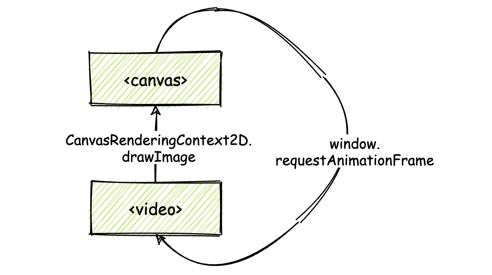
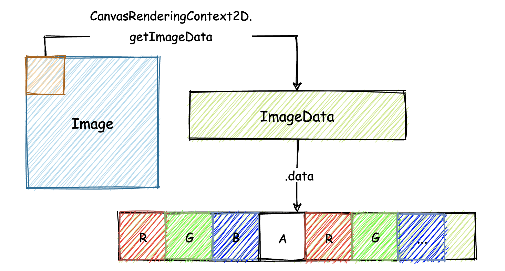

## 实现一个WebAssembly在线多媒体处理应用（二）

继续构建这个基于wasm实现的多媒体Web应用

### HTML

首先，构建这个Web应用所对应的HTML部分。

```html
<!DOCTYPE html>
<html lang="en">
<head>
    <meta charset="UTF-8">
    <meta name="viewport" content="width=device-width, initial-scale=1.0">
    <title>DIP-DEMO</title>
    <style>
        * { font-family: "Arial,sans-serif"; }
        .fps-num { font-size: 50px; }
        .video { display: none; }
        .operation { margin: 20px; }
        button {
            width: 150px;
            height: 30px;
            margin-top: 10px;
            border: 1px solid #999;
            font-size: 13px;
            font-weight: bold;
        }
        .radio-text { font-size: 13px; }
    </style>
</head>
<body>
    <canvas class="canvas"></canvas>
    <div class="operation">
        <h2>帧率：<span class="fps-num">NaN</span> FPS</h2>
        <input type="radio" name="options" value="0" checked="checked"/>
        <span class="radio-text">不开启渲染.</span><br/>
        <input type="radio" name="options" value="1"/>
        <span class="radio-text">使用 <b>[JavaScript]</b> 渲染.</span><br/>
        <input type="radio" name="options" value="2"/>
        <span class="radio-text">使用 <b>[WebAssembly]</b> 渲染.</span>
        <br/>
        <button>确认</button>
    </div>
    <video class="video" type="video/mp4" 
        muted="muted"
        loop="true"
        autoplay="true"
        src="media/video.mp4"></video>
</body>
<script src="./dip.js"></script>
</html>
```

最为重要的两个部分为`<canvas>`标签和`<video>`标签。

`<canvas>`将用于展示对应`<video>`标签所加载外部视频资源的画面数据；这些帧数据在被渲染到`<canvas>`之前，将会根据用户的设置，有选择性地被JavaScript代码或者wasm模块进行处理。

有一点需要注意，我们为`<video>`标签添加了muted、loop以及autoplay三个属性，这三个属性分别把这个视频资源设置为“静音”、“循环”以及“自动播放”。

但实际上，根据Chrome官方给出的“Autoplay Policy”，我们并不能够直接依赖其中的“autoplay”属性，来让视频在用户打开网页时立即自动播放；后面在应用实际加载时，仍会通过调用`<video>`标签所对应的`play()`方法，来确保视频资源可以在网页加载完毕后，直接自动播放。

在HTML代码的末尾处，使用`<script>`标签加载了同目录下名为“dip.js”的JavaScript文件；在这个文件中，将完成该Web应用的所有控制逻辑，包括：视频流的控制与显示逻辑、用户与网页的交互逻辑、JavaScript版滤镜的实现、wasm版滤镜实现对应的模块加载、初始化与调用逻辑，以及实时帧率的计算逻辑等。


### JavaScript

#### 视频流的控制与显示逻辑

* 第一步，将`<video>`标签所加载的视频资源，实时渲染到`<canvas>`标签所代表的画布对象上。

  具体实现方式，可以参考下图。

  

  其中的核心逻辑是：通过名为“`CanvasRenderingContext2D.drawImage()`”的Web API，来将`<video>`标签所承载视频的当前帧内容，绘制到`<canvas>`上。

  `drawImage()`方法支持设置多种类型的图像源，`<video>`标签所对应的`HTMLVideoElement`便是其中一种。

  `CanvasRenderingContext2D`接口是Canvas API的一部分；通过这个接口，我们能够获得一个可以在对应Canvas上进行2D绘图的”渲染上下文“；在后面的代码中，将通过`<canvas>`对象上名为`getContext`的方法，来获得这个上下文对象。

  `drawImage()`方法只能够绘制`<video>`标签对应视频流的”当前帧“内容，但随着视频的播放，”当前帧“内容也会随之发生改变；为了能够让绘制到`<canvas>`上的画面可以随着视频的播放来实时更新，将使用名为`window.requestAnimationFrame`这个Web API，来实时更新绘制在`<canvas>`上的画面内容。

  以下是这部分功能对应的代码：

  ```javascript
  // 获取相关的HTML元素
  let video = document.querySelector('.video');
  let canvas = document.querySelector('.canvas');
  
  // 使用getContext方法获取<canvas>标签对应的一个CanvasRenderingContext2D接口（即2D绘图上下文）
  let context = canvas.getContext('2d');
  
  // 自动播放<video>载入的视频
  let promise = video.play();
  if (promise !== undefined) {
      promise.catch(err => {
          console.error("The video can not autoplay!");
      });
  }
  
  // 定制绘图函数
  function draw() {
      const start = performance.now();
      // 调用drawImage 函数绘制图像到<canvas>
      context.drawImage(video, 0, 0);
      // 获得<canvas>上当前帧对应画面的像素数组
      pixels = context.getImageData(0, 0, video.videoWidth, video.videoHeight);
      // ...
      // 更新下一帧画面
      requestAnimationFrame(draw);
  }
  
  // <video>视频资源加载完毕后执行
  video.addEventListener("loadeddata", () => {
      // 根据<video>载入视频大小调整对应的<canvas>尺寸
      canvas.setAttribute('height', video.videoHeight);
      canvas.setAttribute('width', video.videoWidth);
      // 绘制函数入口
      draw();
  });
  ```

  * 首先，需要获得相应的HTML元素

  * 然后获取`<canvas>`标签对应的2D绘图上下文

  * 紧接着，处理`<video>`标签所加载视频自动播放的问题；直接调用`<video>`元素的play方法

  * 然后，在`<video>`元素的加载回调完成事件”loadeddata“中，根据所加载视频的尺寸相应地调整`<canvas>`元素的大小，以确保它可以完整地显示出视频的画面内容；并在其中调用了自定义的draw方法，来把视频的首帧内容更新到`<canvas>`画布上。

  * 在自定义`draw`方法中，调用了`drawImage`方法来更新`<canvas>`画布的显示内容，该方法接受三个参数：第一个为图像源，本例中也就是`<video>`元素对应的HTMLVideoElement对象；第二个为待绘制图像的起点在`<canvas>`上X轴的偏移；第三个为在Y轴上的偏移。

    然后调用名为`CanvasRenderingContext2D.getImageData()`的方法，来获得`<canvas>`上当前帧对应画面的像素数组；该方法接受四个参数：前两个指定想要获取像素的帧画面、在当前帧画面X轴和Y轴上的偏移范围；后两个参数指定这个范围的长和宽。这四个参数共同指定了画面上的一个矩形位置。在对应该矩形的范围内，所有像素序列将会被返回。

    最后调用`requestAnimationFrame`方法，以60Hz的频率来更新`<canvas>`上的画面。

  上述代码实现后，Web应用便可在用户打开网页时，直接将`<video>`加载播放的视频，实时地绘制在`<canvas>`对应的画布中。

#### 用户与网页的交互逻辑

与”处理用户交互逻辑“这部分功能有关的代码。

主要流程就是监听用户做出的更改，然后将这些更改后的值保存起来。

此处直接以”全局变量“的方式来保存这些设置项的值。

```javascript
// 全局状态
const STATUS = ['STOP', 'JS', 'WASM'];
// 当前状态
let globalStatus = 'STOP';
// 监听用户点击事件
document.querySelector("button").addEventListener('click', () => {
    globalStatus = STATUS[
        Number(
            document.querySelector("input[name='options']:checked").value
        )
    ];
});
```

这里需要维护应用的三种不同状态，即：不使用滤镜（STOP）、使用JavaScript实现滤镜（JS）、使用wasm实现滤镜（WASM）；全局变量globalStatus维护了当前应用的状态。

#### 实时帧率的计算逻辑

先来实现帧率的实时计算逻辑，然后观察在不开启任何滤镜效果时的`<canvas>`渲染帧率情况。

对于帧率，我们可以将其简单理解为在1s时间内屏幕上画面能够刷新的次数。

一个简单的帧率计算逻辑可以这样来实现：

先得到每一次从对画面像素开始进行处理，到真正绘制到`<canvas>`这整个流程所耗费的时间，得到的这个时间是以毫秒为单位；然后用1000除以这个值；即可得到一个估计的、在1s时间内所能够渲染的画面次数，也就是帧率。

这部分逻辑的JavaScript实现代码如下所示：

```javascript
/**
 * 计算帧率
 * @param {*} vector
 * @returns
 */
function calcFPS (vector) {
    // 提取容器中的前20个元素来计算平均值
    const AVERAGE_RECORDS_COUNT = 20;
    if (vector.length > AVERAGE_RECORDS_COUNT) {
        vector.shift(-1); // 维护容器大小
    } else {
        return 'NaN';
    }
    // 计算平均每帧在绘制过程中所消耗的时间
    let averageTime = (vector.reduce((pre, item) => {
        return pre + item;
    }, 0) / Math.abs(AVERAGE_RECORDS_COUNT));
    // 估算出1s内能够绘制的帧数
    return (1000 / averageTime).toFixed(2);
}
```

以上代码中，为了能够让帧率的估算更加准确，我们为JavaScript和WASM这两个版本的滤镜实现，分别单独准备了用来保存每帧计算时延的全局数组；这些数组会保存着最近20帧里，每一帧计算渲染时所花费的时间。

在函数`calcFPS`中，通过对这20个帧时延记录取平均值，来求得一个更加稳定、相对准确的平均帧时延；最后使用1000来除以这个平均帧时延，就能够得到一个估算出的、在1s时间内能够绘制的帧数，也就是帧率。

`vector.shift(-1)`用以维护整个数组的大小维持在20及以内，不会随着应用的运行而产生OOM（out-of-memory）的问题。

至此，JavaScript的代码整体大致如下。

```javascript
// 获取相关的HTML元素
let video = document.querySelector('.video');
let canvas = document.querySelector('.canvas');
let fpsNum = document.querySelector('.fps-num');

// 使用getContext方法获取<canvas>标签对应的一个CanvasRenderingContext2D接口（即2D绘图上下文）
let context = canvas.getContext('2d');

// 自动播放<video>载入的视频
let promise = video.play();
if (promise !== undefined) {
    promise.catch(err => {
        console.error("The video can not autoplay!");
    });
}

const vector = [];
// 定制绘图函数
function draw() {
    const start = performance.now(); // 开始计时
    // 调用drawImage 函数绘制图像到<canvas>
    context.drawImage(video, 0, 0);
    // 获得<canvas>上当前帧对应画面的像素数组
    pixels = context.getImageData(0, 0, video.videoWidth, video.videoHeight);
    // ...
    let timeUsed = performance.now() - start; // 得到帧时延
    fpsNum.innerText = calcFPS(vector);

    // 更新下一帧画面
    requestAnimationFrame(draw);
}

// <video>视频资源加载完毕后执行
video.addEventListener("loadeddata", () => {
    // 根据<video>载入视频大小调整对应的<canvas>尺寸
    canvas.setAttribute('height', video.videoHeight);
    canvas.setAttribute('width', video.videoWidth);

    // 绘制函数入口
    draw();
});

// 全局状态
const STATUS = ['STOP', 'JS', 'WASM'];
// 当前状态
let globalStatus = 'STOP';
// 监听用户点击事件
document.querySelector("button").addEventListener('click', () => {
    globalStatus = STATUS[
        Number(
            document.querySelector("input[name='options']:checked").value
        )
    ];
});

/**
 * 计算帧率
 * @param {*} vector
 * @returns
 */
function calcFPS (vector) {
    // 提取容器中的前20个元素来计算平均值
    const AVERAGE_RECORDS_COUNT = 20;
    if (vector.length > AVERAGE_RECORDS_COUNT) {
        vector.shift(-1); // 维护容器大小
    } else {
        return 'NaN';
    }
    // 计算平均每帧在绘制过程中所消耗的时间
    let averageTime = (vector.reduce((pre, item) => {
        return pre + item;
    }, 0) / Math.abs(AVERAGE_RECORDS_COUNT));
    // 估算出1s内能够绘制的帧数
    return (1000 / averageTime).toFixed(2);
}
```

可以尝试在浏览器中运行这个Web应用，在不开启任何滤镜的情况下，可以看到相应的画面实时渲染帧率。

#### JavaScript滤镜方法的实现

整个Web应用的核心组成之一——JavaScript滤镜函数。

首先，根据规则，需要准备一个3 x 3大小的二维数组，来容纳”卷积核“矩阵；

然后将该矩阵进行180度的翻转，得到结果矩阵。该结果矩阵会在后续参与到各个像素点的滤镜计算过程。

这部分对应的JavaScript代码实现如下：

```javascript
const KERNELS = [
    [
        [-1, -1, 1],
        [-1, 14, -1],
        [1, -1, -1]
    ]
];
/**
 * 矩阵翻转函数
 * @param {*} kernel
 * @returns
 */
function flipKernel(kernel) {
    const h = kernel.length;
    const half = Math.floor(h / 2);
    // 按中心对称的方式将矩阵中的数字上下、左右进行互换
    for(let i = 0; i < half; i ++) {
        for(let j = 0; j < h; j ++) {
            let _t = kernel[i][j];
            kernel[i][j] = kernel[h - i - 1][h - j - 1];
            kernel[h - i - 1][h - j - 1] = _t;
        }
    }
    // 处理矩阵行数为奇数的情况
    if (h & 1) {
        // 将中间行左右两侧对称位置的数进行互换
        for (let j = 0; j < half; j ++) {
            let _t = kernel[half][j];
            kernel[half][j] = kernel[half][h - j - 1];
            kernel[half][h - j - 1] = _t;
        }
    }
    return kernel;
}
// 得到经过翻转180度后的卷积核矩阵
const kernel = flipKernel(KERNELS[0]);
```

然后，来编写核心的JavaScript滤镜处理函数`jsConvFilter`；其一共接受四个参数：

* 第一个参数，是通过`getImageData`方法，从`<canvas>`对象上获取的当前帧画面的像素数组数据；

  `getImageData`执行完毕后会返回一个`ImageData`类型的对象，该对象有一个名为data的属性。data属性实际上是一个`Uint8ClampedArray`类型的”TypedArray“，其中存放着所有像素点按顺序排放的RGBA分量值。

  各个方法与返回值之间的对应关系，如下图所示。

  

* 第二和第三个参数为视频帧画面的宽和高

* 最后一个参数为所应用滤镜对应的”卷积核“矩阵数组。

至此，得到JavaScript版本的”滤镜函数“：

```javascript
/**
 * js版滤镜
 * @param {*} data 帧画面的像素数组数据
 * @param {*} width 帧画面的宽
 * @param {*} height 帧画面的高
 * @param {*} kernel 所应用滤镜对应的“卷积核”矩阵数组
 * @returns
 */
function jsConvFilter(data, width, height, kernel) {
    const divisor = 4; // 分量调节参数；
    const h = kernel.length, w = h; // 保存卷积核数组的宽和高
    const half = Math.floor(h / 2);
    // 根据卷积核的大小来忽略对边缘像素的处理
    for (let y = half; y < height - half; y ++) {
        for (let x = half; x < width - half; x ++) {
            // 每个像素点在像素分量数组中的起始位置
            const px = (y * width + x) * 4;
            let r = 0, g = 0, b = 0;
            // 与卷积核矩阵数组进行运算
            for (let cy = 0; cy < h; cy ++) {
                for (let cx = 0; cx < w; cx ++) {
                    // 获取卷积核矩阵所覆盖位置的每一个像素的起始偏移位置
                    const cpx = ((y + (cy - half))* width + (x + (cx - half))) * 4;
                    // 对卷积核中心像素点的RGB各分量进行卷积计算（累加）
                    r += data[cpx + 0] * kernel[cy][cx];
                    g += data[cpx + 1] * kernel[cy][cx];
                    b += data[cpx + 2] * kernel[cy][cx];
                }
            }
            // 处理RGB三个分量的卷积结果
            data[px + 0] = ((r / divisor) > 255) ? 255 : ((r / divisor) < 0) ? 0 : r / divisor;
            data[px + 1] = ((g / divisor) > 255) ? 255 : ((g / divisor) < 0) ? 0 : g / divisor;
            data[px + 2] = ((b / divisor) > 255) ? 255 : ((b / divisor) < 0) ? 0 : b / divisor;
        }
    }
    return data;
}
```

几个需要注意的点：

* 名为divisor的变量，是用以控制滤镜对视频帧画面产生的效果强度。

  divisor的值越大，滤镜的效果就越弱

* 遍历整个帧画面的像素序列时（最外层的两个循环体），将循环控制变量y和x的初始值，设置为`Math.floor(h / 2)`，这样可以直接忽略对帧画面边缘像素的处理。

  为了简化流程，这里直接忽略对边缘像素的处理过程

* 在得到经过卷积累加计算的RGB分量值后，需要判断对应值是否在[0, 255]这个有效区间内

至此，JavaScript的代码整体如下：

```javascript
// 获取相关的HTML元素
let video = document.querySelector('.video');
let canvas = document.querySelector('.canvas');
let fpsNum = document.querySelector('.fps-num');

// 使用getContext方法获取<canvas>标签对应的一个CanvasRenderingContext2D接口（即2D绘图上下文）
let context = canvas.getContext('2d');

// 自动播放<video>载入的视频
let promise = video.play();
if (promise !== undefined) {
    promise.catch(err => {
        console.error("The video can not autoplay!");
    });
}

const KERNELS = [
    [
        [-1, -1, 1],
        [-1, 14, -1],
        [1, -1, -1]
    ],
    [
        [50, -1, 2],
        [-1, 2, -1],
        [2, -1, 50]
    ]
];
/**
 * 矩阵翻转函数
 * @param {*} kernel
 * @returns
 */
function flipKernel(kernel) {
    const h = kernel.length;
    const half = Math.floor(h / 2);
    // 按中心对称的方式将矩阵中的数字上下、左右进行互换
    for(let i = 0; i < half; i ++) {
        for(let j = 0; j < h; j ++) {
            let _t = kernel[i][j];
            kernel[i][j] = kernel[h - i - 1][h - j - 1];
            kernel[h - i - 1][h - j - 1] = _t;
        }
    }
    // 处理矩阵行数为奇数的情况
    if (h & 1) {
        // 将中间行左右两侧对称位置的数进行互换
        for (let j = 0; j < half; j ++) {
            let _t = kernel[half][j];
            kernel[half][j] = kernel[half][h - j - 1];
            kernel[half][h - j - 1] = _t;
        }
    }
    return kernel;
}
// 得到经过翻转180度后的卷积核矩阵
const kernel = flipKernel(KERNELS[1]);

let clientX, clientY; // 保存canvas的宽高

const vector = []; // 无滤镜的帧时延数组
const jsVector = []; // js滤镜的帧时延数组
// 定制绘图函数
function draw() {
    const start = performance.now(); // 开始计时
    // 调用drawImage 函数绘制图像到<canvas>
    context.drawImage(video, 0, 0);
    // 获得<canvas>上当前帧对应画面的像素数组
    pixels = context.getImageData(0, 0, video.videoWidth, video.videoHeight);
    // ...
    // 根据滤镜状态处理像素数组数据
    switch(globalStatus) {
        case "JS":
            pixels.data.set(jsConvFilter(pixels, clientX, clientY, kernel));
            break;
    }
    // 将处理后的帧画面数据渲染到canvas
    context.putImageData(pixels, 0, 0);

    let timeUsed = performance.now() - start; // 得到帧时延
    // 更新页面上展示的帧率
    switch(globalStatus) {
        case "JS":
            jsVector.push(timeUsed);
            fpsNum.innerText = calcFPS(jsVector);
            break;
        default:
            vector.push(timeUsed);
            fpsNum.innerText = calcFPS(vector);
    }

    // 更新下一帧画面
    requestAnimationFrame(draw);
}

// <video>视频资源加载完毕后执行
video.addEventListener("loadeddata", () => {
    // 根据<video>载入视频大小调整对应的<canvas>尺寸
    canvas.setAttribute('height', video.videoHeight);
    canvas.setAttribute('width', video.videoWidth);

    clientX = canvas.clientWidth;
    clientY = canvas.clientHeight;
    // 绘制函数入口
    draw();
});

// 全局状态
const STATUS = ['STOP', 'JS', 'WASM'];
// 当前状态
let globalStatus = 'STOP';
// 监听用户点击事件
document.querySelector("button").addEventListener('click', () => {
    globalStatus = STATUS[
        Number(
            document.querySelector("input[name='options']:checked").value
        )
    ];
});

/**
 * 计算帧率
 * @param {*} vector
 * @returns
 */
function calcFPS (vector) {
    // 提取容器中的前20个元素来计算平均值
    const AVERAGE_RECORDS_COUNT = 20;
    if (vector.length > AVERAGE_RECORDS_COUNT) {
        vector.shift(-1); // 维护容器大小
    } else {
        return 'NaN';
    }
    // 计算平均每帧在绘制过程中所消耗的时间
    let averageTime = (vector.reduce((pre, item) => {
        return pre + item;
    }, 0) / Math.abs(AVERAGE_RECORDS_COUNT));
    // 估算出1s内能够绘制的帧数
    return (1000 / averageTime).toFixed(2);
}

/**
 * js版滤镜
 * @param {*} data 帧画面的像素数组数据
 * @param {*} width 帧画面的宽
 * @param {*} height 帧画面的高
 * @param {*} kernel 所应用滤镜对应的“卷积核”矩阵数组
 * @returns
 */
function jsConvFilter(data, width, height, kernel) {
    const divisor = 4; // 分量调节参数；
    const h = kernel.length, w = h; // 保存卷积核数组的宽和高
    const half = Math.floor(h / 2);
    // 根据卷积核的大小来忽略对边缘像素的处理
    for (let y = half; y < height - half; y ++) {
        for (let x = half; x < width - half; x ++) {
            // 每个像素点在像素分量数组中的起始位置
            const px = (y * width + x) * 4;
            let r = 0, g = 0, b = 0;
            // 与卷积核矩阵数组进行运算
            for (let cy = 0; cy < h; cy ++) {
                for (let cx = 0; cx < w; cx ++) {
                    // 获取卷积核矩阵所覆盖位置的每一个像素的起始偏移位置
                    const cpx = ((y + (cy - half))* width + (x + (cx - half))) * 4;
                    // 对卷积核中心像素点的RGB各分量进行卷积计算（累加）
                    r += data[cpx + 0] * kernel[cy][cx];
                    g += data[cpx + 1] * kernel[cy][cx];
                    b += data[cpx + 2] * kernel[cy][cx];
                }
            }
            // 处理RGB三个分量的卷积结果
            data[px + 0] = ((r / divisor) > 255) ? 255 : ((r / divisor) < 0) ? 0 : r / divisor;
            data[px + 1] = ((g / divisor) > 255) ? 255 : ((g / divisor) < 0) ? 0 : g / divisor;
            data[px + 2] = ((b / divisor) > 255) ? 255 : ((b / divisor) < 0) ? 0 : b / divisor;
        }
    }
    return data;
}
```

在浏览器中再次运行这个Web应用，选择开启JavaScript版滤镜，使用滤镜后的画面渲染帧率明显下降了。


### 总结

主要讲解了本次实践项目中与JavaScript代码相关的几个重要功能的实现思路，以及实现细节。