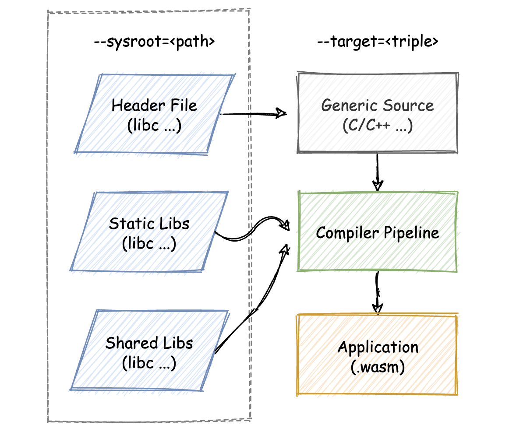

## 如何应用WASI及其相关生态

”如何从零构建一个WASI应用？“

前三节，关于”如何基于Emscripten，去构建一个可以运行在Web浏览器中的wasm应用“。

基于WASI构建的wasm应用将会被运行在浏览器之外的Native环境中，因此其构建和使用方式与基于Emscripten的wasm应用有所不同。

WASI本身作为一种抽象的操作系统调用接口，对上层的应用开发者来说，没有较为直接的影响。

对于同样的一段可以被编译为本地可执行应用程序的代码来说，我们只需要适当调整编译器的相关设置，就可以在不做任何代码更改的情况下，编译出所对应的WASI版本代码（也就是wasm字节码）；再配合相应的wasm虚拟机，就能够以”另一种方式“来执行这些代码了。

相较于传统的可执行文件，WASI应用程序的整个”生命周期“基本上只有”编译“与”运行“两个阶段会有所不同。


🌰：以一段C/C++代码入手，从编码、编译、再到运行，一步步完成这个WASI应用。

### 编码

先编写应用对应的C/C++代码，内容如下：

```c++
// src2/wasi-app.c
#include <stdio.h>
#define BUF_SIZE 1024

int main(int argc, char **argv) {
    size_t counter = 0;
    char buf[BUF_SIZE];
    int c;
    while((c = getchar()) != '\n') {
        buf[counter ++] = c;
    }
    if(counter > 0) {
        printf("The input content is: %s\n", buf);
        // write content to local file.
        FILE* fd;
        if((fd = fopen("wasi-static.txt", "w"))) {
            fwrite(buf, sizeof(char), counter, fd);
        } else {
            perror("Open static file failed!");
        }
    }
    return 0;
}
```

这段代码所对应的功能是：

程序在实际运行时，用户需要先输入一些文本字符，当用户输入回车键（`\n`）后，之前输入的所有内容将会被回显到命令行中；

这些输入的文本字符也会被同时保存到当前目录下名为”wasi-static.txt“的文本文件中。无论在程序运行时该文本文件是否存在，应用都将会重新创建或清空该文件，并写入新的内容。

为完成上述功能，代码中使用了诸如”fopen“与”fwrite“等用于操作系统文件资源的C标准库函数；这些函数在被编译至Native可执行文件后，会通过间接调用”操作系统调用“的方式，来实现与文件等系统资源的实际交互过程。


### 编译

#### Native可执行程序

将上述代码编译为本地可执行文件，并尝试运行这个程序以观察应用的实际运行效果。

对应的编译和运行命令如下：

```shell
$ clang wasi-app.c -o wasi-app && ./wasi-app
```

#### WASI应用

尝试把上面这段C/C++代码编译成对应的wasm字节码，并使用wasmtime来执行它。

首先需要了解整个编译链路的基本情况。

##### 交叉编译

LLVM工具链已经具备可以将LLVM-IR编译为wasm字节码的编译器后端能力。基于LLVM构建的编译器Clang，便也有这个能力。

此处**借助Clang来进行针对WASI的”交叉编译“**。

为什么说是”交叉编译（Cross-Compilation）“呢？可以这么来简单理解：无论是wasm32还是wasm64，都是指一种”指令集架构“，也就是”(V)ISA“。ISA本身只是规定了与指令相关的一些信息，比如：有哪些指令？指令的用法和作用？以及这些指令对应的OpCode编码是什么？等等。

“WASI”是一种基于wasm指令集的“平台类型”；所谓“平台”，可以用诸如Linux、Windows等各种不同的操作系统类型来进行类比；WASI指定了一种自己独有的操作系统接口使用方式，就如同Linux与Windows都有其各自不同的操作系统调用号一样——这影响着C/C++代码应该**如何与对应平台的不同操作系统调用进行编译整合**。

##### 基于Clang的编译管道

在开始真正动手编译之前，需要准备哪些其他必要的组件呢？

通常在Clang中，一个**大致的交叉编译流程**如下图所示。



同正常的编译流程十分类似，输入到编译器的C/C++源代码会通过适用于对应目标平台的头文件，来引用诸如“C标准库”中的函数；

在编译链路中，应用本身对应的对象文件将会与标准库对应的动态或静态库文件再进行链接，以提取所引用函数的实际定义部分；

最后，再根据所指定的平台类型，将编译输出的内容转换为对应的平台代码格式。

在上述流程中，输入到编译链路的源代码，以及针对WASI平台适用的标准库头文件、静态库以及动态库将需要由我们自行提供。

在Clang中，通过“`--sysroot`”参数来指定这些标准库相关文件的所在位置；参数”`--target`“则负责指定交叉编译的目标平台。

##### WASI SDK

我们可以通过WASI SDK的帮助来简化上述流程。

”WASI SDK“整合了用于支持WASI交叉编译的一切文件和工具资源，包括：基于”wasi-libc“编译构建的适用于WASI平台的C标准库、可用于支持WASI交叉编译的最新版Clang编译器，以及其他的相关必要配置信息等等。

[WASI-SDK](https://github.com/WebAssembly/wasi-sdk)

```shell
## 下载后解压缩
$ tar xvf wasi-sdk-20.0-macos.tar.gz
```

然后便可以开始进入编译流程。以下是对应的交叉编译命令：

```shell
# ying.ye @ xieyingdeMacBook-Pro in ~/Downloads/wasi-sdk-20.0 [11:36:14] 
$ cd demos

$ ../bin/clang \                  
> --target=wasm32-wasi \
> --sysroot=../share/wasi-sysroot \
> wasi-app.c -o wasi-app.wasm

## 提示clang-16是从网页下载无法运行 ==> 去设置打开
## 提示lld是从网页下载无法运行 ==> 去设置打开

$ ../bin/clang \
--target=wasm32-wasi \
--sysroot=../share/wasi-sysroot \
wasi-app.c -o wasi-app.wasm
$ ls
wasi-app.c    wasi-app.wasm
```

此处直接使用由WASI SDK提供的Clang编译器来进行交叉编译。

“`--sysroot`”参数指定了适用于WASI的标准库相关文件所在目录；

“`--target`”参数所指定的平台类型“wasm32-wasi”是LLVM所支持的、针对于WASI的平台编译类型。

编译完成后，便可得到一个wasm文件“wasi-app.wasm”。


### 运行

最后，使用wasmtime来运行以上编译得到的wasm模块。

#### wasmtime

首先，安装[wasmtime](https://github.com/bytecodealliance/wasmtime)。

```shell
$ curl https://wasmtime.dev/install.sh -sSf | bash              
  Installing latest version of Wasmtime (v12.0.1)
    Checking for existing Wasmtime installation
    Fetching archive for macOS, version v12.0.1
https://github.com/bytecodealliance/wasmtime/releases/download/v12.0.1/wasmtime-v12.0.1-x86_64-macos.tar.xz 
######################################################################## 100.0%
    Creating directory layout
  Extracting Wasmtime binaries
x wasmtime-v12.0.1-x86_64-macos/
x wasmtime-v12.0.1-x86_64-macos/wasmtime
x wasmtime-v12.0.1-x86_64-macos/LICENSE
x wasmtime-v12.0.1-x86_64-macos/README.md
     Editing user profile (/Users/ying.ye/.zshrc)
    Finished installation. Open a new terminal to start using Wasmtime!
```

通过以下方式来尝试运行这个wasm文件

```shell
# ying.ye @ xieyingdeMacBook-Pro in ~/Downloads/wasi-sdk-20.0/demos [12:41:43] 
$ wasmtime wasi-app.wasm        
Hello, WASI!
The input content is: Hello, WASI!
Open static file failed!: No such file or directory
```

当命令实际执行时，会发现wasmtime给出一条错误提示：“Capabilities insufficient”，这便是“Capability-based Security”在WASI上的体现。（测试：并无出现这条提示信息，只提示打开文件失败）

wasmtime在实际执行“wasi-app.wasm”文件中的字节码时，发现这个WASI应用使用了文件操作相关的操作系统接口，而对于一个普通的WASI应用来说，这些接口在正常情况下是无法被直接使用的；即，默认情况下的WASI应用不具备“文件操作”相关的Capability。这些Capability需要我们在实际运行应用时主动“授予”给应用，“授予”方式如下所示：

```shell
$ wasmtime wasi-app.wasm --dir=.
Hello, World!
The input content is: Hello, World!
```

在通过wasmtime运行WASI应用时，为其指定一个额外的“`--dir=.`”参数；通过该参数，wasmtime可以将其所指定的文件路径（`.`）“映射”到WASI应用中，以供其使用。

这样便可以使用wasmtime来成功运行这个WASI应用了。

对于其他支持WASI的wasm运行时来说，也会以类似的方式来实现Capability-based Security这一WASI最为重要的安全模型；这一模型也是WASI + wasm能够在一定程度上“取代”Docker进行应用沙盒化的基础。


### 总结

如何从零构建一个WASI应用。

构建WASI应用的过程，其实是一个“交叉编译”的过程。我们需要在各自的宿主机器（Linux、MacOS、Windows等等）上构建“以wasm字节码为ISA架构，WASI作为平台类型”的这样一种应用；应用的实际运行将交由支持WASI的wasm运行时来负责。

开发者可以直接借助“WASI SDK”来简化整个交叉编译的实施难度。其中整合了在编译WASI应用时需要使用的所有工具与组件，包含有可以支持“wasm32-wasi”这一平台类型的Clang编译器、WASI适用的相关标准库头文件与库文件等等。

在执行WASI应用时，也需要注意WASI本身所基于的“Capability-based Security”这一安全模型。在实际执行WASI应用时，我们需要主动“告知”运行时引擎当前WASI应用所需要使用到的Capability；否则，即使当前用户拥有对某一个系统资源的访问权限，也无法通过wasm运行时来隐式地让其所执行的WASI应用访问这些资源。


### 思考题

使用“Lucet”这个wasm运行时来运行上述这个WASI应用，来看看Lucet以怎样的”交互方式“来支持Capability-based Security这一安全模型？

