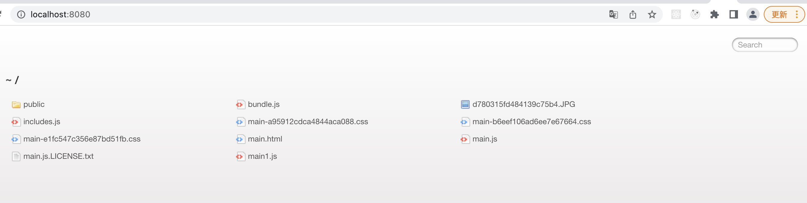
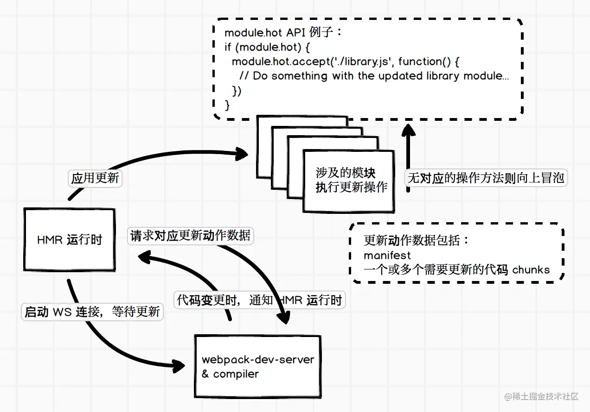

## Webpack

#### 优点
webpack 本身具备了诸多优点：从单一入口出发，打包所有前端资源，使用 loader 处理多种代码语言的转换，使用 plugin 扩展原有的模块打包流程，使用 HMR 提升开发体验，利用代码压缩和代码分割来提升前端加载性能等等。


### 基本使用
```shell
## 初始化 创建package.json文件
npm init

## 安装webpack和webpack-cli
yarn add webpack webpack-cli -D

## 查看webpack版本
npx webpack --version

## 运行构建，没有入口文件会报错
npx webpack

## 添加一个入口文件src/index.js和一个测试文件src/fool.js
```
```javascript
// fool.js
export const fool = 'Hello World';

export function log(message) {
    console.log(message);
}

// index.js
import {fool, log} from './fool';

log(fool);
```
#### 配置脚本命令
```json
{
  "scripts": {
    "build": "webpack"
  }
}
```

```js
// 配置webpack, webpack.config.js
// 对外暴露一个配置对象，webpack通过这个对象来读取相关的一些配置
const path = require('path');

module.exports = {
    mode: 'development', // 指定构建模式
    
    entry: './src/index.js', // 指定构建入口文件
    
    output: {
        path: path.resolve(__dirname + 'dist'), // 指定构建生成文件所在的路径
        filename: 'bundle.js' // 指定构建生成的文件名
    }
}
```

#### 本地开发

```shell
## 配置服务
yarn add webpack-dev-server -D
```

配置脚本：启动开发服务器的命令

```json
{
  "scripts": {
    "build": "webpack",
    "serve": "webpack-dev-server"
  }
}
```

##### 在dist目录下手动添加一个html文件进行测试

```html
<!doctype html>
<html lang="en">
<head>
    <meta charset="UTF-8">
    <meta name="viewport"
          content="width=device-width, user-scalable=no, initial-scale=1.0, maximum-scale=1.0, minimum-scale=1.0">
    <meta http-equiv="X-UA-Compatible" content="ie=edge">
    <title>Webpack</title>
</head>
<body>
<script src="./bundle.js"></script>
</body>
</html>
```

##### 配置webpack.config.js

```js
module.exports = {
  // ...
  devServer: {
    static: path.resolve(__dirname, 'dist') // 开发服务器启动路径
  }
}
```

#### 使用css

使用loader处理css文件

0. 安装loader

   ```shell
   yarn add style-loader css-loader -D
   ```

1. 创建css文件

   ```css
   // index.css
   .container {
     width: 200px;
     height: 200px;
     background-color: orange;
   }
   ```

2. 在src/index.js中引用

   ```js
   import './index.css'
   ```

3. 配置webpack.config.js文件

   ```javascript
   module.exports = {
     // ...
     module: {
       rules: [
         {
           test: /\.css$/i,
           use: ['style-loader', 'css-loader'] // 注意顺序
         }
       ]
     }
   }
   ```

4. 运行`yarn serve`

   可以看到打包后的文件里包含了index.css的内容，js被执行后css的内容会被包在style标签中插入到html文件的head中


### 基础概念

#### 1. entry

webpack构建的入口，构建的起点。webpack会读取这个文件，并从它开始解析依赖，在内部构建一个依赖图，这个依赖图会引用项目中使用到的各个模块，然后进行打包，生成一个或多个bundle文件。

```js
module.exports = {
  entry: 'index.js'
}

// 等价于
module.exports = {
  entry: {
    main: 'index.js'
  }
}
```

#### 2. output

webpack最终构建出来的静态文件

```javascript
module.exports = {
  output: {
    path: path.resolve(__dirname, 'dist'),
    filname: 'bundle.js'
  }
}

// 也可以利用entry的名称
module.exports = {
  output: {
    filname: '[name].js', // 使用[name]来引入entry名称，这里即为main
    path: path.join(__dirname, '/dist/[hash]') // 路径中使用hash，每次构建时会有一个不同的hash值，可以用于避免发布新版本时浏览器缓存导致的问题，文件名中也可以使用hash
  }
}
```

#### 3. loader

提供一种处理多种文件格式的机制。可以理解为一个转换器，负责将某种文件格式的内容转换成webpack可以支持打包的模块。

最终把不同格式的文件都解析成js代码，以便打包后在浏览器中运行

**配置babel来处理js文件：**

```shell
yarn add babel-loader @babel/core @babel/preset-env -D
```

```js
module.exports = {
  // ...
  module: {
    rules: [
      // ...
      {
        test: /\.jsx?/,
        include: path.resolve(__dirname, 'src'),
        use: {
          loader: 'babel-loader', // 使用babel-loader可以使用babel将ES6代码转译为浏览器可以执行的ES5代码
          options: {
            presets: ['@babel/preset-env']
          }
        }
      }
    ]
  }
}
```

#### 4. plugin

满足更多构建中特殊的需求，例如使用copy-webpack-plugin来复制不需要loader处理的文件、定义环境变量的define-plugin、生成css文件的extra-text-webpack-plugin等。

plugin理论上可以干涉webpack整个构建流程，可以在流程的每一个步骤中定制自己的构建需求。

```shell
yarn add copy-webpack-plugin -D
```

```javascript
const copyPlugin = require('copy-webpack-plugin');

module.exports = {
  // ...
  plugins: [
    new copyPlugin({
      patterns: [
        { from: 'src/public', to: 'public'}
      ]
    })
  ]
}
```

**将css提取到单独的打包文件中**

```shell
yarn add mini-css-extract-plugin -D
```

```javascript
const MiniCssExtractPlugin = require('mini-css-extract-plugin');

module.exports = {
  module: {
    rules: [
      {
        test: /\.css$/i,
        use: [MiniCssExtractPlugin.loader, 'css-loader']
      }
    ]
  },
  plugins: [
    // ...,
    new MiniCssExtractPlugin({
      filename: '[name].css' // 这里也可以使用hash
    })
  ]
}
```

#### 5. mode

用于方便快捷地指定一些常用的默认优化配置，值为：development、production和none。

production：会启用[TerserPlugin](https://github.com/webpack-contrib/terser-webpack-plugin)来压缩JS代码，让生成的代码文件更小

development：会启用`devtools: 'eval'`配置，提升构建和再构建的速度


### 资源利用

* webpack官方文档或类库周边的文档
* 社区的各种文章
* github官方仓库的issues
* 源码

#### 官方文档建议查看顺序

Guides 》Concepts 》Configuration 》Loaders 》Plugins 》API

Github Issues 搜索技巧：[searching-issues-and-pull-requests](https://docs.github.com/en/search-github/searching-on-github/searching-issues-and-pull-requests)

注意内容的时效性，留意版本的坑

#### 查阅源码小技巧

* 优先思考问题根源，列出可能导致问题的原因，再有针对性的查阅源码
* 如有异常报错，仔细阅读报错信息和异常堆栈，根据其内容定位问题所在
* 可以直接在node_modules中修改webpack或其他第三方类库的源码进行debug，方便快速定位
* 实现一个可以复现问题的最小化demo，可以有效避免其他无关因素的干扰
* 一些疑难杂症可以尝试使用github issues或者email和作者进行沟通，可以更有效率


### 前端构建基础配置

最基础的构建需求：

* 构建发布需要的HTML、JS、CSS文件
* 使用CSS预处理器来编写样式
* 引用图片
* 使用Babel来支持ES新特性
* 本地提供静态服务以方便开发调试

#### 1. 关联HTML

如果文件名或者路径会变化，例如使用`[hash]`来进行命名，那最好将HTML引用路径和构建结果关联起来，可以使用[html-webpack-plugin](https://github.com/jantimon/html-webpack-plugin)

```shell
yarn add html-webpack-plugin -D
```

```javascript
const HtmlPlugin = require('html-webpack-plugin');

module.exports = {
  // ...
  plugins: [
    new HtmlPlugin({
      template: './src/index.html' // 传递一个指定的模板html文件
    })
  ]
}
```

html-webpack-plugin会创建一个HTML文件，其中会引用构建出来的js文件

[examples](https://github.com/jantimon/html-webpack-plugin/tree/main/examples)

#### 2. 构建CSS

* css-loader 负责解析CSS代码，并处理CSS中的依赖，例如`@import`和`url()`等引用外部文件的声明；
* style-loader 将css-loader解析的结果转变为字符串，运行时动态插入`style`标签来让css代码生效
* MiniCSSExtractPlugin.loader可以单独把css文件分离出来

#### 3. 使用CSS预处理器

使用less，可以通过添加对应的loader来支持

```shell
yarn add less less-loader -D
```

```javascript
module.exports = {
  module: {
    rules: [
      {
        test: /\.less$/,
        use: [
          MiniCssExtractPlugin.loader,
          'css-loader',
          'less-loader'
        ]
      }
    ]
  }
}
```

#### 4. 处理图片文件

```javascript
module.exports = {
  module: {
    rules: [
      {
        test: /\.(png|jpg|gif)$/i,
        /*use: [ // webpack 5使用这个打包会生成两个图片文件，css中引用的是其中无法打开的文件
          {
            type: 'file-loader',
            options: {}
          }
        ]*/,
        type: 'asset', // 'asset/resource', // 默认都打包成独立的图片资源
        parser: {
          dataUrlCondition: { // 大于4kb的打包成独立图片，否则转为base64格式插入css文件
            maxSize: 4 * 1024 // 4kb
          }
        }
      }
    ]
  }
}
```

[Asset Modules](https://webpack.js.org/guides/asset-modules/#resource-assets)

#### 5. 使用Babel处理js文件

使我们可以使用ES新特性的JS编译工具

具体可以参考Babel官方文档[.babelrc](https://babeljs.io/docs/en/config-files/)


### 配置entry

构建入口

#### 1. 单一入口

```javascript
module.exports = {
  entry: './src/index.js',
 
  // 两者等价 
  entry: {
    main: './src/index.js'
  }
};
```

#### 2. 多个js作为入口

```javascript
// 多个入口生成不同的文件
module.exports = {
  entry: {
    // 按需取名，通常是业务名称
    foo: './src/foo.js',
    bar: './src/bar.js'
  }
}
```

#### 3. 多个文件作为一个入口打包到一起

```javascript
module.exports = {
  entry: {
    main: [
      './src/foo.js',
      './src/bar.js'
    ]
  }
}
```

#### 4. 配置动态的入口

🌰：支持在「src/pages」下添加多个页面入口

```javascript
const path = require('path');
const fs = reqiure('fs');

// src/pages目录为页面入口的根目录
const pagesRoot = path.resolve(__dirname, './src/pages');
// fs读取pages下的所有文件夹来作为入口，使用entries对象记录下来
const entries = fs.readdirSync(pagesRoot).reduce((entries, page) => {
  // 文件夹名称作为入口名称，值为对应的路径，可以省略`index.js`，webpack默认会寻找目录下的index.js
  entries[page] = path.resolve(pagesRoot, page);
  return entries;
}, {});

module.exports = {
  entry: entries // 与上述`多个js作为入口`效果相同
}
```

打包后依旧是在一个html文件引用这多个js文件


### module

管理模块和模块之间的关系

#### 1. 路径解析

当我们写一个`import`语句来引用一个模块时，webpack是如何获取到对应模块的文件路径的？

[enhanced-resolve](https://github.com/webpack/enhanced-resolve/)：处理依赖模块路径的解析

Nodejs模块路径解析机制：[深入 Node.js 的模块机制](https://www.infoq.cn/article/nodejs-module-mechanism/)

基本的模块解析规则：

* 解析相对路径

  1. 查找相对当前模块的路径下是否有对应文件或文件夹
  2. 有文件：则直接加载
  3. 有文件夹：则继续查找文件夹下的package.json文件
  4. 有package.json文件：则按照文件中`main`字段对应的值（文件名）来查找文件
  5. 无package.json文件或者无`main`字段：则查找`index.js`文件

* 解析模块名

  查找当前文件目录、父级目录及以上目录下的`node_modules`文件夹，看是否有对应名称的模块

* 解析绝对路径（不建议使用）

  直接查找对应路径的文件

> 在webpack配置中，和模块路径解析相关的配置都在`resolve`字段下

#### 2. resolve配置

1. `resolve.alias`

   配置某个模块的别名：经常编写相对路径很麻烦

   ```javascript
   module.exports = {
     resolve: {
       alias: {
         // 模糊匹配，只要模块路径中携带了`utils`就可以被替换掉
         // utils: path.resolve(__dirname, 'src/utils') // 获取绝对路径
        	// 精确匹配
         utils$: path.resolve(__dirname, 'src/utils')
       }
     }
   }
   ```

   [Resolve Alias](https://webpack.js.org/configuration/resolve/#resolvealias)

2. `resolve.extensions`

   webpack自行补全文件后缀

   webpack会尝试给依赖的路径添加上`extensions`字段所配置的后缀，然后进行依赖路径查找

3.  `resolve.modules`

   对于直接声明依赖名的模块，如`react`，webpack会类似Node.js一样进行路径搜索，搜索`node_modules`目录，这个目录就是使用`resolve.modules`字段进行配置的，默认就是：

   ```javascript
   modules.exports = {
     resolve: {
       modules: ['node_modules'],
     }
   }
   ```

   通常情况下不会调整这个配置。

   可以简化模块的查找，提升构建速度。

4. `resolve.mainFields`

   路径解析规则中，解析相对路径的第4步，提到有package.json文件则按照文件中`main`字段的值（文件名）来查找文件。

   实际，webpack的`resolve.mainFields`配置可以进行调整。当引用的是一个模块或者一个目录时，会使用package.json文件中的哪一个字段指定的文件，默认的配置是：

   ```json
   {
     resolve: {
       // 配置 target === 'web' 或者 target === 'webworker' 时的默认值
       mainFields: ['browser', 'module', 'main'],
       
       // target的值为其他时的默认值
       mainFields: ['module', 'main']
     }
   }
   ```

   通常情况下，模块的package都不会声明`browser`或者`module`字段，所以便是使用`main`

5. `resolve.mainFiles`

   路径解析规则中，解析相对路径的第5步，提到无package.json文件或者无`main`字段：则查找`index.js`文件。

   实际，这个也是可以配置的，使用`resolve.mainFiles`字段，默认配置是：

   ```json
   {
     resolve: {
       mainFiles: ['index'] // 也可以添加其他默认使用的文件名
     }
   }
   ```

   通常情况下，无需修改，index.js基本是约定俗成

6. `resolve.resolveLoader`

   用于配置解析loader时的resolve配置，原本resolve的配置项在这个字段下基本都有。默认的配置是：

   ```json
   {
     resolve: {
       resolveLoader: {
         extensions: ['.js', '.json'],
         mainFields: ['loader', 'main']
       }
     }
   }
   ```

   一般遵从标准的使用方式，把loader安装在项目根路径下的node_modules下。

#### 3. 小结

webpack配置文件中和`resolve`相关的选项都会传递给enhanced-resolve使用，来解析代码模块的路径


### loader

用于处理不同的文件类型（模块），类似预处理器。Webpack本身只认识JavaScript，对于其他类型的资源必须预先定义一个或多个loader对其进行转译，输出为Webpack能够接收的形式再继续进行，因此loader做的实际上是一个预处理的工作。

> loader基本上都是第三方库，使用时需要安装，有一些loader还需要安装额外的类库，例如less-loder需要less，babel-loader需要babel等。

#### 1. 匹配规则

由于loader处理的是代码模块的内容转换，所以loader的配置是放在`module`字段下的，当配置loader时，就是在`module.rules`中添加新的配置项，在该字段中，每一项被视为一条匹配使用哪些loader的规则。

匹配规则的两个最关键因素：一个是匹配条件（test），一个是匹配规则后的引用（use）。

**匹配条件**通常使用资源文件的绝对路径来进行匹配，在官方文档中称为`resource`，除此之外还有较少使用的`issuer`，指的是声明依赖资源的源文件的绝对路径。

🌰：在/path/to/app.js中声明引入`import './src/style.scss'`，`resource`是「/path/to/src/style.scss」，`issuer`是「/path/to/app.js」，规则条件会对这两个值来尝试匹配。

被加载模块是resource，而加载者是issuer。resource与issuer可用于更加精确地确定模块规则的作用范围

`webpack.config.js`中rules写的`test`和`include`都用于匹配`resource`路径，是`resource.test`和`resource.include`的简写。

#### 2. 规则条件配置

webpack的规则提供了多种配置形式：

* `test`：匹配特定条件
* `include`：匹配特定路径
* `exclude`：排除特定路径
* `and: []`：必须匹配数组中所有条件
* `or: []`：匹配数组中任意一个条件
* `not: []`：排除匹配数组中所有条件

上述条件的值可以是：

* 字符串：是字符串的话，需要提供绝对路径
* 正则表达式：调用正则的`test`方法来判断匹配
* 函数：`(path)=>boolean`，返回`true`表示匹配
* 数组：至少包含一个条件的数组  （通常需要高度自定义时才会使用）
* 对象：匹配所有属性值的条件

`test/include/exclude`是`resource.(test/include/exclude)`的简写（webpack 5中只支持简写），`and/or/not`这些需要放到`resource`中进行配置。

如果exclude 和include同时存在，则exclude权限比较高

#### 3. module type

模块类型。不同的模块类型类似于配置了不同的loader，webpack会有针对性地进行处理。可能的值：

* `javascript/auto`：webpack 3默认的类型，支持现有的各种JS代码模块类型——CommonJS、AMD、ESM
* `javascript/esm`：ECMAScript modules，其他模块系统如CommonJS或AMD等不支持，是`.mjs`文件的默认类型
* `javascript/dynamic`：CommonJS和AMD，排除ESM
* `javascript/json`：JSON数据格式，`require`或者`import`都可以引入，是`.json`文件的默认类型
* `webassembly/experimental`：WebAssembly modules，当前还处于试验阶段，是`.wasm`文件的默认类型。webassembly/sync、webassembly/async
* asset、asset/resource，asset/inline，aseet/source：资源文件

如果不希望使用默认的类型的话，在确定好匹配规则条件时，可以使用`type`字段来指定模块类型。可以帮助规范整个项目的模块系统。

#### 4. 使用loader配置（use）

`use`字段可以是一个数组，也可以是一个字符串或者表示loader的对象。

当使用表示loader的对象，对象通常包含两个属性：loader和options，`options`可以给对应的loader传递一些配置项

#### 5. loader应用顺序

一个模块文件可以经过多个loader的转换处理，执行顺序是从最后配置的loader开始，一步步往前。

如果多个rule匹配上了同一个模块文件，loader的应用顺序可以使用`enforce`字段来配置当前rule的loader类型，没配置的话是普通类型，可以配置`pre`或`post`，分别对应前值类型或后置类型的loader。

还有一种行内loader，即在应用代码中引用依赖时直接声明使用的loader，如`const json = require('json-loader!./file.json')`这种。不建议在应用开发中使用这种loader。

所有的loader按照 **前置->行内->普通->后置** 的顺序执行。

通常建议把要应用的同一类型loader都写在同一个匹配规则中，更好维护和控制。

#### 6. 使用`noParse`

`module.noParse`字段，可以用于配置哪些模块文件的内容不需要进行解析。对于一些**不需要解析依赖（即无依赖）**的第三方大型类库等，可以通过这个字段来配置，以提高整体的构建速度。

> 使用`noParse`进行忽略的模块文件中不能使用`import`、`require`、`define`等导入机制。

```javascript
module.exports = {
  // ...
  module: {
    rules: [
    	// ...
    ],
    noParse: /jquery|lodash/, // 正则表达式
    // 或者使用function
    noParse(content) {
      return /jquery|lodash/.test(content)
    }
  }
};
```

#### 使用

1. 添加[`postcss-loader`](https://webpack.js.org/loaders/postcss-loader/)，并添加[`autoprefixer`](https://github.com/postcss/autoprefixer)配置，需要在package.json中配置browserslist配置，或添加.browserslistrc文件

   ```shell
   yarn add postcss-loader -D
   yarn add autoprefixer -D
   ```

   ```javascript
   // webpack.config.js
   module.exports = {
     module: {
       rules: [
         {
           test: /\.css$/i,
           use: [
             MiniCssExtractPlugin.loader,
             'css-loader',
             'postcss-loader'
           ]
         }
       ]
     }
   }
   
   // postcss.config.js
   module.exports = {
     plugins: [
       require('autoprefixer')
     ]
   }
   ```

   ```json
   {
     browserslist: [
       ">0.2%",
       "not dead",
       "not op_mini all"
     ],
   }
   ```

2. 尝试使用[`htmlloader`](https://webpack.js.org/loaders/html-loader/)，可以在js中使用例如`import file from './file.html'`。

   ```shell
   yarn add html-loader -D
   ```

   ```javascript
   module.exports = {
     module: {
       rules: [
         {
           test: /\.html$/,
           use: ['html-loader']
         }
       ]
     }
   }


### 使用plugin

负责除了模块化打包外其他多样性的构建任务处理。

mode对plugin配置的影响？

#### 1. mode和plugin

mode不同值会影响webpack构建配置，其中有一个就是会启用DefinePlugin来设置`process.env.NODE_ENV`的值，方便代码中判断构建环境。

除此之外，development和production两个不同的mode之间还有其他plugin使用上的区别：

* development

  会启用NamedChunksPlugin和NamedModulesPlugin，主要作用是在HotModuleReplacement（热模块替换）开启时，模块变化时的提示内容显示chunk或者module名称（控制台），而不是ID。

* production

  会启用多个plugins：

  * FlagDependencyUsagePlugin：在构建时给使用的依赖添加标识，用于减少构建生成的代码量。
  * FlagIncludedChunksPlugin：在构建时给chunk中所包含的所有chunk添加id，用于减少不必要的chunk。
  * ModuleConcatenationPlugin：构建时添加作用域提升的处理，用于减少构建生成的代码量，详细参考：[module-concatenation-plugin](https://webpack.js.org/plugins/module-concatenation-plugin/)
  * NoEmitOnErrorsPlugin：编译时出错的代码不生成，避免构建出来的代码异常。
  * OccurenceOrderPlugin：按使用的次数来对模块进行排序，可以进一步减少构建代码量。
  * SideEffectsFlagPlugin：在构建时给带有Side Effects的代码模块添加标识，用于优化代码量时使用。
  * TerserPlugin：压缩JS代码。参考[Terser](https://terser.org/)

  production mode下启用的大量plugin都是为了优化生成代码而使用的，和配置的`optimization`的内容息息相关，详细可以查阅：[optimization](https://webpack.js.org/configuration/optimization/)

#### 2. 一些plugin

##### Defineplugin

webpack内置的插件，可以使用webpack.DefinePlugin直接获取。

在不同的mode中，会使用DefinePlugin来设置运行时的`process.env.NODE_ENV`常量。

DefinePlugin用于创建一些在编译时可以配置值，在运行时可以使用的常量。🌰：

```javascript
module.exports = {
  // ...
  plugins: [
    new webpack.DefinePlugin({
      PRODUCTION: JSON.stringify(true), // const PRODUCTION = true
      VERSION: JSON.stringify('5fa3b9'), // const VERSION = '5fa3b9'
      BROWSER_SUPPORTS_HTML5: true, // const BROWSER_SUPPORTS_HTML5 = 'true'
      TWO: '1+1', // const TWO = 1 + 1
      CONSTANTS: {
        APP_VERSION: JSON.stringify('1.1.2') // const CONSTANTS = { APP_VERSION: '1.1.2' }
      }
    }),
  ]
}

// index.js
console.log("Running App version " + VERSION); // 5fa3b9
console.log('PRODUCTION: ', PRODUCTION); // true
console.log('TWO: ', TWO); // 2
console.log('BROWSER_SUPPORTS_HTML5: ', BROWSER_SUPPORTS_HTML5); // true
console.log('CONSTANTS: ', CONSTANTS); // { APP_VERSION: "1.2.2" }
```

有了以上配置，就可以在应用代码文件中，访问配置好的常量了，如：

```javascript
console.log("Running App version " + VERSION);

if(!!BROWSER_SUPPORTS_HTML5) require('html5shiv');
```

配置规则：

* 如果值是字符串，那么整个字符串会被当成代码片段来执行，其结果作为最终变量的值
* 如果是对象字面量，那么该对象的所有key会以同样的方式去定义
* 如果既不是字符串，也不是对象字面量，那么该值会被转为一个字符串，如`true`，最后的结果是`'true'`(???true打印出来为布尔值的true，不是字符串的`'true'`)

关于DefinePlugin使用得最多的方式是定义环境常量，如`production=true`或者`__DEV__=true`等。部分类库在开发环境时依赖这样的环境变量来给予开发者更多的开发调试反馈。

##### TerserPlugin

webpack mode为production时会启用TerserPlugin来压缩JS代码。使用方式：

```shell
yarn add terser-webpack-plugin -D
```

```javascript
module.exports = {
  // ...
  // TerserPlugin的使用比较特别，需要配置在optimization字段中，属于构建代码优化的一部分
  optimization: {
    minimize: true, // 启用代码压缩
    minimizer: [ // 配置代码压缩工具
      new TerserPlugin({
        test: /\.js(\?.*)?$/i, // 只处理.js文件
        terserOptions: {
          compress: true
        }
      })
    ],
  }
}
```

[terser-webpack-plugin](https://github.com/webpack-contrib/terser-webpack-plugin)

> 以前的版本webpack是使用UglifyWebpackPlugin来压缩JS代码，后边更换为TerserPlugin，可以更好地处理新的JS代码语法。

##### IgnorePlugin

也是webpack内置的插件，可以使用`webpack.IngorePlugin`来获取。

用于忽略某些特定的模块，让webpack不把这些指定的模块打包进去。例如使用moment.js，直接引用后，会有大量的i18n的代码，导致最后打包出来的文件比较大，而实际场景并不需要这些i18n的代码，就可以使用IgnorePlugin来忽略掉这些代码文件：

```javascript
module.exports = {
  // ...
  plugins: [
    new webpack.IgnorePlugin({resourceRegExp: /^\.\/locale$/, contextRegExp: /moment$/})
  ]
}
```

IgnorePlugin配置的参数有两个，第一个是匹配引入模块路径的正则表达式，第二个是匹配模块的对应上下文，即所在目录名。

##### webpack-bundle-analyzer

这个plugin可以用于分析webpack构建打包的内容，用于查看各个模块的依赖关系和各个模块的代码内容多少，便于开发者做性能优化。

配置简单，仅仅引入plugin即可，在构建时可以在浏览器中查看分析结果

```javascript
const BundleAnalyzerPlugin = require('webpack-bundle-analyzer').BundleAnalyzerPlugin;

module.exports = {
  // ...
  plugins: [
    new BundleAnalyzerPlugin()
  ]
}
```

使用这个可配置IgnorePlugin来过滤掉部分大而无用的第三方模块。

#### 3. awesome-webpack

[awesome webpack](https://webpack.js.org/awesome-webpack/)

#### 4. 其他一些plugin

##### ProgressPlugin

可以在构建时获取构建进度。

```shell
yarn add progress-webpack-plugin -D
```

```javascript
const ProgressPlugin = require('progress-webpack-plugin');

module.exports = {
  // ...
  plugins: [
    new ProgressPlugin((percentage, message, ...args) => {
      console.log(percentage, message, ...args);
    })
  ]
}
```

[文档](https://webpack.js.org/plugins/progress-plugin/)

##### DllPlugin

用于将一部分稳定的代码构建给分离出来，之后构建时重复使用那一部分内容，来减少构建时的工作量，提升构建效率

```javascript
// webpack.dll.config.js
const path = require('path');
const webpack = require('webpack');

module.exports = {
  entry: {
    moment: ['moment']
  },
  output: {
    filename: '[name].dll.js',
    path: path.resolve(__dirname, 'dist/public'),
    library: '[name]_[fullhash]'
  },
  plugins: [
    new webpack.DllPlugin({
      context: __dirname,
      name: '[name]_[fullhash]', // 需要和output.library保持一致
      path: path.join(__dirname, 'dist/public', '[name].manifest.json')
    })
  ]
}
```

```shell
## 运行命令，会在dist/public目录下生成moment.dll.js和moment.manifest.json两个文件
npx webpack --config webpack.dll.config
```

```javascript
// webpack.config.js 中使用动态库文件
module.exports = {
  // ...
  plugins: [
    new HtmlPlugin({
      inject: true,
      template: './index.html',
      title: 'webpack学习'
    }),
    // 定义常量，在html中替换
    new webpack.DefinePlugin({
      // ...
      DLL_PATH: JSON.stringify('/public/moment.dll.js')
    }),
    // 通过引用dll的manifest文件，来把依赖的名称映射到模块的id上，之后再在需要的时候通过内置的webpack_require函数来require他们
    new webpack.DllReferencePlugin({
      context: __dirname,
      manifest: require('./dist/public/moment.manifest.json'),
    })
  ]
}
```

```html
<!-- 在index.html中引用dll文件 -->
<head>
  <title>
    <%= htmlWebpackPlugin.options.title %>
  </title>
</head>
<body>
  <div>
    Test....
  </div>
  <script src="<%= DLL_PATH %>"></script>
  <script src="/public/moment.dll.js"></script><!-- 两种都可以 -->
</body>
```

> 注意！！需要把对html处理的loader把index.html文件排除在外，否则会去解析index.html中引用的js，抛出找不到模块的错误，也无法解析webpack配置的常量

#### 5. 思考mode对plugin的影响

plugin主要用于提高开发构建效率，处于不同mode有不同的需求，在开发调试中，侧重于实时更新，看到最新的代码效果，所以就需要热替换的效果，就不必手动刷新页面，只要修改内容就能得到反馈；在构建部署生产阶段，侧重于提升前端资源的加载性能，比如更快的打开页面，就需要配置更多提升性能相关的插件，如引入压缩的plugin，减少资源的体积，达到提升性能的效果，再比如给模块添加标识，在重复使用时不重复引入构建，减少构建生成的代码，还可以利用到缓存。


### 优化图片&HTML&CSS

#### 1. 图片资源压缩

* 可以使用[image-webpack-loader](https://github.com/tcoopman/image-webpack-loader)来压缩图片文件

```shell
## 使用cnpm安装loader
npm install cnpm -g --registry=https://registry.npm.taobao.org
## 使用yarn或npm可能会导致无法完整下载依赖，导致无法打包
cnpm install --save-dev image-webpack-loader
```

```javascript
module.exports = {
  // ...
  module: {
    rules: [
      {
        test: /\.(png|jpg|gif)$/i,
        type: 'asset',
        parser: {
          dataUrlCondition: {
            maxSize: 4 * 1024 // 4kb，超过限制会生成独立文件
          }
        },
        use: [
          {
            loader: 'image-webpack-loader',
            options: {
              mozjpeg: { // 压缩jpeg的配置
                progressive: true,
                quality: 65
              },
              optipng: { // 使用imagemin-optipng压缩png，enable false为关闭
                enabled: false
              },
              pngquant: { // 使用imagemin-pngquant压缩png
                quality: [0.65, 0.9],
                speed: 4
              },
              gifsicle: { // 压缩gif的配置
                interlaced: false,
              },
              webp: { // 开启webp，会把jpg和png图片压缩为webp格式
                quality: 75
              }
            }
          }
        ]
      }
    ]
  }
}
```

image-webpack-loader的压缩是使用[imagemin](https://github.com/imagemin)提供的一系列图片压缩类库来处理的

* 使用DataURL：减少图片请求，优化大量小图片加载效率

过去：使用CSS Sprites，将多个小图片合并成一张，然后利用CSS background position的方式来引用对应的图片资源，这种方式受到CSS background的限制，并且position的值都由工具生成，有时不便于维护。[webpack生成CSS sprites](https://juejin.cn/post/6844903501890322440)

更为方便：将小图片转换为base64编码，将图片变成编码和代码文件打包到一起，可以起到减少小图片请求数量的效果

webpack4可以使用[url-loader](https://github.com/webpack-contrib/url-loader)，webpack5中可以直接配置`parser.dataUrlCondition.maxSize`来指定大于多少体积转为base64编码

#### 2. 代码压缩

* HTML

  使用html-webpack-plugin插件，使用`minify`字段配置就可以使用HTML压缩（使用[html-minifier](https://github.com/kangax/html-minifier#options-quick-reference)来实现HTML代码压缩）

  不配置minify，默认去除无用空格和换行、并移除注释

  ```javascript
  const HtmlWebpackPlugin = require('html-webpack-plugin');
  
  module.exports = {
    // ...
    plugins: [
      new HtmlWebpackPlugin({
        template: './index.html',
        title: 'webpack学习',
        minify: {
          minifyCSS: true, // 压缩HTML中出现的CSS代码，默认false
          minifyJS: true, // 压缩HTML中出现的JS代码，默认false
          collapseInlineTagWhitespace: true,
          collapseWhitespace: true, // 和上一个配置配合，移除无用的空格和换行，默认false
          removeComments: true, // 移除html注释，默认false
        }
      })
    ]
  }
  ```

* CSS

  在postcss-loader的基础上使用[cssnano](https://cssnano.co/)，移除无用的空格和换行

  ```shell
  npm install --save-dev cssnano
  ## 安装cssnano后，有影响到image-webpack-loader，需要重新安装下image-webpack-loader
  cnpm install --save-dev  image-webpack-loader
  ```

  ```javascript
  // webpack.config.js
  module.exports = {
    // ...
    module: {
      rules: [
        {
          test: /\.less$/,
          loader: [
            MiniCssExtractPlugin.loader,
            'css-loader',
            'postcss-loader'
            'less-loader',
          ]
        }
      ]
    }
  }
  // postcss.config.js
  module.exports = {
    // ...
    plugins: [
      require('autofixer'),
      require('cssnano')()
    ]
  }
  ```


### 优化JS代码

尽可能减少构建出来的JS代码体积

#### 1. Tree shaking（ESM）

依赖于ES2015模块系统中的[静态结构特性](https://exploringjs.com/es6/ch_modules.html#static-module-structure),可以移除JavaScript上下文中未引用代码，删除用不着的代码，能够有效减少JS代码文件的大小。

在production的mode下，webpack会移除未引用的这部分代码，来减少构建出来的代码整体体积。

在development mode，需要在配置文件中新增：

```javascript
module.exports = {
  mode: 'development',
  //...
  optimization: {
    usedExports: true, // 模块内未使用的部分不进行导出
  }
}
```

再打包可以看到，有注释说明square未使用，对外暴露的方法只有`cube`。这里已经给模块中是否被使用到的方法打了标识，当使用TerserPlugin后，Terser会移除那些没有对外暴露且没有额外副作用的方法，来减小构建出来的代码体积。

#### 2. sideEffects（主要用于开发npm包）

🌰：

`lodash-es`这个模块的「package.json」文件中有`sideEffects: false`的声明，最终webpack的打包结果不会把lodash-es所有的代码内容打包进来，只会打包用到的模块相关的代码，这就是sideEffects的作用。

如果使用`lodash`模块，则会全部打包。

当某个模块的`package.json`文件中有了这个声明之后，webpack会认为这个模块没有任何副作用，只是单纯用来对外暴露模块使用，一旦开启了`optimization.sideEffects`的话，那么在打包的时候就会做一些额外的处理。

> 对比：
>
> `usedExports`依赖Terser来检测未使用的部分代码是否有副作用，而sideEffects是通过「package.json」等相关的标识来确定，由应用开发者自己来进行控制，并且移除的是无用的模块或者代码文件，相对效率更高一些。

「package.json」下的`sideEffects`可以是匹配文件路径的数组，表示这些模块文件是有副作用的，不能被移除：

```json
{
  sideEffects: [
    "*.css"
  ]
}
```

CSS代码文件是最典型的有副作用的模块，主要import了就不能移除，因为你需要它的样式代码，所以使用`sideEffects`来优化项目代码时切记，要声明CSS文件是有副作用的。

#### 3. concatenateModules

当用development构建生成的代码，每个模块都会使用`(function(module, __webpack_exports__, __webpack_require__){})`的函数包起来，我们可以使用`optimization.concatenateModules: true`的配置来移除这一部分多余的代码。

webpack会把可以优化的模块整合到一起，来减少上述那样的闭包函数的代码。

注释中的`CONCATENATED MODULE`的模块便是webpack整合到一起的模块，而模块间依赖的方法则是以局部变量的方式直接调用了，就可以减少大量的闭包函数代码，从而减少构建出来的代码体积，如果加上Terser的压缩，效果就更加显著了。

#### 4. 总结

Tree shaking，sideEffects和concatenateModules这些优化配置选项，在production mode中都是开箱即用，无须用户设置便会默认开启。


### 拆分代码文件

将CSS代码单独拆分的原因：

* 所有静态资源都打包成一个JS文件，如果只是单独修改了样式，也要重新加载整个应用的JS文件，相当不划算，浪费带宽、时间
* 有多个页面如果共用一部分样式，但是每个页面都单独打包一个JS文件，那么每次访问都会重复加载原本可以共享的那些CSS代码
* 如果单独拆分出来，不仅可以减少一次请求的体积，使请求返回更快，也可以利用到缓存，避免重复的加载

JS代码过大时，也可以用代码文件拆分的方法来进行优化。分离公共部分

#### 1. splitChunks配置项

`optimization.splitChunks`的多个配置项：

* chunks：表示从哪些模块中抽取代码，可以设置`all/async/initial`三个值其中一个，分别表示`所有模块/异步加载的模块/同步加载的模块`，或者也可以设置一个function，用于过滤掉不需要抽取代码的模块，如：

  ```javascript
  modules.exports = {
    // ...
    optimization: {
      splitChunks: {
        chunks: 'all', // 从所有模块中抽取代码
        chunks(chunk) {
          // 排除`my-excluded-chunk`
          return chunk.name !== 'my-excluded-chunk';
        }
      }
    }
  }
  ```

* minSize：表示生成的公共代码文件最小的体积，而maxSize则是告诉webpack尽可能把大于这个设置值的代码量拆分成更小的文件来生成，默认为0，即不限制。

  代码量在[minSize, maxSize]区间内的模块生成公共代码文件

* minChunks：表示一个模块被多少个模块共享引用时要被抽离出来，默认为1，如果设置为2，表示起码有两个模块引用了一个模块，这个被引用的模块才会被抽离出来

* name：是抽离出来的文件名称，默认为true，即自动生成

* automaticNameDelimiter：抽取模块后生成的文件由多个模块的名称组成，这个选项用于配置多个名称组合时使用的连接符，默认是`~`

* cacheGroups：最关键的配置，表示抽离公共部分的配置，一个key-value的配置对应一个生成的代码文件（？）。🌰：

  ```javascript
  module.exports = {
    // ...
    optimization: {
      chunks: 'all',
      name: 'common',
      cacheGroups: {
        defaultVendors: { // id hint?
          test: /[\\/]node_modules[\\/]/,
          priority: -10
        },
        default: {
          minChunks: 2,
          priority: -20,
          reuseExistingChunk: true
        }
      },
    }
  }
  ```

  上述例子会抽离两个代码文件出来：defaultVendors和default，这两个的配置会继承splitChunks上的所有配置项，并且多了三个配置项：

  * test：用于匹配要抽离的代码模块
  * priority：权重配置，如果一个模块满足多个cacheGroup的匹配条件，那么就由权重来确定抽离到哪个cacheGroup
  * reuseExistingChunk：设置为true表示如果一个模块已经被抽离出去了，那么就复用它，不会重新生成

  更多配置项参考官方文档：[split chunks](https://webpack.js.org/plugins/split-chunks-plugin/)

#### 2. 应用：拆分第三方类库

拆分文件是为了更好地利用缓存，分离公共类库很大程度上是为了让多页面利用缓存，从而减少下载的代码量，同时，代码变更时可以利用缓存减少下载代码量的好处。

建议将公共使用的第三方类库显式地配置为公共的部分，而不是webpack自己去判断处理。因为公共的第三方类库通常升级频率相对低一些，这样可以避免因业务chunk的频繁变更而导致缓存失效。

显式配置共享类库🌰：

```javascript
module.exports = {
  // ...
  optimization: {
    splitChunks: {
      cacheGroups: {
        vendor: { // vendor 是我们第三方类库的公共代码的名称
          test: /react|angular|lodash/, // 直接使用test来做路径匹配
          chunks: 'initial',
          name: 'vendor',
          enforce: true
        }
      }
    }
  }
}

// 或者
module.exports = {
  // ...
  optimization: {
    splitChunks: {
      cacheGroups: {
        vendor: {
          chunks: 'initial',
          test: path.resolve(__dirname, "node_modules"), // 路径在node_modules目录下的都作为公共部分
          name: 'vendor', // 使用vendor入口作为公共部分
          enforce: true
        }
      }
    }
  }
}
```

可以针对项目情况，选择最合适的做法。

#### 3. 按需加载

当Web应用是单个页面，并且极其复杂的时候，会发现有一些代码并不是每一个用户都需要用到的。可以将这一部分代码抽离出去，仅当用户真正需要用到时才加载。

在webpack的构建环境中，要按需加载代码模块很简单，遵循ES标准的动态加载语法[dynamic-import](https://github.com/tc39/proposal-dynamic-import)来编写代码即可，webpack会自动处理使用该语法编写的模块：

```javascript
// import作为一个方法使用，传入模块名即可，返回一个promise来获取模块暴露的对象
// 注释webpackChunkName: "jquery" 可以用于指定chunk的名称，在输出文件时有用
import(/* webpackChunkName: "jquery" */ 'jquery').then(($) => {
  console.log($);
})
import(/* webpackChunkName: "includes" */"lodash-es/includes.js").then(includes => {
    console.log(includes);
    console.log(includes.default([1, 2, 3], 1))
});
```

由于动态加载代码模块的语法依赖于promise，对于低版本的浏览器，需要添加promise的[polyfill](https://github.com/stefanpenner/es6-promise)后才能使用。

如上代码，webpack构建时会自动把jQuery模块分离出来，并且在代码内部实现动态加载jQuery的功能。动态加载代码时依赖于网络，其模块内容会异步返回，所以`import`方法是返回一个promise来获取动态加载的模块内容。

`import`后面的注释`webpackChunkName: "jquery"`用于告知webpack所要动态加载模块的名称，这样就可以把分离出来的文件名称带上jQuery标识了。如果没有这个注释，那么分离出来的文件名称会以简单数字的方式标识，不便于识别。

通常在大型的单页应用中，一般会把局部业务功能作为一个异步模块，在用户使用到时再动态加载进来，这样可以进一步减少大型应用初始化时需要加载的前端资源，来提升我们应用的用户体验。

#### 4.  思考：拆分代码带来的性能和体验优化，可以通过什么指标来测试？

* 可以使用lighthouse进行性能分析
* 在chrome中查看network查看请求、响应的时间
* 打包后使用webpack-bundle-analyzer查看代码分析
* 直接查看打包后的包体积


### webpack-dev-server

本地环境，用于运行我们开发的代码，相当于提供了一个简单的服务器，用于访问webpack构建好的静态文件，我们日常开发时可以使用它来调试前端代码。

webpack-dev-server是webpack官方提供的一个工具，可以基于当前的webpack构建配置快速启动一个静态服务，除此之外，基于webpack-dev-server丰富的配置，我们还可以使用它来帮助我们进一步完善本地的前端开发环境。

#### 1. 配置

webpack-dev-server默认使用8080端口，如果使用了html-webpack-plugin来构建HTML文件，并且有一个index.html的构建结果，那么直接访问8080就可以看到index.html页面了；如果没有HTML文件，那么webpack-dev-server就会生成一个展示静态资源列表的页面。



在webpack的配置文件中，可以通过`devServer`字段来配置webpack-dev-server，如端口、开启gzip压缩等。

* **`host`字段**：用于指定要使用的host，默认是`localhost`。

* **`port`字段**：用于指定静态服务的端口，默认是`8080`，通常情况下都不需要改动。

* **`static.publicPath`字段**：用于指定构建好的静态文件在浏览器中用什么路径去访问，默认是`/`，如一个构建好的文件`bundle.js`，完整的访问路径是`http://localhost:8080/bundle.js`，如果配置了`publicPath: '/assets'`，那么完整的访问路径就是`http://localhost:8080/assets/bundle.js`。可以使用整个URL来作为`publicPath`的值，如`publicPath: 'http://localhost:8080/assets/'`。

  **`static.directory`字段**：用于指定服务器从哪里提供内容

  原来的publicPath和contentBase字段已弃用。

* **`proxy`字段**：用于配置webpack-dev-server将特定URL的请求代理到另外一台服务器上。通常可以用于解决开发环境下的接口请求跨域。使用方式：

  ```javascript
  module.exports = {
    // ...
    devServer: {
      proxy: {
        '/api': {
          target: 'http://localhost:3000', // 将URL中带有/api的请求代理到本地的3000端口的服务上
          pathRewrite: {
            '^/api': '', // 把URL中path部分的`api`移除掉
          }
        }
      }
    }
  }
  ```

  proxy功能是使用[http-proxy-middleware](https://github.com/chimurai/http-proxy-middleware)来实现的

* **`setupMiddlewares`字段**：提供执行自定义函数和应用自定义中间件的能力。🌰：

  ```javascript
  module.exports = {
    // ...
    devServer: {
      // 提供执行自定义函数和应用自定义中间件的能力
      setupMiddlewares: function (middlewares, devServer) {
        if(!devServer) {
          throw new Error('webpack-dev-server is not defined');
        }
        devServer.app.get('/setup-middleware/some/path', function(req, res) { // 当访问/setup-middleware/some/path路径时，返回send的内容
          res.send('console.log("setup-middlewares option GET")');
        });
        // 如果想在所有其他中间件之前运行一个中间件，
        // 可以使用unshift方法，与放在`onBeforeSetupMiddleware`作用一样
        middlewares.unshift({
          name: 'first-in-array',
          path: '/foo/path',
          middleware: (req, res) => {
            res.send('Foo!');
          }
        });
  
        // 如果想在所有其他中间件之后运行一个中间件，
        // 可以使用push方法，与放在`onAfterSetupMiddleware`作用一样
        middlewares.push({
          name: 'hello-world-test-one',
          path: '/foo/bar',
          middleware: (req, res) => {
            res.send('Foo Bar!');
          }
        });
  
        middlewares.push((req, res) => {
          res.send('Hello, world');
        })
  
        return middlewares;
      }
    }
  }
  ```

  可以用于拦截部分请求返回特定内容，或者实现简单的数据mock。也可以用于打印日志或者做一些额外处理。

* 更多配置可以参考官方文档[webpack-dev-server](https://webpack.js.org/configuration/dev-server/#devserversetupmiddlewares)

#### 2. webpack-dev-middleware

中间件就是，在Express之类的Web框架中实现各种各样功能（如静态文件访问）的这一部分函数。多个中间件可以一起协同构建起一个完整的Web服务器。[Express使用中间件](https://www.expressjs.com.cn/guide/using-middleware.html)

[webpack-dev-middleware](https://github.com/webpack/webpack-dev-middleware)就是在Express中提供webpack-dev-server静态服务能力的一个中间件，我们可以很轻松地将其集成到现有的Express代码中去，就像添加一个Express中间件那么简单。

1. 首先安装webpack-dev-middleware依赖：

   `npm install webpack-dev-middleware --save-dev`

   还是会移除掉image-webpack-loader，需要重新安装依赖

2. 创建一个Node.js服务的脚本文件

   ```javascript
   const webpack = require('webpack');
   const middleware = require('webpack-dev-middleware');
   const webpackOptions = require('./webpack.config.js'); // webpack配置文件的路径，不支持image-webpack-loader和CopyPlugin，需要注释掉
   
   webpackOptions.mode = 'development'; // 本地的开发环境默认就是使用development mode
   
   const compiler= webpack(webpackOptions);
   const express = require('express');
   const app = express();
   
   app.use(middleware(compiler, {
     // webpack-dev-middleware的配置选项
     // publicPath: '/assets',
     headers: () => [ // 请求资源的响应头
       {
         key: "X-custom-header",
         value: "foo"
       },
       {
         key: "Y-custom-header",
         value: "bar"
       }
     ],
   }))
   
   // 其他web服务中间件
   // app.use(...)
   
   app.listen(3000, () => console.log('Example app listening on port 3000!'));
   ```

3. 运行该文件

   ```shell
   nodemon app.js
   ```

4. 运行成功后，localhost:3000默认打开的是webpack打包后的html文件，要修改html打开的路径，可以配置webpack-dev-middleware的配置选项publicPath

使用webpack-dev-server的好处是相对简单，直接安装依赖后执行命令即可，而使用webpack-dev-middleware的好处是可以在既有的Express代码基础上快速添加webpack-dev-server的功能（[启动node后端服务时自动启动webpack打包相关程序](https://blog.csdn.net/qq_41614928/article/details/103939379)），同时利用Express来根据需要添加更多的功能，如mock服务、代理API请求等。

webpack-dev-middleware目前使用看来对有些webpack插件的支持不够。（e.g. image-webpack-loader、CopyPlugin，devServer配置无效）

#### 3. mock

本地开发除了提供静态内容访问的服务，有时还需要模拟后端API数据来做一些应用测试工作，这就需要一个mock数据的服务，可以利用webpack-dev-server的`setupMiddlewares`或者`proxy`配置，或者使用webpack-dev-middleware结合Express，来实现简单的mock服务。🌰：

```javascript
// mock.js
module.exports = function mock(app) {
  app.get("/some/path", (req, res) => {
    res.json({data: "mock"});
  });
  
  // ... 其他的请求 mock
  // 如果 mock 代码过多，可以将其拆分成多个代码文件，然后 require 进来
}

// webpack.config.js
const mock = require('./mock');

module.exports = {
  // ... 
  devServer: {
    setupMiddlewares: function(middlewares, devServer) {
      // ...
      mock(devServer.app);
      // ...
      return middlewares;
    }
  }
}
```

由于`app.get("/some/path", (req, res) => {})`的callback中可以拿到`req`请求对象，就可以根据请求参数来改变返回的结果，即通过参数来模拟多种场景的返回数据来协助测试多种场景下的代码应用。

单独实现或者使用一个mock服务时，可以通过`proxy`来配置部分路径代理到对应的mock服务上，从而把mock服务集成到当前的开发服务中去。（跨域）

#### 4. 思考

开发过程中其他可以在webpack-dev-server配置辅助开发的工具，如：配置服务启动打开浏览器`open: true`


### 热模块替换

即Hot Module Replacement，简称HMR，过去的Hot Reloading，是当代码变更时通知浏览器刷新页面，以避免频繁手动刷新浏览器页面。HMR可以理解为增强版的Hot Reloading，但不用整个页面刷新，而是局部替换掉部分模块代码并且使其生效，可以看到代码变更后的效果。

HMR即避免了频繁手动刷新页面，也减少了页面刷新时的等待，可以极大地提高前端页面开发效率。

#### 1. 开箱即用

在webpack的development mode下webpack-dev-server，HMR就是开箱即用的功能，简单添加一个配置项即可开启（默认开启）：

```javascript
module.exports = {
  // ...
  devServer: {
    hot: true,
  }
}
```

在浏览器打开页面时，也可以从控制台看到大概的HMR执行流程：


#### 2. 运行原理

webpack内部运行时，会维护一份用于管理构建代码时各个模块之间交互的表数据，webpack官方称之为manifest，其中包括入口代码文件和构建出来的bundle文件的对应关系。可以使用[WebpackManifestPlugin](https://github.com/shellscape/webpack-manifest-plugin)插件来输出这样的一份数据。使用：

1. 安装 `npm install webpack-manifest-plugin --save-dev`

2. 编写代码

   ```javascript
   // webpack.config.js
   const { WebpackManifestPlugin } = require('webpack-manifest-plugin');
   
   module.exports = {
     // ...
     plugins: [
       new WebpackManifestPlugin({})
     ]
   }
   ```

3. 运行打包 `npm run build`

4. 生成的打包文件中多了一个`manifest.json`

   ```json
   {
     "main.css": "auto/main-88245ac81c142aa116b4.css",
     "main.js": "auto/main.js",
     "includes.js": "auto/includes.js",
     "IMG_3549.JPG": "auto/d780315fd484139c75b4.JPG",
     "index.html": "auto/index.html",
     "public/index.html": "auto/public/index.html"
   }
   ```

**HMR大致运行流程图**：



1. 开启hot功能后webpack会往我们应用的主要代码中添加WS相关的代码，用于和服务器保持连接，等待更新动作，实现和Hot Reloading类似，本地代码变更时通知浏览器运行时做相应的处理。

2. webpack还会往应用代码中添加HMR运行时的代码，主要用于定义代码模块在应用更新时的API。[源码：HotModuleReplacement.runtime.js](https://github.com/webpack/webpack/blob/main/lib/hmr/HotModuleReplacement.runtime.js)

这两部分可以支持整个HMR的功能了。上图中左下角的流程相对容易理解：当有更新时，webpack-dev-server发送更新信号给HMR运行时，然后HMR再请求所需要的更新数据，请求的更新数据没有问题的话就应用更新。

HMR运行时代码会提供定义代码模块在应用更新时执行的API，这些API可以让我们在模块中定义接收到HMR更新应用信号时，需要额外做什么工作。如：style-loader就需要实现HMR接口，当收到更新时，使用新的样式替换掉旧的样式。大致是这样的：

```javascript
if(module.hot) {
  module.hot.accept('/some/path', function() {
    // 用新样式替换旧样式
  })
}
```

[HMR interface implemention in style-loader](https://github.com/webpack-contrib/style-loader/blob/master/src/index.js#L34)

HMR应用更新是使用`webpackHotUpdate`来处理的：

```javascript
webpackHotUpdate(id, {
  'modulePath': function (){
    // 模块更新后的代码
  }
})
```

执行`webpackHotUpdate`时如发现模块代码实现了HMR接口，就会执行相应的回调或者方法，从而达到应用更新时，模块可以自行管理自己所需要额外做的工作。但并不是所有的模块都有额外的处理，当遇见没有实现HMR接口的模块时，就会往上层冒泡。

webpack如何保证HMR接口中的引用是最新的模块代码？🌰：

```javascript
// ...
import { utils } from 'utils';

utils();

if (module.hot) {
    console.log("+++++++++++++++++++++++++++++");
    module.hot.accept("utils", () => {
        console.log("Accepting the updated utils module");
        console.log("++==================================++");
        utils();
    })
}
```

代码在webpack构建后的结果(chrome开发者工具)：

```javascript
if (true) {
  console.log("+++++++++++++++++++++++++++++");
  module.hot.accept(/*! utils */ "./src/utils/index.js",
    function(__WEBPACK_OUTDATED_DEPENDENCIES__) { 
    	/* harmony import */ utils__WEBPACK_IMPORTED_MODULE_5__ =
        __webpack_require__(/*! utils */ "./src/utils/index.js");
    (function () {   
      console.log("Accepting the updated utils module");
      console.log("++==================================++");
      (0,utils__WEBPACK_IMPORTED_MODULE_5__.utils)();  
    })(__WEBPACK_OUTDATED_DEPENDENCIES__); 
}.bind(this)
```

可以看到utils使用`_webpack_require_`来引用了，所以可以确保它是最新的模块代码。

日常开发中，我们需要更多的工具来帮助我们实现HMR的接口，避免编写过多HMR需要的代码。如React在组件代码更新时可能需要触发重新render来实现实时的组件展示效果，官方提供了一些现有的工具，可以参考[hot module replacement tools](https://webpack.js.org/guides/hot-module-replacement/#other-code-and-frameworks)

#### 3. 常见的module.hot的API

* `module.hot.accept`方法：指定在应用特定代码模块更新时执行相应的callback，第一个参数可以是字符串或者数组。也可以用于处理自身的更新，仅使用一个callback参数则是处理自身更新，更新时自身模块代码会再执行一次，并且不会通知上层模块，即不会触发上层模块的相关accept callback。

  ```javascript
  module.hot.accept((error) => { // 处理自身的更新异常
    // 这里是异常回调，当更新异常时调用
    console.log("Accepting the updated self", error);
    console.log("++=============self================++");
  })
  ```

* `module.hot.decline`方法：对于指定的代码模块，拒绝进行模块代码的更新，进入更新失败的状态。比较少用到，如果不传参数的话，则表明自身模块是不可更新的。

* `module.hot.dispose`方法：用于添加一个处理函数，在当前模块代码被替换时运行该函数，通常用于移除模块之前添加的持久化资源或者相关状态等。🌰：

  ```javascript
  if(module.hot) {
    module.hot.dispose((data) => {
      // data用于传递数据，如果有需要传递的数据可以挂在data对象上，然后在模块代码更新后可以通过module.hot.data来获取
    })
    
    // 这里可以通过判断module.hot.data来区分该模块是否为更新后的第二次执行
    if(module.hot.data) {
      // ...
    }
  }
  ```

  

* `module.hot.removeDisposeHandler`方法：用于移除`dispose`方法添加的callback。

更多API可参考官方文档：[Hot Module Replacement APIs](https://webpack.js.org/api/hot-module-replacement/#module-api)


### 开发流程

webpack的mode有development何production两种选项，分别对应了日常开发时的两套构建环境：

* 开发环境：构建结果用于本地开发调试，不进行代码压缩，打印debug 信息，包含sourcemap文件
* 生产环境：代码都是压缩后，运行时不打印debug信息，静态文件不包括sourcemap

但日常开发并不止两套环境，可能还有测试环境、预发环境，多个环境中可能有些许差别，所以在大多情况下，不仅仅需要一个webpack的配置，还需要根据不同的环境配置不同的开发设置。

如何更好地处理webpack的配置来满足开发中的多样性要求？如何更好地区分环境来进行不同配置的构建？

#### 1. 动态控制mode：命令行参数

通过不同的命令执行不同环境的构建。

根据官方的文档[多种配置类型](https://webpack.js.org/configuration/configuration-types/)，配置文件可以对外暴露一个函数，所以可以这样做：

```javascript
module.exports = (env, argv) => ({
  mode: env.production ? 'production': 'development', // 从env参数获取mode
  devtool: env.production ? false: 'eval-cheap-source-map', // 开发环境需要sourcemap
})
```

然后在「package.json」中配置不同环境的构建命令：

```json
{
  "scripts": {
    "build:pro": "webpack --env.production"
  }
}
```

运行：`npm run build:pro`。webpack5中脚本是：`webpack --env production`

webpack的运行时环境是Node.js，也可以通过Node.js提供的机制给要运行的webpack程序传递环境变量，来控制不同环境下的构建行为。

这样获取命令行参数之后，就能够区分不同的构建环境，然后根据不同环境再对特殊的loader或plugin做额外的配置就可以了。

#### 2. 拆分配置：webpack-merge

大量环境变量判断的配置，会让整个webpack的配置变得复杂。我们可以把webpack的配置按照不同的环境拆分成多个文件，运行时直接根据环境变量加载对应的配置即可。提高可维护性。

基本的划分：

* webpack.base.js：基础部分，即多个文件中共享的配置
* webpack.development.js：开发环境使用的配置
* webpack.production.js：生成环境使用的配置
* webpack.test.js：测试环境使用的配置

如何处理这样的配置拆分？

对于webpack的配置，其实是对外暴露一个JS对象，所以对于这个对象，可以用JS代码来修改它，如：

```javascript
const config = {
  // ... webpack配置
};

// 修改这个config来调整配置，如添加一个新的插件
config.plugins.push(new YourPlugin());

module.exports = config;
```

[webpack-merge](https://github.com/survivejs/webpack-merge)可以比较智能地合并多个配置对象，通过判断环境变量，将对应环境的多个配置对象整合后提供给webpack使用。

webpack配置基础部分，和原先的webpack.config.js文件差不多，然后webpack.development.js或其他环境下的配置文件需要添加loader或plugin，可以使用webpack-merge的API，如：

```javascript
const {merge} = require('webpack-merge');
const webpack = require('webpack');
const base = require('./webpack.base');

module.exports = merge(base, {
  optimization: {
    nodeEnv: false, // webpack5会根据mode自动给process.env.NODE_ENV赋值，要重新赋值需要设置该字段为false
  },
  module: {
    rules: [
      // 用smart API，当这里的匹配规则相同且use值都是数组时，smart会识别后处理
      // 和base配置合并后，这里会是{ test: /\.js$/, use: ['babel', 'coffee'] }
      // 如果这里use的值用的是字符串或者对象的话，那么会替换掉原本的规则use的值
      {
        test: /\.js$/,
        use: ['coffee']
      },
      // ...
    ]
  },
  plugins: [
    // plugins这里的数组会和base中的plugins数组进行合并
    new webpack.DefinePlugin({
      'process.env.NODE_ENV': JSON.stringify('development'),
    })
  ]
})
```

webpack-merge提供的`merge`方法，可以帮助我们更加轻松地处理loader配置的合并。webpack-merge还有其他API可以用于自定义合并行为，可查阅官方文档[webpack-merge](https://github.com/survivejs/webpack-merge)

#### 3. 改善开发流程：两个例子

* devtool

  devtool是用于控制代码构建的sourcemap输出的，可参考文档[devtool](https://webpack.js.org/configuration/devtool/)和例子[devtool example](https://github.com/webpack/webpack/tree/main/examples/source-map)。

  一般情况下开发环境使用`eval-cheap-source-map`，来确保sourcemap基本可用且还有着不错的构建速度，在构建和调试中取个平衡。

  在测试或生产等环境中使用`none`来避免sourcemap对外可见，或者用`sourcemap`来生成sourcemap文件，但不发布到线上，而是转移到另外的地方，便于生产环境上的问题定位。

* 接口服务

  配置mock或proxy

  在开发环境中，我们配置proxy来连接后端的开发环境，或者使用mock来模拟接口服务。

  测试、预发或者线上环境，需要本地代码调试时，可以将proxy设置指向对应的环境后端服务接口地址，从而实现本地代码运行其他环境的接口数据，可以很方便地用于不同环境的联调以及问题定位。

  可以在运行webpack-dev-server时通过proxy参数来控制你需要代理转发的环境地址，如：

  ```json
  {
    "scripts": {
      "serve:test": "proxy=test webpack-dev-server --config webpack.test.js"
    }
  }
  ```

  ```javascript
  // webpack.test.js
  console.log(process.env.proxy); // test
  
  const service = {
    test: '', // 测试环境的接口服务地址
    // ...
  }
  module.exports = {
    // ...
    devServer: {
      proxy: {
        '/api': {
          target: service[process.env.proxy],
          pathRewrite: {'^/api': ''}
        }
      }
    }
  }
  ```

  

### 社区工具

[awesome webpack](https://webpack.js.org/awesome-webpack/)：列举了许多webpack优秀的周边

#### 1. [create-react-app](https://github.com/facebook/create-react-app)

有一定局限性，基本上限定在用react开发的 项目上，但它是一个将webpack应用得十分好的工具。

create-react-app的eject命令创建出来的配置还是蛮复杂的，自定义时修改起来也不方便，所以在此基础上衍生出来一个[react-app-rewired](https://github.com/timarney/react-app-rewired/)，可以不用eject把所有配置吐出来，就能够实现自定义构建配置。

1. 安装依赖

   `npm install react-app-rewired`

2. 修改package.json中的脚本

   ```json
   {
     "scripts": {
       "start": "react-app-rewired start", // 原"react-scripts start"
       "build": "react-app-rewired build", // 原"react-scripts build"
       "test": "react-app-rewired test", // 原"react-scripts test"
     }
   }
   ```

3. 编写config-overrides.js

   ```javascript
   const HTMLWebpackPlugin = require('html-webpack-plugin');
   
   moudle.exports = function (config, env) {
     // 对config进行修改
     // 如：
     config.plugins.push(new HTMLWebpackPlugin({
       template: 'public/index1.html',
       filename: 'index1.html'
     }))
     return config;
   }
   ```

4. 也可以使用第三方库的config-overrides.js

#### 2. webpack-chain

[@vue/cli](https://cli.vuejs.org/zh/)提供了一种基于链式api的webpack配置方式，并且它内部的webpack配置也是用这种方式维护的，而这种配置方式的核心类库就是[webpack-chain](https://github.com/neutrinojs/webpack-chain)。

webpack-chain提供了webpack配置的一个上层抽象的方法调用，可以更方便、更加细粒度地控制webpack的配置，而脚本编程的方式，也便于引入更多构建环境判断和处理的相关逻辑。

```javascript
// webpack.config.js
const path = require('path');
const Config = require('webpack-chain'); // webpack-chain提供一个Config类
const HTMLWebpackPlugin = require('html-webpack-plugin');

const config = new Config(); // 新建一个配置对象

config
	.mode('development')
	// Interact with entry points
	.entry('index')
		.add('./src/index.js')
		.end()
	// Modify output settings
	.output
		.path(path.resolve(__dirname), 'dist')
		.filename('[name].bundle.js');

config
  .resolve
		.modules.add('/node_modules')
		.add('../../node_modules') // 根据项目路径
		.clear();

config.plugin('html-template')
	.use(HTMLWebpackPlugin, [{
    template: './src/index.html'
  }])

module.exports = config.toConfig();
```

webpack-chain的使用需要了解链式调用的api。（有typescript支持）

#### 3. neutrino

webpack-chain是[neutrino](https://github.com/neutrinojs/neutrino)项目的产物，neutrino是一个基于webpack再次封装的构建工具，可以让你快速完成一个项目的前端构建工作的配置，有点像create-react-app。

集成了很多基础的webpack配置，但是更加多样化，不仅支持react，还支持vue等其他前端类库，以及支持node相关项目。

最大的亮点，是类似babel一样可以创建preset来自定义和共享配置，所以使用neutrino可以结合工作中实际项目需要，在享用它提供的一些基础配置的同时，自定义自己的一些配置。

可以快速启动项目以及更好地复用构建配置(?)

1. 创建项目，使用neutrino提供的脚手架工具

   ` npx @neutrinojs/create-project neutrino-app`

2. 修改`.neutrinorc.js`来自定义配置

[官网](https://neutrinojs.org/)

#### 4. [webpack-dashboard](https://github.com/FormidableLabs/webpack-dashboard)

可以把webpack构建过程中的信息以一种更漂亮的方式展示出来

1. 安装依赖`npm install webpack-dashboard --save-dev`

2. 修改webpack.config.js

   ```javascript
   const DashboardPlugin = require('webpack-dashboard/plugin');
   const Config = require('webpack-chain');
   const config = new Config();
   
   // ...
   config.plugin('dashboard')
   	.use(DashboardPlugin);
   
   module.exports = config.toConfig();
   ```

3. 修改package.json中的脚本

   ```json
   {
     "scripts": {
       "serve:dash": "webpack-dashboard -- webpack-dev-server"
     }
   }
   ```


### 工作原理

webpack本质上就是一个JS模块Bundler，用于将多个代码模块进行打包。

JS模块Bundler的基础工作流程：

#### 1. 古早：合并代码

简单的合并代码文件的工具：有序地将多个代码文件合并到一起成为最终的js文件。

缺点：在代码库越来越大的时候会变得难以维护，第一：文件合并时的顺序很难确定，第二：代码文件内变量和方法命名容易冲突。

#### 2. 模块化

第一个问题，模块文件合并到一起时位置的顺序，简单理解也就是模块代码的执行顺序。

[CommonJS规范](https://www.commonjs.org/specs/modules/1.0/)和[ES Module规范](https://es6.ruanyifeng.com/#docs/module)定义的就是在模块中声明依赖的方式。🌰：

```javascript
// entry.js
import { bar } from './bar.js'; // 依赖 ./bar.js 模块

// bar.js
const foo = require('./foo.js'); // 依赖 ./foo.js 模块
```

bundler需要从这个入口代码中解析出依赖bar.js，然后再读取bar.js这个代码文件，解析出依赖foo.js代码文件，继续解析其依赖，递归下去，直至没有更多的依赖模块，最终形成一棵模块依赖树。

**依赖解析和管理**便是webpack这个Bundler很重要的一个工作。

> 关于如何从JavaScript代码中解析出这些依赖，可以参考文章：[使用Acorn来解析JavaScript](https://juejin.cn/post/6844903450287800327)

如果只是简单的合并文件，「foo.js」和「bar.js」模块的代码需要放到入口代码的前边。但是webpack不是简单地按照依赖的顺序合并，顺带解决了前边提到的命名冲突的问题。

#### 3. webpack的打包

在已经解析出依赖关系的前提下，webpack会利用JavaScript Function的特性提供一些代码来将各个模块整合到一起，即，将每一个模块包装成一个JS Function，提供一个引用依赖模块的方法，如`__webpack__require__`，这样既可以避免变量相互干扰，又能够有效控制执行顺序。🌰：

```javascript
// 分别将各个依赖模块的代码用modules的方式组织起来打包成一个文件
// entry.js
modules['./entry.js'] = function () {
  const { bar } = __webpack__require__('./bar.js')
}

// bar.js
modules['./bar.js'] = function () {
  const foo = __webpack__require__('./foo.js')
}

// foo.js
modules['./foo.js'] = function () {
  // ...
}

// 已经执行的代码模块结果会保存在这里
const installedModules = {}

function __webpack__require__(id) {
  // ...
  // 如果installedModules中有就直接获取
  // 没有的话就从modules中获取function然后执行，将结果缓存在installedModules中然后返回结果
}
```

这种实现方式最大的缺点就是会增大生成的js代码体积，当webpack可以确定代码执行顺序，以及可以用唯一的模块id去调整模块内变量名防止冲突时，这些胶水代码也就没有必要存在了（webpack配置optimization.concatenateModules）。

#### 4. webpack的结构

webpack利用了[tapable](https://github.com/webpack/tapable)这个库来协助实现对于整个构建流程各个步骤的控制。

tapable使用上并不算十分复杂，最主要的功能，就是用来添加各种各样的钩子方法（即Hook）。

webpack基于tapable定义了主要构建流程后，使用tapable这个库添加了各种各样的钩子方法来将webpack扩展至功能十分丰富，同时对外提供了相对强大的扩展性，即plugin的机制。

**webpack工作的主要流程和其中几个重要的概念：**

* Compiler：webpack的运行入口，实例化时定义webpack构建主要流程，同时创建构建时使用的核心对象compilation。
* Compilation：由Compiler实例化，存储构建过程中各流程使用到的数据，用于控制这些数据的变化
* Chunk：用于表示chunk的类，即构建流程中的主干，一般情况下一个入口会对应一个chunk，对于构建时需要的chunk对象由Compilation创建后保存管理
* Module：用于表示代码模块的类，衍生出很多子类用于处理不同的情况，关于代码模块的所有信息都会存在Module实例中，例如`dependencies`记录代码模块的依赖等。
* Parser：相对复杂的一个部分，基于[acorn](https://github.com/acornjs/acorn)来分析AST语法树，解析出代码模块的依赖
* Dependency：解析时用于保存代码模块对应的依赖所使用的对象
* Template：生成最终代码要使用到的代码模板，如上述的function代码就是用对应的Template来生成

**官方定义：**

* compiler对象：代表了完整的webpack环境配置。这个对象在启动webpack时被一次性建立，并配置好所有可操作的设置，包括options、loader和plugin。当在webpack环境中应用一个插件时，插件将收到此compiler对象的引用。可以使用它来访问webpack的主环境。
* compilation对象：代表了一次资源版本构建。当运行webpack开发环境中间件时，每当检测到一个文件变化，就会创建一个新的compilation，从而生成一组新的编译资源。一个compilation对象表现了当前的模块资源、编译生成资源、变化的文件、以及被跟踪依赖的状态信息。compilation对象也提供了很多关键步骤的回调，以供插件做自定义处理时选择使用。

**webpack运行的大概工作流程**

```
创建 Compiler ->
调用 compiler.run 开始构建 ->
创建 Compilation ->
基于配置开始创建 Chunk ->
使用 Parser 从 Chunk 开始解析依赖 ->
使用 Module 和 Dependency 管理代码模块相互关系 ->
使用 Template 基于 Compilation 的数据生成结果代码 ->
```

实现细节可以查阅webpack源码，从webpack基础流程入手：[Compiler Hooks](https://github.com/webpack/webpack/blob/v4.42.0/lib/Compiler.js#L45)

如果想要学习bundler的整个工作流程，可以考虑阅读[rollup](https://github.com/rollup/rollup)的源码，可读性相对更好。

概念区分文章：[Module、Chunk、Bundle](https://www.jianshu.com/p/8f9dfccf0c6b)，

#### 5. webpack的源码

webpack主要的构建处理方法都在`Compilation`中。

Compilation的实现比较复杂，关键的几个部分：

* addEntry和_addModuleChain

  * `addEntry`方法顾名思义，用于把配置的入口加入到构建的任务中去，当解析好webpack配置，准备好开始构建时，便会执行`addEntry`方法，而`addEntry`会调用`_addModuleChain`来为入口文件（入口文件此时等同于第一个依赖）创建一个对应的`Module`实例。
  * `_addModuleChain`方法，会根据入口文件这第一个依赖的类型创建一个`moduleFactory`，然后再使用这个`moduleFactory`给入口文件创建一个`Module`实例，这个`Module`实例用来管理后续这个入口构建的相关数据信息。
  * `Module`类的具体实现可以参考源码：[lib/Module.js](https://github.com/webpack/webpack/blob/v4.42.0/lib/Module.js)，这个是基础类，大部分我们构建时使用的代码模块的`Module`实例是[lib/NormalModule.js](https://github.com/webpack/webpack/blob/v4.42.0/lib/NormalModule.js)这个类创建的。
  * `addEntry`相当于整个构建的起点

* buildModule

  * 当一个`Module`实例被创建后，比较重要的一步，是执行`compilation.buildModule`这个方法，这个方法主要会调用`Module`实例的`build`方法，这个方法主要是创建`Module`实例需要的一些东西，最重要的部分就是调用自身的[runLoaders](https://github.com/webpack/webpack/blob/v4.42.0/lib/NormalModule.js#L295)方法。
  * `runLoaders`方法是webpack依赖的[loader-runner](https://github.com/webpack/loader-runner)这个类库实现的，比较容易理解，就是执行对应的loaders，将代码源码内容一一交由配置中指定的loader处理后，再把处理的结果保存起来。
  * webpack的loader就是转换器，loader就是在这个时候发挥作用的。
  * `Module`实例的`build`方法在执行完对应的loader，处理完模块代码自身的转换后，还有相当重要的一步，是调用[Parser](https://github.com/webpack/webpack/blob/v4.42.0/lib/Parser.js)的实例来解析自身依赖的模块，解析后的结果存放在`module.dependencies`中，首先保存的是依赖的路径，后续会经由`compilation.processModuleDependencies`方法，再来处理各个依赖模块，递归地去建立整个依赖关系树。

* Compilation的钩子

  webpack会使用[tapable](https://github.com/webpack/tapable)给整个构建流程中的各个步骤定义钩子，用于注册事件，然后在特定的步骤执行时触发相应的事件，注册的事件函数便可以调整构建时的上下文数据，或者做额外的处理工作，这就是webpack的plugin机制。

  [lib/webpack.js](https://github.com/webpack/webpack/blob/v4.42.0/lib/webpack.js#L46)有这么一段代码：

  ```javascript
  if (options.plugins && Array.isArray(options.plugins)) {
    for (const plugin of options.plugins) {
      if (typeof plugin === "function") {
        plugin.call(compiler, compiler);
      } else {
        plugin.apply(compiler);
      }
    }
  }
  ```

  plugin的`apply`方法就是用来给`compiler`实例注册事件钩子函数的，而`compiler`的一些事件钩子中可以获得`compilation`实例的引用，通过引用又可以给`compilation`实例注册事件函数，以此类推，便可以将plugin的能力覆盖到整个webpack构建过程。

  官方文件：[compiler的事件钩子](https://webpack.js.org/api/compiler-hooks/)和[compilation的事件钩子](https://webpack.js.org/api/compilation-hooks/)

* 产出构建结果

  `Template`产出最终构建结果的代码内容。

  * `Template`基础类：[lib/Template.js](https://github.com/webpack/webpack/blob/v4.42.0/lib/Template.js)
  * 常用的主要`Template`类：[lib/MainTemplate.js](https://github.com/webpack/webpack/blob/v4.42.0/lib/MainTemplate.js)
  * Compilation中产出构建结果的代码：[compilation.createChunkAssets](https://github.com/webpack/webpack/blob/v4.42.0/lib/Compilation.js#L2111)

#### 6. 小结

* 模块bundler的工作原理：依赖解析和管理，将多个代码模块打包
* webpack在bundler的基础上如何去增强自己的扩展性：利用tapable库来实现对整个构建流程各个步骤的控制，可以添加各种各样的钩子方法，方便用户添加自定义的额外处理
* webpack主要构建流程中比较重要的几个概念：Compiler、Compilation、Chunk、Module、Parser、Dependency、Template
* webpack基础构建流程的源码结构：addEntry、__addModuleChain、build、runLoaders、调用Parser的实例解析自身依赖的模块

官网文档api中的[PLUGIN部分](https://webpack.js.org/api/plugins)有助于梳理和理解webpack主要的执行流程，也有助于更好地学习webpack plugin的开发。

#### 7. 实践

**使用nodejs简单合并代码：**[参考文章](https://wenku.baidu.com/view/d3e72f26a5c30c22590102020740be1e640ecc73.html)

1. 编写两个简单JS文件`src/A.js, src/B.js`

2. 编写合并文件：

   ```javascript
   // Combine.js
   /*
   简单合并代码
   */
   
   const { readFileSync, open, close, writeFile } = require('fs');
   const fs = require('fs');
   const path = require('path');
   
   let content = '/* 合并A.js和B.js */\n';
   const read = (filepath) => {
       const data = readFileSync(filepath);
       content += data.toString();
   }
   
   const write = () => {
       writeFile(path.resolve(__dirname, 'C.js'), content, (err) => {
           if (err) throw err;
           console.log('The file has been saved!');
       });
   }
   
   const pagesRoot = path.resolve(__dirname, './src');
   fs.readdirSync(pagesRoot).forEach((file) => {
       read(path.resolve(pagesRoot, file))
   });
   write();
   ```

3. 运行`Combine.js`，生成`C.js`文件

**在webpack中打断点调试：**[参考文章1](http://t.zoukankan.com/h2zZhou-p-12973690.html), [文章2](https://segmentfault.com/a/1190000023734819)

1. 添加npm script

   ```json
   {
     "scripts": {
       "debug": "node --inspect-brk ./node_modules/webpack/bin/webpack.js --progress"
     }
   }
   ```

2. 在node_modules/webpack/lib/webpack.js和webpack.config.js中添加断点debugger

3. 在Chrome中打开`chrome://inspect/#devices` 并点击链接 `Open dedicated DevTools for Node`

4. 执行脚本

   ```shell
   npm run debug
   ```

5. 更多调试说明: https://nodejs.org/en/docs/guides/debugging-getting-started/

**使用[acorn]编写一个简单的解析模块依赖的工具：**[参考文章](https://juejin.cn/post/6844903450287800327)

1. 安装acorn `npm install acron`

2. 编写测试文件

   ```javascript
   // src/entry.js
   import Bar from './bar.js';
   import { bar, bar1 } from './bar.js';
   
   Bar.bar('buffer');
   bar('buffer');
   
   // src/bar.js
   const foo = require('./foo');
   
   export const bar = (name) => {
       console.log('===================bar======================');
       foo(name);
       console.log('===================end======================');
   }
   
   export const bar1 = () => {
       console.log('===================bar1==================');
   }
   
   export default {
       bar
   }
   
   // src/foo.js
   module.exports = function (name) {
       console.log(`test acorn, your arg is: ${name}`);
   }
   ```

3. 编写编译文件

   ```javascript
   // compile.js
   const { readFileSync } = require('fs');
   
   const acorn = require('acorn');
   
   const data = readFileSync('./src/entry.js');
   const data1 = readFileSync('./src/bar.js');
   
   function walkNode(node, callback) {
       callback(node);
   
       Object.keys(node).forEach(key => {
           const item = node[key];
           if (Array.isArray(item)) {
               item.forEach(sub => {
                   sub.type && walkNode(sub, callback);
               })
           }
   
           item && item.type && walkNode(item, callback);
       })
   }
   
   function parseDependencies(str) {
       const ast = acorn.parse(str, {
           sourceType: "module",
           ranges: true
       });
       const resource = []; // 依赖列表
   
       walkNode(ast, node => {
           const callee = node.callee;
           const args = node.arguments;
   
           if (
               node.type === 'CallExpression' &&
               callee.type === 'Identifier' &&
               callee.name === 'require' &&
               args.length === 1 &&
               args[0].type === 'Literal'
           ) {
               const args = node.arguments;
   
               resource.push({
                   string: str.substring(node.start, node.end),
                   path: args[0].value,
                   start: node.start,
                   end: node.end
               });
           }
   
           if (
               node.type === 'ImportDeclaration' &&
               node.source.type === 'Literal'
           ) {
               const usages = node.specifiers;
   
               resource.push({
                   string: str.substring(node.start, node.end),
                   path: node.source.value,
                   start: node.start,
                   end: node.end,
                   usage: usages.map(item => {
                       if (item.type === 'ImportDefaultSpecifier') {
                           return item.local.name;
                       } else {
                           return {
                               imported: item.imported.name,
                               local: item.local.name
                           }
                       }
                   })
               });
           }
       });
   
       return resource;
   }
   
   console.log(parseDependencies(data.toString()));
   console.log(parseDependencies(data1.toString()));
   ```

4. 运行`compile.js`文件，可以看到打印出来的依赖数组


### 提升构建速度

